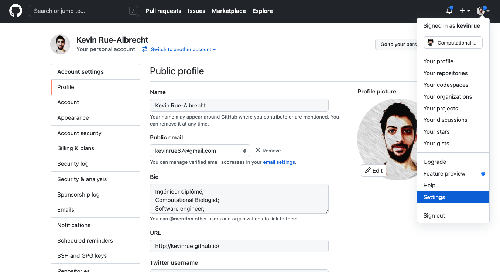
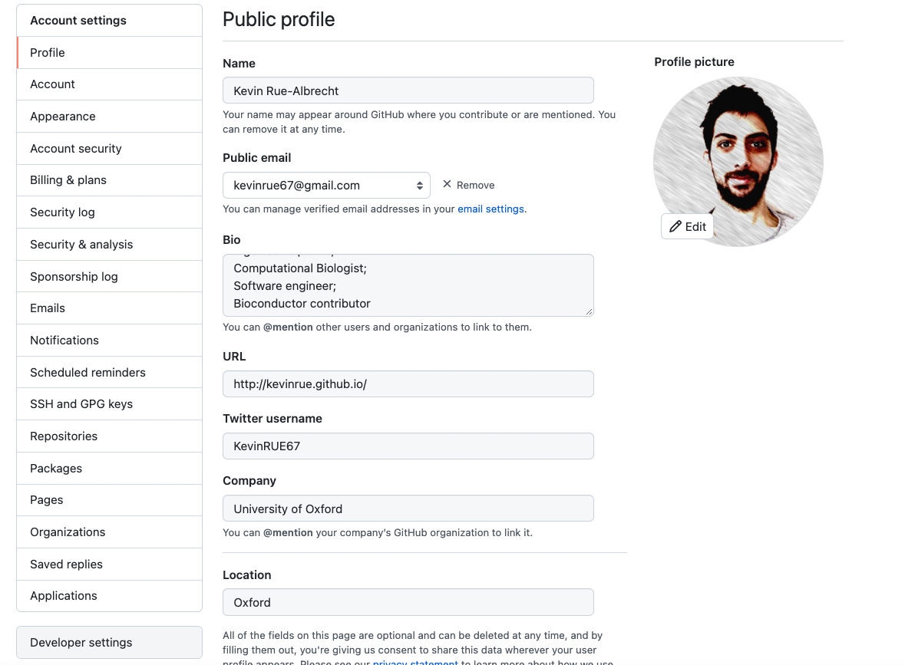
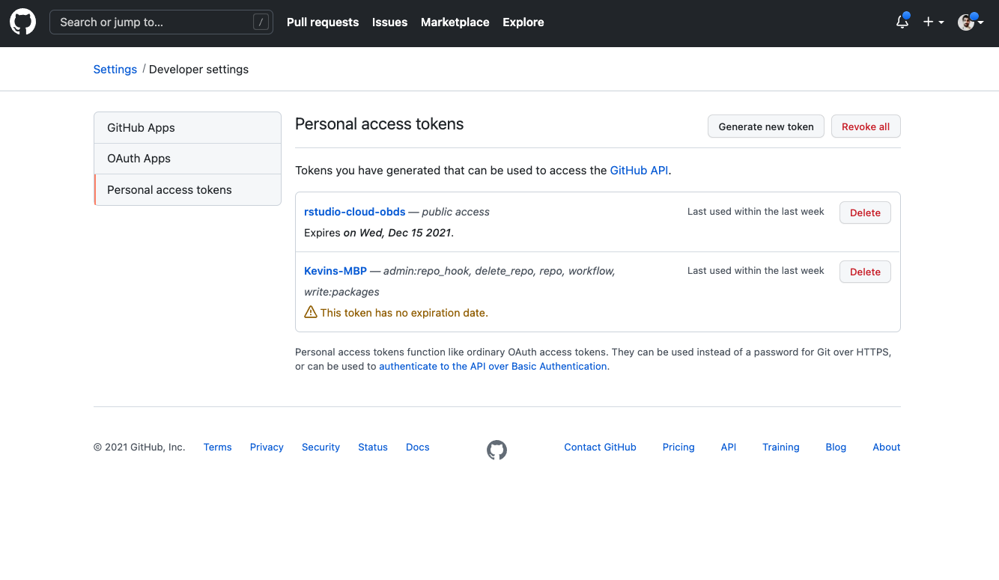
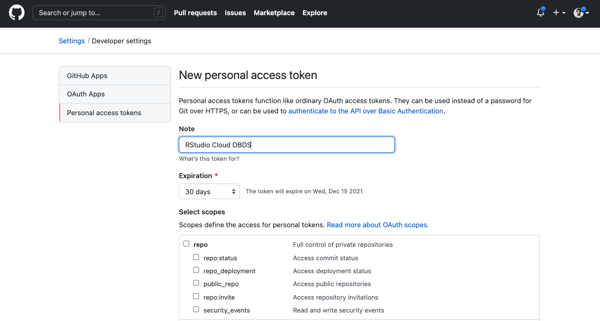

# Exercise

## Setting up a GitHub Personal Access Token

```{r, fig.align='center', out.height='400px'}
# Screenshot

```

---

# Exercise

## Setting up a GitHub Personal Access Token

```{r, fig.align='center', out.height='450px'}
# Screenshot

```

---

# Exercise

## Setting up a GitHub Personal Access Token

```{r, fig.align='center', out.height='450px'}
# Screenshot

```

---

# Exercise

## Setting up a GitHub Personal Access Token

```{r, fig.align='center', out.height='400px'}
# Screenshot

```

Click "Generate token" at the bottom of the page.
Copy the token from the next page - you will not get another look at this token in any way in the future!