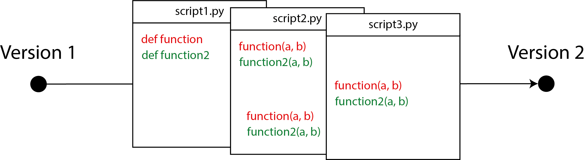
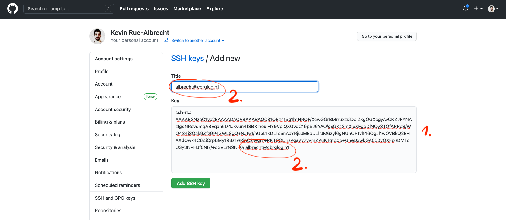
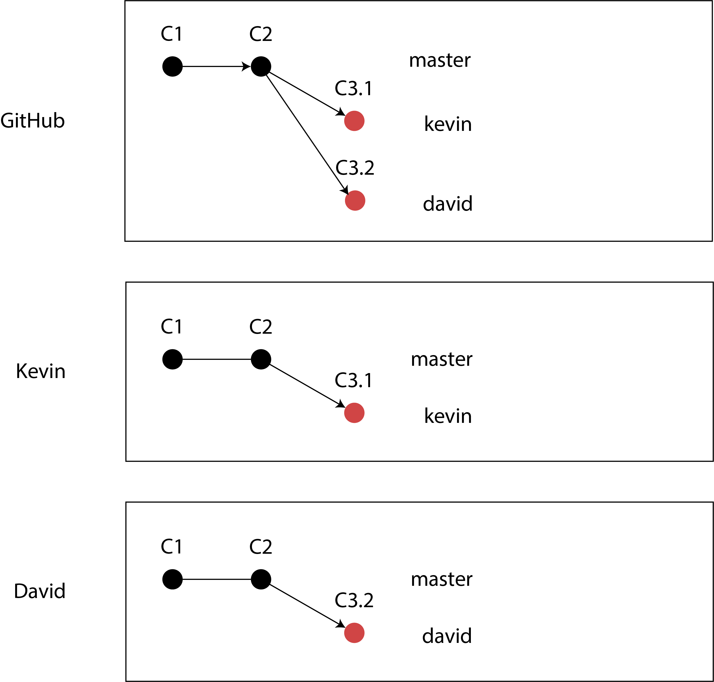
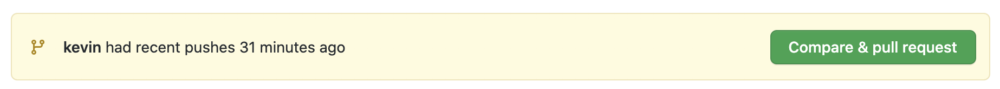
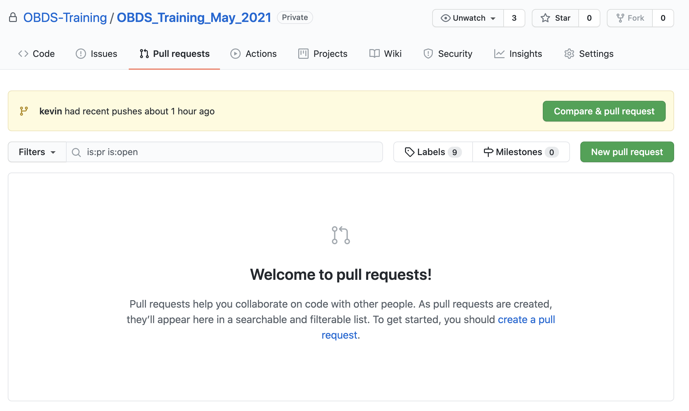
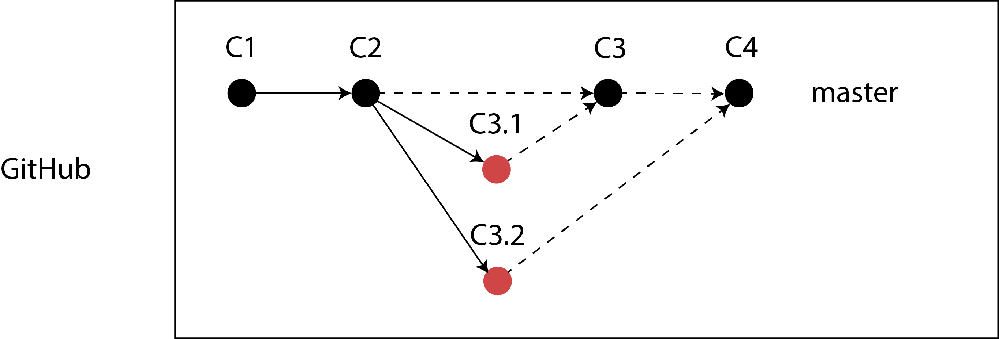

layout: true

<div class="my-header"></div>

<div class="my-footer"><span>
Kevin Rue-Albrecht
&emsp;&emsp;&emsp;&emsp;&emsp;&emsp;&emsp;&emsp;&emsp;&emsp;
Version control with <i class="fab fa-git"></i> and <i class="fab fa-github"></i> GitHub
</span></div> 

```{r setup, include = FALSE}
stopifnot(requireNamespace("htmltools"))
htmltools::tagList(rmarkdown::html_dependency_font_awesome())
knitr::opts_chunk$set(
  message = FALSE, warning = FALSE, error = FALSE, include = TRUE, echo = FALSE,
  fig.align='center', out.height='500px'
)
options(width = 90)
stopifnot(require(base))
```

```{r, load_refs, include=FALSE, cache=FALSE}
options(htmltools.dir.version = FALSE)
library(RefManageR)
BibOptions(
  check.entries = FALSE,
  bib.style = "authoryear",
  cite.style = "authoryear",
  style = "markdown",
  hyperlink = "to.doc",
  dashed = TRUE)
bib <- ReadBib("bibliography.bib")
```

---

# Learning Objectives & Goals

## Learning Objectives

- Understand what version control is and when you should use it.

- Identify where <i class="fab fa-git"></i> stores information.

- Practice how to record changes in <i class="fab fa-git"></i>.

## Goals

- Get (i.e., _clone_) your own copy of the shared repository for this course.

- Edit files and record (i.e., _commit_) your changes.

- Publish (i.e., _push_) your contributions in the shared repository.

- Retrieve (i.e., _pull_) contributions from other participants in the shared repository.

- Examine the history (i.e., _log_) of contributions to the shared repository.

---

# Pre-requisites

- Access to the CCB cluster over SSH.

- A [<i class="fab fa-github"></i> GitHub](https://github.com/) account.

- Accept the invitation to be a member of the GitHub Organisation [OBDS-Training](https://github.com/OBDS-Training).

Those last two points are required to grant you access to private repositories that are only visible to members of the organisation.

- A [SSH key pair](https://www.ssh.com/ssh/public-key-authentication) - ideally password-protected - added to your <i class="fab fa-github"></i> GitHub account.

This will allow the <i class="fab fa-github"></i> GitHub server to verify your identity when you programmatically interact with it.

---

# Credits

```{r, out.height='300px'}
knitr::include_graphics("img/TheCarpentries.svg")
# Source: https://carpentries.org/
```

.center[
Version Control with Git

<https://swcarpentry.github.io/git-novice/>
]

---

# What is version control and why should I use it?

.pull-left[
```{r}
knitr::include_graphics("img/phd101212s.gif")
# Source: http://www.phdcomics.com/comics/archive/phd101212s.gif
```
]

.pull-right[
- Try various ideas.

- Track additions and deletions to a base document.

- Undo and re-apply changes.

- Integrate contributions from multiple authors.

- Backup important work.

- Manage and resolve conflicting changes.

- Go back to any version at any time.

**What do _you_ expect from a tool to track changes?**
]

---

# Track changes

## Microsoft Word

```{r, out.height='350px', out.width='500px'}
# Source: https://medium.com/jumpto365/sharepoint-version-history-isnt-track-changes-fae1b71754ea
knitr::include_graphics("img/microsoft-word-track-changes.png")
```

Other examples:
Google Docs [version history](https://support.google.com/docs/answer/190843?hl=en),
LibreOffice [Recording and Displaying Changes](https://help.libreoffice.org/Common/Recording_and_Displaying_Changes).

.center[
**In your opinion, what are pros/cons of track changes in this way?**
]

---

# Track changes using version control

## Versions and changes

```{r, fig.align='center', out.height='200px'}
# Source: https://swcarpentry.github.io/git-novice/01-basics/index.html
knitr::include_graphics("img/carpentries-play-changes.svg")
```

#### Process

- Start with a base version of the document.
- Then, record changes that you make along the way (i.e. checkpoints).

#### Result

- You can rewind to any version of the document (up to the base version).
- You can play back each change that you made (up to the most recent version).

---

# Changes can be made independently

## Different versions

.pull-left[
```{r, fig.align='center', out.height='300px'}
# Source: https://swcarpentry.github.io/git-novice/01-basics/index.html
knitr::include_graphics("img/carpentries-versions.svg")
```
]

.pull-right[
Changes are separate from the document itself.

- You can play back different sets of changes on the base document.

- Those changes result in different versions of that document.

For example, different users make independent changes on the same document.
]

---

# Independent changes can be incorporated

## Merge sets of changes

.pull-left[
```{r, fig.align='center', out.height='300px'}
# Source: https://swcarpentry.github.io/git-novice/01-basics/index.html
knitr::include_graphics("img/carpentries-merge.svg")
```
]

.pull-right[
Unless changes affect the same lines of the document (i.e., conflicts):

- changes can be _merged_ into the same base document.
]

---

# Tracking simultaneous changes to multiple files 

```{r, fig.align='center', out.height='200px', out.width='800px'}
# In-house illustration made using Adobe Illustrator

```

Process:

- Add each file to the next set of changes (i.e., _staging area_).
- Then, add this set of changes to the repository (i.e., _commit_).

Result:

- That set of changes is recorded as a single unit in the repository.
- Undoing or playing back these changes applies all the changes simultaneously.
- It is _not_ possible to undo or play back these changes in one file independently from the other files.

---

# Summary: version tracking software

- Keep track of changes (i.e. differences or _diffs_).

  + Effectively creating different _versions_ of our files.

- Allows users to decide which changes are made to the next version.

  + Each record of changes is called a _commit_.

- The complete history of _commits_ for a given project makes up a _repository_.

- Copies of a _repository_ can be kept in sync across different computers (i.e. _remotes_).

  + Each copy of the repository is called a _clone_.

---

# The Long History of Version Control Systems

Tools like [RCS](https://git.savannah.gnu.org/cgit/rcs.git), [CVS](https://savannah.nongnu.org/projects/cvs), or [Subversion](https://subversion.apache.org/) have been around since the early 1980s and are used by many large companies.

However, many of these are now considered legacy systems (i.e., _outdated_) due to various limitations in their capabilities.

More modern systems, such as [Git](https://git-scm.com/) and [Mercurial](https://www.mercurial-scm.org/), are _distributed_, meaning that they do not need a centralized server to host the repository.

---

# Using <i class="fab fa-git"></i> as an HPC module

Use SSH to open a terminal on the HPC cluster.

The system executable of `git` on your default `PATH` is a rather old version.
What is the path to the system `git`?
What version of `git` is it?

```{bash, eval=FALSE, echo=TRUE}
$ which git
$ git --version
```

Instead, we will use the `module` command to put a more recent version of `git` on our `PATH`.

```{bash, eval=FALSE, echo=TRUE}
$ module avail git
$ module load git/2.31.1
```

Examine your `PATH` variable, the path to the new `git` executable, and the version of this new `git` executable.

```{bash, eval=FALSE, echo=TRUE}
$ which git
$ git --version
```

---

# Getting started with <i class="fab fa-git"></i>

The `git` command has many sub-commands, options, and flags.
You can run `git` alone to list the sub-commands and a short description of each.
How many sub-commands do you see?

```{bash, eval=FALSE, echo=TRUE}
$ git
```

The `--version` flag asks `git` to print the version of the `git` executable that is used.
The <i class="fab fa-git"></i> program is generally backward compatible, but you may observe subtle differences in the way different version of <i class="fab fa-git"></i> display information.

```{bash, eval=FALSE, echo=TRUE}
$ git --version
```

You can access more detailed help for any sub-command using the `--help` flag.

```{bash, eval=FALSE, echo=TRUE}
$ git clone --help
```

---

# Setting up <i class="fab fa-git"></i>

On each computer where we use <i class="fab fa-git"></i>, we need to configure a few things:

- our name and email address
- our preferred text editor
- that these settings should apply _globally_ (i.e. to all our projects on this computer)

The `git config` sub-command can be used to get and set those settings.

#### Getting

```{bash, eval=FALSE, echo=TRUE}
$ git config --global user.name
$ git config --global user.email
$ git config --global core.editor
```

#### Setting

```{bash, eval=FALSE, echo=TRUE}
$ git config --global user.name "Kevin Rue-Albrecht"
$ git config --global user.email "kevinrue@users.noreply.github.com"
$ git config --global core.editor "nano -w"
```

---

# Setting up an SSH key for <i class="fab fa-github"></i> GitHub

## Generate an SSH key pair

At this point, you have likely generated an SSH key pair on your personal computer, but not on the HPC cluster.

We need to generate a key pair *on the cluster*, so that you can programmatically identify yourself to <i class="fab fa-github"></i> GitHub and access private repositories.

```{bash, eval=FALSE, echo=TRUE}
$ ssh-keygen -t rsa -b 4096
# leave default location to store the key (leave field empty)
# do set a passphrase (do not leave field empty)
$ cat ~/.ssh/id_rsa.pub
ssh-rsa [...] username@hostname
# copy the whole line (including 'ssh-rsa' and 'username@hostname')
```

---

# Setting up an SSH key for <i class="fab fa-github"></i> GitHub

## Add the public key to your <i class="fab fa-github"></i> GitHub account

```{r, fig.align='center', out.height='350px'}
# Screenshot
knitr::include_graphics("img/github-add-ssh-key.png")
```

---

# Setting up an SSH key for <i class="fab fa-github"></i> GitHub

## Add the public key to your <i class="fab fa-github"></i> GitHub account

```{r, fig.align='center', out.height='350px'}
# Screenshot

```

---

# Clone the shared repository

In this step, you will each create (i.e., _clone_) your own copy of the shared repository for this course.

The `git clone` sub-command takes the address of a remote repository and creates a copy of that repository in a new local directory.

```{bash, eval=FALSE, echo=TRUE}
$ mkdir -p $HOME/git
$ cd $HOME/git
$ git clone git@github.com:OBDS-Training/OBDS_Training_Sep_2021.git
```

```{r, fig.align='center', out.height='300px'}
# Source: https://www.atlassian.com/git/tutorials/setting-up-a-repository/git-clone
knitr::include_graphics("img/atlassian-clone.svg")
```

???

- A clone contains both the files _and_ the history of changes.

- By default, the local directory will be named identically to the repository, it is possible to name it differently using `git clone git@github.com:OBDS-Training/OBDS_Training_Sep_2021.git local_directory_name`

---

# The `.git` subdirectory

Change directory to your new local clone of the repository, and list its contents.

```{bash, eval=FALSE, echo=TRUE}
$ cd OBDS_Training_Sep_2021
$ ls -a
```

```
.  ..  .git  .gitignore  1_linux  2_r  README.md
```

Git uses the `.git` sub-directory to store all the information about the project history.
You can have a brief look for yourself if you wish.
Make sure that you do not alter or remove anything in that sub-directory.

```{bash, eval=FALSE, echo=TRUE}
$ ls -a .git/
```

#### Result

- Deleting the `.git` sub-directory is effectively discarding the _history_ of changes made to the repository.
- However, deleting the `.git` sub-directory does not affect the _current state_ of the other sub-directories and files that make up your project (e.g., `README.md`).

.center[
**Changes are stored separately from the files themselves.**
]

---

# Status of a repository

The `git status` sub-command can be used to check whether the repository is up-to-date.

```{bash, eval=FALSE, echo=TRUE}
$ git status
```

```
On branch master
Your branch is up to date with 'origin/master'.

nothing to commit, working tree clean
```

---

# Working on branches

## Conflict of histories

```{r, fig.align='center', out.height='300px', out.width='400px'}
# In-house illustration made using Adobe Illustrator
knitr::include_graphics("img/branch-conflict.png")
```

.center[
**What do you think will happen when David and Kevin push their respective `master` branch to <i class="fab fa-github"></i> GitHub?**
]

---

# Working on branches

## Work independently

```{r, fig.align='center', out.height='350px', out.width='400px'}
# In-house illustration made using Adobe Illustrator

```

We will discuss later how to incorporate changes made on branches back into the `master` branch.

---

# Create a branch

The `git branch` sub-command can be used to inspect and create branches in a copy of the repository.

- This does not automatically synchronise remote copies of the repository.
- You can only create branches with names that are not already used (locally*).
- The new branch is created from the commit on the current branch (not necessarily `master`).

The `git checkout` sub-command can be used to switch between branches.

```{bash, eval=FALSE, echo=TRUE}
$ git branch          # list existing branches
$ git branch kevin    # create a new branch named kevin
$ git branch          # list existing branches (again)
$ git checkout kevin  # switch to the branch named kevin
$ git status          # check the status of the repository (currently on branch kevin)
```

**At this point, is there any difference between branch `master` and branch `kevin`?**

#### Alternative

It is possible to create and checkout the new branch in a single command.

```{bash, eval=FALSE, echo=TRUE}
$ git checkout -b kevin
```

---

# Make changes

First make sure that you have checked out a branch other than `master`.

In the repository sub-directory `week2/day1_version_control_using_git`, create a file called `<username>.md`, replacing `<username>` by your own cluster user name (i.e. Bash command `whoami`).

> I included an example `albrecht.md`, as `albrecht` is CCB user name.

In that file, write you full name as a first level header (preceded by a `#` symbol and a space).

As second level header (i.e., `##`), add a section 'Expertise' with a list of bullet points, and another second level header 'Operating System' to indicate whether you use 'macOS', 'Windows', or 'Linux' during this course.

It is best practice to add a newline character at the end of this line as <i class="fab fa-git"></i> works best in that case.

#### Practice Bash

You can also make a copy the example file and edit that copy, instead of creating the file from scratch yourself.

---

# Track changes

We have just made changes to files in the repository.
However, we have not told <i class="fab fa-git"></i> to record those changes yet.
In other words, we have edited the files, but we haven't committed those changes.

> Remember that changes are separate from the files themselves!

The `git status` sub-command can be used to check the status of our project again.

```{bash, eval=FALSE, echo=TRUE}
$ git status
```

```
On branch kevin
Your branch is up to date with 'origin/master'.

Untracked files:
  (use "git add <file>..." to include in what will be committed)
	week2/day1_version_control_using_git/albrecht.md
```

The "Untracked files" section reports files that are new and not track by <i class="fab fa-git"></i> yet.

---

# Track new files

The `git add` sub-command can be used to add new files to the list of files tracked by <i class="fab fa-git"></i>.

- As long as <i class="fab fa-git"></i> is not explicitly told to track new files, those files will exist in the _directory_ but not in the _repository_.
- In other words, the file will exist, but changes to that file will not be tracked, and we will not be able to restore past versions of that file.

```{bash, eval=FALSE, echo=TRUE}
$ git add albrecht.md
$ git status
```

```
On branch kevin
Changes to be committed:
  (use "git restore --staged <file>..." to unstage)
	new file:   week2/day1_version_control_using_git/albrecht.md
```

.center[
**What changed in `git status` after running `git add`?**
]

---

# The staging area

We just ran `git add`, which added a set of changes to the _staging area_.

- The _staging area_ contains the set of changes that will be recorded in the next _commit_.
- You may add to the _staging area_ only a subset of the changes that you have made in the repository since the latest _commit_.
- The _staging area_ can include changes made to multiple files.

The `git commit` sub-command can be used to add changes currently in the _staging area_ in the next _commit_ of the _repository_.

```{r, fig.align='center', out.height='200px', out.width='800px'}
# Source: https://swcarpentry.github.io/git-novice/04-changes/index.html
knitr::include_graphics("img/carpentries-git-staging-area.svg")
```

---

# Record a set of changes 

The `git commit` sub-command can be used to add changes currently in the _staging area_ in the next _commit_ of the _repository_.

- The `-m` option can be used to specify the message used to annotate the _commit_ that will contain this set of changes. 

```{bash, eval=FALSE, echo=TRUE}
$ git commit -m "Added a file for kevin rue"
```

```
[kevin 41121a3] Added a file for kevin rue
 1 file changed, 1 insertion(+)
 create mode 100644 week2/day1_version_control_using_git/albrecht.md
```

.center[
**What information do you recognise in the message displayed as a result of the `git commit` command?**
]

---

# Share your changes with others

The `git push` sub-command can be used to send local changes to a remote repository.

- The local repository must have configured the address of the remote repository.

Before we push, the `git remote` command can be used to inspect, add, and remove remote repositories from the local repository configuration.

```{bash, eval=FALSE, echo=TRUE}
$ git remote -v
```

```
origin	git@github.com:OBDS-Training/OBDS_Training_Sep_2021.git (fetch)
origin	git@github.com:OBDS-Training/OBDS_Training_Sep_2021.git (push)
```

When everything is in place, you can tell <i class="fab fa-git"></i> to push a branch (e.g. `my_branch`) to a given remote (e.g. `origin`):

```{bash, eval=FALSE, echo=TRUE}
$ git push origin my_branch
```

.center[
**Do not run this yet, we will do it in a moment, with a difference.**
]

---

# Synchronise branches between remotes

We have seen this illustration earlier, to discuss how branches allow multiple contributors to work independently.

```{r, fig.align='center', out.height='450px', out.width='500px'}
# In-house illustration made using Adobe Illustrator

```

---

# Push a new branch to a remote

The first time you push a branch, you should use the `--set-upstream` flag (or `-u` in short), and <i class="fab fa-git"></i> will display more information.

```{bash, eval=FALSE, echo=TRUE}
$ git push -u origin kevin
```

.small-code[
```
Enumerating objects: 8, done.
Counting objects: 100% (8/8), done.
Delta compression using up to 16 threads
Compressing objects: 100% (3/3), done.
Writing objects: 100% (5/5), 417 bytes | 417.00 KiB/s, done.
Total 5 (delta 1), reused 0 (delta 0)
remote: Resolving deltas: 100% (1/1), completed with 1 local object.
remote: 
remote: Create a pull request for 'kevin' on GitHub by visiting:
remote:      https://github.com/OBDS-Training/OBDS_Training_Sep_2021/pull/new/kevin
remote: 
To github.com:OBDS-Training/OBDS_Training_Sep_2021.git
 * [new branch]      kevin -> kevin
Branch 'kevin' set up to track remote branch 'kevin' from 'origin'.
```
]

.center[
**How do you read the command? What do you think is done, according to the output?**
]

---

# Incorporate changes to the base branch

The `git merge` sub-command can be used to merge branches.
However, we are not going to use it, at least not explicitly at the command line.

- We do not want to create different (i.e., conflicting) histories on the `master` branch.
- We will use <i class="fab fa-github"></i> GitHub to manage the `master` branch centrally.
- Every other repository will only ever `pull` the `master` branch from <i class="fab fa-github"></i> GitHub.
- No one will ever directly `push` their `master` branch to <i class="fab fa-github"></i> GitHub.

```{r, fig.align='center', out.height='200px', out.width='600px'}
# In-house illustration made using Adobe Illustrator
knitr::include_graphics("img/branch-merge.png")
```

**Do not do this:** To incorporate the changes from branch `kevin` into branch `master` locally, one could run:

```{bash, eval=FALSE, echo=TRUE}
$ git checkout master
$ git merge kevin
```

---

# Create pull requests on <i class="fab fa-github"></i> GitHub

## Recently pushed branches

On the page of the repository (<https://github.com/OBDS-Training/OBDS_Training_Sep_2021>), branches that were recently pushed are highlighted, with a button "Compare & pull request".

- Unless a pull request already exists for that branch.

```{r, fig.align='center', out.height='75px', out.width='800px'}
# Screenshot

```

---

# Create pull requests on <i class="fab fa-github"></i> GitHub

<i class="fab fa-github"></i> GitHub also offers a page dedicated to creating pull requests.

```{r, fig.align='center', out.height='500px', out.width='800px'}
# Screenshot

```

---

# Create pull requests on <i class="fab fa-github"></i> GitHub

## Comparing changes and opening a pull request

```{r, fig.align='center', out.height='375px', out.width='800px'}
# Screenshot
knitr::include_graphics("img/github-compare-changes.png")
```

---

# Create pull requests on <i class="fab fa-github"></i> GitHub

## Title and description

```{r, fig.align='center', out.height='450px', out.width='800px'}
# Screenshot
knitr::include_graphics("img/github-open-pull-request.png")
```

---

# Create pull requests on <i class="fab fa-github"></i> GitHub

## Monitor the status of a pull request

```{r, fig.align='center', out.height='400px', out.width='550px'}
# Screenshot
knitr::include_graphics("img/github-pull-request.png")
```

.center[
**What do you think is happening here?**
]

---

# Review a pull request

Often considered cumbersome, in practice manual reviews offer another chance to catch issues and provide feedback, before the changes are applied to the target branch.

```{r, fig.align='center', out.height='375px', out.width='600px'}
# Screenshot
knitr::include_graphics("img/github-pull-request-review.png")
```

.center[
**In this setup, a pull request can only be applied if the reviewer selects the "Approve" radio button.**
]

---

# Merge a pull request

```{r, fig.align='center', out.height='500px', out.width='600px'}
# Screenshot
knitr::include_graphics("img/github-merge-pull-request.png")
```

---

# Merge a pull request

## Commit message

```{r, fig.align='center', out.height='200px', out.width='600px'}
# Screenshot
knitr::include_graphics("img/github-merge-commit.png")
```

.center[
**Merging a pull request creates a new commit. This commit needs its own commit message.**
]

---

# Merge a pull request

## Delete branches successfully merged

```{r, fig.align='center', out.height='75px', out.width='600px'}
# Screenshot
knitr::include_graphics("img/github-delete-branch-merged.png")
```

- The target branch now contains all the changes that were made on the branch that was merged.
- The merged branch does not have any more value.

```{r, fig.align='center', out.height='200px', out.width='600px'}
# In-house illustration made using Adobe Illustrator
knitr::include_graphics("img/branch-merge.png")
```

.center[
**In this scenario, which branches would you delete and when?**
]

---

# Merge a pull request

## Deleted branches

```{r, fig.align='center', out.height='60px', out.width='900px'}
# In-house illustration made using Adobe Illustrator
knitr::include_graphics("img/github-branch-deleted.png")
```

- Deleting branches that were merged does not delete their commit(s).
- Branches are merely pointers to certain commits.

```{r, fig.align='center', out.height='200px', out.width='600px'}
# In-house illustration made using Adobe Illustrator

```

.center[
**Can you tell what the difference with the previous slide is?**
]

---

# Delete a branch locally

We deleted the branch on <i class="fab fa-github"></i> GitHub, but it still exists locally.

```{bash, eval=FALSE, echo=TRUE}
$ git branch -a
```

```
 * kevin
   master
   remotes/origin/HEAD -> origin/master
   remotes/origin/kevin
   remotes/origin/master
```

To delete a branch locally, we need to move to another branch (often, `master`) first.

```{bash, eval=FALSE, echo=TRUE}
$ git fetch --prune   # remove local links to any branch deleted on the remote
$ git branch -D kevin # "politely" remove the local copy of the branch
$ git branch -D kevin # "force" remove the local copy of the branch
$ git branch -a
```

```
 * master
   remotes/origin/HEAD -> origin/master
   remotes/origin/master
```

---

# The repository history

## On <i class="fab fa-github"></i> GitHub

```{r, fig.align='center', out.height='400px', out.width='800px'}
# In-house illustration made using Adobe Illustrator
knitr::include_graphics("img/github-network-graph.png")
```

.center[
**How do you read this graph?**
]

---

# The repository history

The `git log` sub-command can be used to display the history of commits in the repository.

- The `--all` option forces <i class="fab fa-git"></i> to display the repository history across all the branches.
  + By default, <i class="fab fa-git"></i> only displays the history of the branch currently checked out.
- The `--graph` option adds a visual representation of branches in the repository, and their connections to each other.
- The `--oneline` (i.e., "one line") forces <i class="fab fa-git"></i> to summarise each commit as a single line.
  + This limits the information displayed, but helps with the visualisation.

.small-code[
```{bash, eval=FALSE, echo=TRUE}
  $ git log --all --graph --oneline
  *   9d330e3 (HEAD -> master, origin/master, origin/HEAD) Merge pull request #2 from OBDS-Training/david
  |\  
  | * cae231c Add page for David Sims
  * |   dc19047 Merge pull request #1 from OBDS-Training/kevin
  |\ \  
  | |/  
  | * 0c4eacc Added a file for <username>
  | * 28d3852 Add an example file in the git sub-directory
  | * 5d0241c Reorder steps for pull request
  | * a430b66 Add usage to README
  |/  
  * e49981e Add README.md
```
]

.center[
**How do you read this commit history? Would you recommend anything to the authors?**
]

---

# View past commits

The `git show` sub-command can be used to examine individual past commits.

```{bash, eval=FALSE, echo=TRUE}
$ git show 28d3852
commit 28d38521da4d75625b5062f61cd6c1bdb6429e6d
Author: Kevin Rue-Albrecht <kevinrue67@gmail.com>
Date:   Wed Apr 7 17:16:13 2021 +0100

    Add an example file in the git sub-directory

diff --git a/git/albrecht.md b/git/albrecht.md
new file mode 100644
index 0000000..468faf4
--- /dev/null
+++ b/git/albrecht.md
@@ -0,0 +1 @@
+# Kevin Rue-Albrecht
```

.center[
**How do you read this output history? What changes were recorded?**
]

---

# View differences between commits

The `git diff` sub-command can be used to compare two states of the repository.

- It is possible to compare all the changes between a reference and a target commits using the syntax `git diff reference_commit target_commit`
  + The order of commit identifiers control the changes that are shown as "added" or "removed.
- It is also possible to compare the current state of files in the repository - including uncommitted changes - to any commit of the repository.
  + This is often used to examine the changes that you have made since the most recent commit.

.pull-left[
.small-code[
```{bash, eval=FALSE, echo=TRUE}
$ git diff 5d0241c 0c4eacc
diff --git a/git/albrecht.md b/git/albrecht.md
new file mode 100644
index 0000000..468faf4
--- /dev/null
+++ b/git/albrecht.md
@@ -0,0 +1 @@
+# Kevin Rue-Albrecht
diff --git a/git/username.md b/git/username.md
new file mode 100644
index 0000000..468faf4
--- /dev/null
+++ b/git/username.md
@@ -0,0 +1 @@
+# Kevin Rue-Albrecht
```
]
]

.pull-right[
```{r, fig.align='center', out.height='200px', out.width='500px'}
# In-house illustration made using Adobe Illustrator
knitr::include_graphics("img/git-diff.png")
```
]

---

# Revert changes

The `git revert` sub-command can be used to undo everything that was done in a particular commit, without the need to edit any of the files manually.

```{r, fig.align='center', out.height='400px', out.width='700px'}
# In-house illustration made using Adobe Illustrator
knitr::include_graphics("img/git-revert.png")
```

---

# Reset to earlier commits

.center[
**!!! DANGER ZONE !!!**
]

The `git reset` sub-command can be used to reset the repository history to an earlier commit.

- This is a dangerous and destructive action that can creates conflicting histories.

```{r, fig.align='center', out.height='350px', out.width='800px'}
# In-house illustration made using Adobe Illustrator
knitr::include_graphics("img/git-reset.png")
```

.center[
**What do you think will happen when Kevin and David pushed their `master` branch?**
]

---

# Ignore files

One or more special files named `.gitignore` can be placed in your project.

Each line in those file specifies a file name or pattern that <i class="fab fa-git"></i> will ignore (i.e., not track) in the future.

- Files that are already tracked will continue to be tracked even after they are added to `.gitignore`, unless they are explicitly removed from the repository using `git rm` (use the `--cached` option to only remove the file from the index, but keep the file itself).

.pull-left[
## .gitignore
```
 .DS_Store
 data/
 *fastq.gz
 *sam
 *bam
```

**Can you tell which files will be tracked when this `.gitignore` exists in the project root directory?**
]

.pull-right[
```
my-project/
|_ .gitignore
|_ data_raw/
| |_ sample1.1.fastq
| |_ sample1.2.fastq
| |_ sample2.1.fastq.gz
| |_ sample2.2.fastq.gz
|_ data/
| |_ sample1.bam
| |_ sample2.bam
|_ scripts/
  |_ fastq_to_bam.sh
```
]

---

# Final advice

.center[
**Can you identify the reasoning underlying each of the following pieces of advice?**
]

.pull-left[
- Track:

  + source code (e.g., scripts).
  
  + README file(s)
  
  + LICENSE file, if any
  
- Optionally track:

  + `.gitignore` file(s)
  
  + Configuration file(s)

- Do not track output files.
]

.pull-right[
- Do not track very large files (e.g., data).

  + Use [git-lfs](https://git-lfs.github.com/) if you must.

  + Host elsewhere
  (e.g.,
  [figshare](https://figshare.com/),
  [zenodo](https://zenodo.org/)).
  
  + Download data at runtime.

- Do not track confidential information

  + e.g. passwords
]

---

# Further reading

## Novice

- Software Carpentry: <https://swcarpentry.github.io/git-novice/>

## Advanced

- <i class="fab fa-git"></i> glossary: <https://git-scm.com/docs/gitglossary>
- Oh s**t <i class="fab fa-git"></i>: <https://ohshitgit.com/>

---

# References

```{r refs, results="asis"}
PrintBibliography(bib)
```

???

Extras:

- Install `git`
- `git init` (as opposed to `git clone`)
- `git merge` vs `git rebase`
