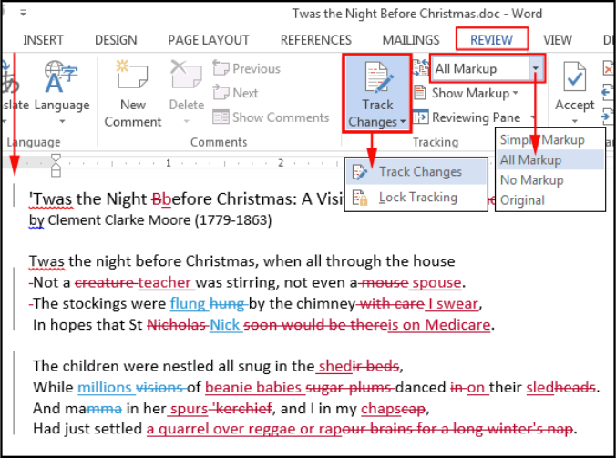
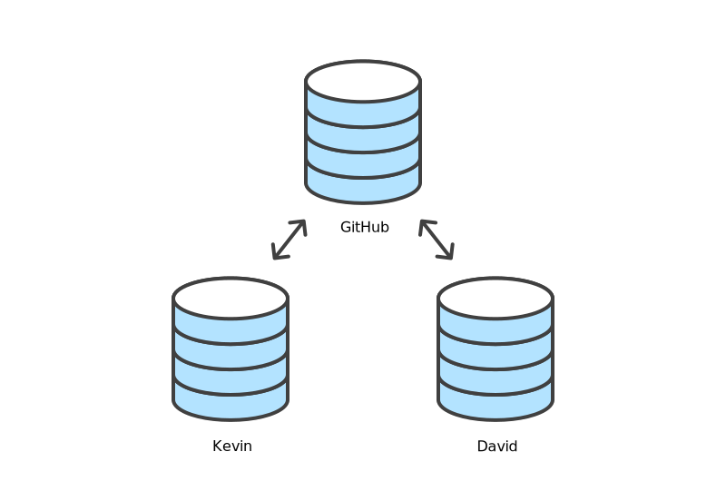

# Credits

```{r, out.height='300px'}
knitr::include_graphics("img/TheCarpentries.svg")
# Source: https://carpentries.org/
```

.center[
Version Control with Git

<https://swcarpentry.github.io/git-novice/>
]

---

# What is version control and why should I use it?

.pull-left[
```{r}
knitr::include_graphics("img/phd101212s.gif")
# Source: http://www.phdcomics.com/comics/archive/phd101212s.gif
```
]

.pull-right[
- Try various ideas.

- Track additions and deletions to a base document.

- Undo and re-apply changes.

- Integrate contributions from multiple authors.

- Backup important work.

- Manage and resolve conflicting changes.

- Go back to any version at any time.

**What do _you_ expect from a tool to track changes?**
]

---

# Track changes

## Microsoft Word

```{r, out.height='350px', out.width='500px'}
# Source: https://medium.com/jumpto365/sharepoint-version-history-isnt-track-changes-fae1b71754ea

```

Other examples:
Google Docs [version history](https://support.google.com/docs/answer/190843?hl=en),
LibreOffice [Recording and Displaying Changes](https://help.libreoffice.org/Common/Recording_and_Displaying_Changes).

.center[
**In your opinion, what are pros/cons of track changes in this way?**
]

---

# Track changes using version control

## Versions and changes

```{r, fig.align='center', out.height='200px'}
# Source: https://swcarpentry.github.io/git-novice/01-basics/index.html
knitr::include_graphics("img/carpentries-play-changes.svg")
```

#### Process

- Start with a base version of the document.
- Then, record changes that you make along the way (i.e. checkpoints).

#### Result

- You can rewind to any version of the document (up to the base version).
- You can play back each change that you made (up to the most recent version).

---

# Changes can be made independently

## Different versions

.pull-left[
```{r, fig.align='center', out.height='300px'}
# Source: https://swcarpentry.github.io/git-novice/01-basics/index.html
knitr::include_graphics("img/carpentries-versions.svg")
```
]

.pull-right[
Changes are separate from the document itself.

- You can play back different sets of changes on the base document.

- Those changes result in different versions of that document.

For example, different users make independent changes on the same document.
]

---

# Independent changes can be incorporated

## Merge sets of changes

.pull-left[
```{r, fig.align='center', out.height='300px'}
# Source: https://swcarpentry.github.io/git-novice/01-basics/index.html
knitr::include_graphics("img/carpentries-merge.svg")
```
]

.pull-right[
Unless changes affect the same lines of the document (i.e., conflicts):

- Changes can be _merged_ into the same base document.
]

---

# Tracking simultaneous changes to multiple files 

```{r, fig.align='center', out.height='250px', out.width='800px'}
# Source: Kevin Rue-Albrecht (Adobe Illustrator)
knitr::include_graphics("img/commit-multiple-files.SVG")
```

#### Process

- Add each file to the next set of changes (i.e., _staging area_).
- Then, add this set of changes to the repository (i.e., _commit_).

#### Result

- That set of changes is recorded as a single unit in the repository.
- Undoing or playing back these changes applies all the changes simultaneously.
- It is _not_ possible to undo or play back these changes in one file independently from the other files.

---

# Collaborate with remote repositories

.pull-left[
```{r, fig.align='center', , out.height='300px'}
# Source: Kevin Rue-Albrecht (Adobe Illustrator)

```
]

.pull-right[
## Git Clones

- Each contributor has a copy (i.e., _clone_) of the repository on their own computer.

- Commits are first made locally.

- Commits can then be _pushed_ and _pulled_ from one clone to another.
]

## Note

- Clones do not communicate automatically with each other; they are not always synchronised.

- Contributors generally interact with a "central" repository online (e.g., GitHub); not directly with each other's clone.

---

# Summary: version tracking software

- Keep track of changes (i.e., differences or _diffs_).

  + Effectively creating different _versions_ of our files, from a base document.

- Allows users to decide which changes are made to the next version.

  + Each record of changes is called a _commit_.

- The complete history of _commits_ for a given project makes up a _repository_.

- Copies of a _repository_ can be kept in sync across different computers (i.e. _remotes_).

  + Each copy of the repository is called a _clone_.

---

# The Long History of Version Control Systems

## A brief summary

Tools like [RCS](https://git.savannah.gnu.org/cgit/rcs.git), [CVS](https://savannah.nongnu.org/projects/cvs), or [Subversion](https://subversion.apache.org/) have been around since the early 1980s and are used by many large companies.

However, many of these are now considered legacy systems (i.e., _outdated_) due to various limitations in their capabilities.

More modern systems, such as [Git](https://git-scm.com/) and [Mercurial](https://www.mercurial-scm.org/), are _distributed_, meaning that they do not need a centralized server to host the repository.
