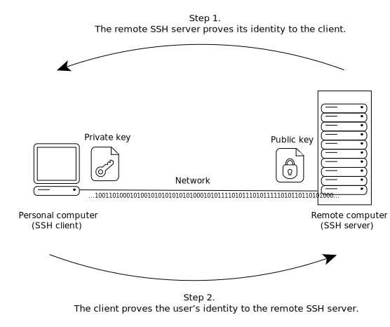
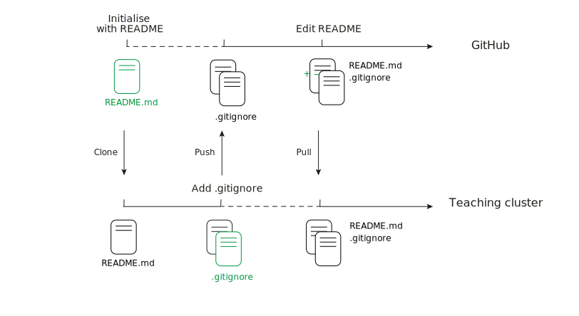

```{r child='layout.Rmd'}
```

---

# Learning Goals & Objectives

### Learning goals

<!--
High-level "big picture" objectives of the learning process.
-->

- Understand what version control is and when to use it.
- Identify where git stores information.
- Practice how to record changes in <i class="fab fa-git"></i>.

### Learning objectives

<!--
More concrete and measurable outputs.
-->

- Create an RStudio Cloud project.
- Set up an SSH key pair on <i class="fab fa-github"></i> GitHub.
- Set up a GitHub Personal Access Token.
- Configure <i class="fab fa-git"></i>.
- _Initialise_ a personal repository on <i class="fab fa-github"></i> GitHub for this course.
- _Clone_ a copy of the repository in your RStudio Cloud project.
- Create and edit files in the repository in your RStudio Cloud project, and _commit_ those changes.
- _Push_ your changes to the <i class="fab fa-github"></i> GitHub clone of the repository.
- Edit files on the <i class="fab fa-github"></i> GitHub clone of the repository.
- _Pull_ updates from the <i class="fab fa-github"></i> GitHub clone to the clone of the repository into your RStudio Cloud project.
- Examine the _log_ of the shared repository, on <i class="fab fa-github"></i> GitHub and in your RStudio Cloud project.

---

# Pre-requisites

- A [<i class="fab fa-github"></i> GitHub](https://github.com/) account.

- Membership to the <i class="fab fa-github"></i> GitHub organisation [OBDS-Training](https://github.com/OBDS-Training).

- An [RStudio Cloud](https://rstudio.cloud/) account.

---

```{r child='opening.Rmd'}
```

---

# RStudio Cloud projects

```{r, fig.align='center', out.height='375px'}
# Screenshot
knitr::include_graphics("img/rstudio-cloud-projects.png")
```

---

# Exercise

## Setting up an RStudio Cloud project

This RStudio Cloud project will be your workplace for the course.

- Navigate to <https://rstudio.cloud/> and sign in.

- Navigate to the Space `OBDS_September_2022`.

- Create a new RStudio project

  + "New Project" > "New RStudio Project".

- Name the project with your own name (e.g., `Kevin Rue`).

---

# SSH key pairs

```{r, fig.align='center', out.height='400px', out.width='600px'}
# Source: Adobe Illustrator

```

.center[
_We need to set an SSH key pair between RStudio Cloud and <i class="fab fa-github"></i> GitHub._
]

---

# Exercise

## Setting up the SSH key pair

This key pair will allow your RStudio Cloud project to push and pull code through the GitHub API.

- In your RStudio Cloud project, open the Terminal.

- Create an SSH key pair.

  + `ssh-keygen -t rsa -b 4096`
  
  + _Do_ set a passphrase to protect your key pair.

- Display the public key and copy it.

  + `cat ~/.ssh/id_rsa.pub`

- Add the public key to your GitHub account.

  + <https://github.com/settings/ssh/new>

.center[
_(See next slides to navigate to that page more naturally.)_
]

---

```{r child='ssh-keypair-screenshots.Rmd'}
```

---

```{r child='github-pat-intro.Rmd'}
```

---

# Exercise

## Setting up a GitHub Personal Access Token

The following slides illustrate how to navigate to the page below more naturally.

- Navigate to <https://github.com/settings/tokens/new>.

- Set note to "OBDS September 2022".

- Leave expiration to 30 days. _Do not_ tick any of the boxes.

- Generate the token and copy it.

- Back in your RStudio Cloud project, create a file called `.Renviron` in your home directory:

  + In the R console, type `file.edit("~/.Renviron")`.
  
- In that file, add the line `GITHUB_PAT="<paste token here>"`.

- Restart the R sesion, and check that the environment variable is set.

  + In the menu bar: "Session" > "Restart R", and in the R console: `Sys.getenv("GITHUB_PAT")`.

---

```{r child='github-pat-screenshots.Rmd'}
```

---

```{r child='get-started.Rmd'}
```

---

```{r child='git-configure.Rmd'}
```

---

```{r child='create-github-repository.Rmd'}
```

---

# Exercise

## Clone the repository

The `git clone` sub-command takes the address of a remote repository and creates a copy of that repository in a new local directory.

```{bash, eval=FALSE, echo=TRUE}
$ git clone git@github.com:kevinrue/OBDS_Training_September_2022.git
```

.pull-left[
```{r, fig.align='center', out.height='300px'}
# Source: Kevin Rue-Albrecht (Adobe Illustrator)
knitr::include_graphics("img/git-clone-collaboration.svg")
```
]

.pull-right[
Make sure to use the URL that starts with `git@github.com`, not `https://`.
For this, select `SSH` on GitHub.

Use the `ls` command to list the contents of the working directory.

.center[
**Do you need new files or directories?**
]
]

---

```{r child='main.Rmd'}
```

---

# Summary so far

- You have _initialised_ a repository (with a `README.md` file) on <i class="fab fa-github"></i> GitHub.

- You have made a _clone_ of the repository in your RStudio Cloud project.

- You have _committed_ changes to files in your RStudio Cloud project.

- You have _pushed_ those commits from your RStudio Cloud project to <i class="fab fa-github"></i> GitHub.

- You have _committed_ changes to files on <i class="fab fa-github"></i> GitHub.

- You have _pulled_ those changes from <i class="fab fa-github"></i> GitHub to your RStudio Cloud project.

.pull-left[
```{r, fig.align='center', out.height='250px', out.width='600px'}
# Screenshot (Kevin Rue-Albrecht)

```
]

.pull-right[
Adding, committing, and pushing/pulling changes cover 99% of the <i class="fab fa-git"></i> commands you will use.

However, you need to be aware of other <i class="fab fa-git"></i> commands to manage and undo mistakes.
]

---

```{r child='etc.Rmd'}
```
