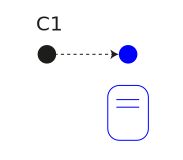
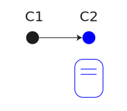
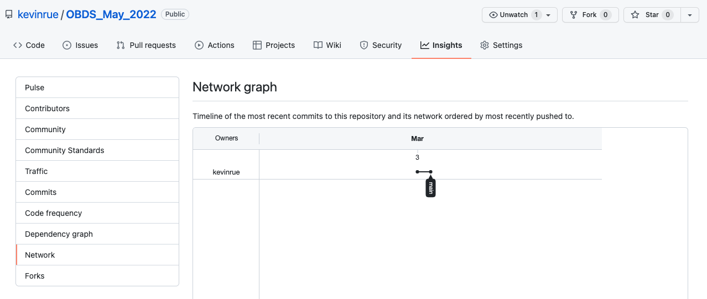
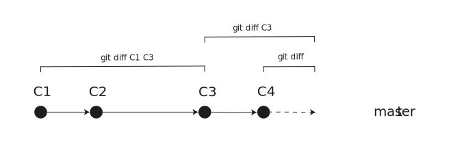
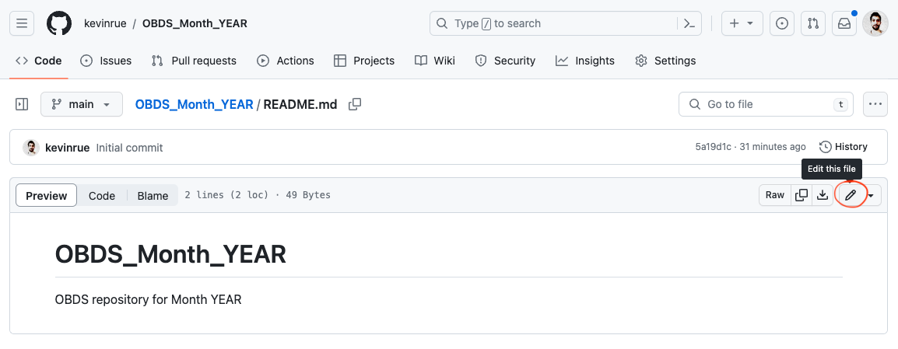
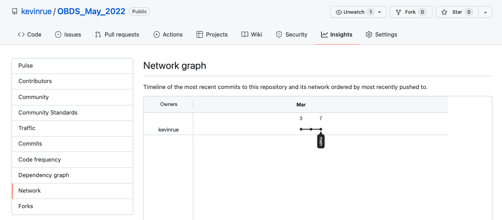

# The `.git` subdirectory

Change directory to your new local clone of the repository, and list its contents.

```{bash, eval=FALSE, echo=TRUE}
$ cd OBDS_May_2022
$ ls -a
```

```
.  ..  .git  README.md
```

Git uses the `.git` sub-directory to store all the information about the project history.
You can have a brief look for yourself if you wish.
Make sure that you do not alter or remove anything in that sub-directory.

```{bash, eval=FALSE, echo=TRUE}
$ ls -a .git/
```

#### Result

- Deleting the `.git` sub-directory is effectively discarding the _history_ of changes made to the repository.
- However, deleting the `.git` sub-directory does not affect the _current state_ of the other sub-directories and files that make up your project (e.g., `README.md`).

.center[
**Changes are stored separately from the files themselves.**
]

---

# Ignore files

One or more special files named `.gitignore` can be placed in your project.

Each line in those file specifies a file name or pattern that <i class="fab fa-git"></i> will ignore (i.e., not track) in the future.

- Files that are already tracked will continue to be tracked even after they are added to `.gitignore`, unless they are explicitly removed from the repository using `git rm` (use the `--cached` option to only remove the file from the index, but keep the file itself).

.pull-left[
## .gitignore
```
 .DS_Store
 data/
 *fastq.gz
 *sam
 *bam
```

**Can you tell which files will be tracked when this `.gitignore` exists in the project root directory?**
]

.pull-right[
```
my-project/
|_ .gitignore
|_ data_raw/
| |_ sample1.1.fastq
| |_ sample1.2.fastq
| |_ sample2.1.fastq.gz
| |_ sample2.2.fastq.gz
|_ data/
| |_ sample1.bam
| |_ sample2.bam
|_ scripts/
  |_ fastq_to_bam.sh
```
]

---

# Status of a repository

The `git status` sub-command can be used to check whether the repository is up-to-date.

```{bash, eval=FALSE, echo=TRUE}
$ git status
```

```
On branch main
Your branch is up to date with 'origin/main'.

nothing to commit, working tree clean
```

---

# Exercise

## Make changes

- Create a file named `.gitignore` in your repository.

```bash
touch .gitignore
```

- Optionally, add a line to that file, e.g.

```
# This file list file patterns to ignore from version control
```

- Run `git status` again.

.center[
**What does the command return this time? How do you interpret it?**
]

---

# Untracked files

Here is an example output of `git status`, after adding a new file `.gitignore`.

```
$ git status
On branch main
Your branch is up to date with 'origin/main'.

Untracked files:
  (use "git add <file>..." to include in what will be committed)
        .gitignore

nothing added to commit but untracked files present (use "git add" to track)
```

```{r, fig.align='center', out.height='200px', out.width='800px'}
# Source: Kevin Rue-Albrecht (Adobe Illustrator)

```

---

# Track new files

The `git add` sub-command can be used to add new sets of changes to the _staging area_.

- The _staging area_ is used to prepare the set of changes that will be recorded in the next _commit_.
- The command adds filenames to the staging area, but only the changes in those files will be recorded.
- In this case, we add a new file to the staging area, so the whole contents of the new file constitute the changes (relative to no file).

```{bash, eval=FALSE, echo=TRUE}
$ git add .gitignore
$ git status
```

```
On branch main
Your branch is up to date with 'origin/main'.

Changes to be committed:
  (use "git restore --staged <file>..." to unstage)
	new file:   .gitignore
```

.center[
**What changed in `git status` after running `git add`?**
]

---

# The staging area

We just ran `git add`, which added a set of changes to the _staging area_.

Then, we ran `git status`, as it is always a good idea to inspect the state of the repository to ensure everything is as expected before taking any further action.

The `git commit` sub-command can be used to add changes currently in the _staging area_ in the next _commit_ of the _repository_.

- The contents of the _staging area_ are added to a new _commit_ in the repository.
- The _staging area_ itself is cleared, ready for the next set of changes to process.

```{r, fig.align='center', out.height='200px', out.width='800px'}
# Source: https://swcarpentry.github.io/git-novice/04-changes/index.html
knitr::include_graphics("img/carpentries-git-staging-area.svg")
```

---

# Record a set of changes 

The `git commit` sub-command can be used to record the changes that are currently in the _staging area_ in the next _commit_ of the _repository_.

- The `-m` option can be used to specify the message used to annotate the _commit_ that will contain this set of changes. 

```{bash, eval=FALSE, echo=TRUE}
$ git commit -m "Added empty .gitignore file"
```

```
[main 81acf15] Added empty .gitignore file
 1 file changed, 0 insertions(+), 0 deletions(-)
 create mode 100644 .gitignore
```

.center[
**What information do you recognise in the message displayed as a result of the `git commit` command?**
]

```{r, fig.align='center', out.height='175px', out.width='800px'}
# Source: Kevin Rue-Albrecht (Adobe Illustrator)

```

---

# Remotes

You have made a _commit_ in the clone of the repository on the teaching cluster.

- The <i class="fab fa-github"></i> GitHub clone of the repository does not about it yet.

- You need to _push_ those updates from the teaching cluster to <i class="fab fa-github"></i> GitHub.

```{r, fig.align='center', out.height='300px', out.width='800px'}
# Source: Kevin Rue-Albrecht (Adobe Illustrator)

```

The histories

---

# Push commits to a remote

The `git push` sub-command can be used to send local changes to a remote repository.

- The local repository must have configured the address of the remote repository.
- When you create a repository as a _clone_ of a remote repository,
  this is done automatically (the remote `origin` is recorded during initialisation).

Before we push, the `git remote` command can be used to inspect, add, and remove remote repositories from the local repository configuration.

```{bash, eval=FALSE, echo=TRUE}
$ git remote -v
```

```
origin	git@github.com:kevinrue/OBDS_May_2022.git (fetch)
origin	git@github.com:kevinrue/OBDS_May_2022.git (push)
```

When everything is in place, you can tell <i class="fab fa-git"></i> to push new commits from the local clone to a remote.
When calling `git push` without any other argument,
the default is to push from the current branch to the corresponding branch on the remote named `origin`.

```{bash, eval=FALSE, echo=TRUE}
$ git push
```

---

# Exercise

## Push commits to a remote

- Run `git push`.

.center[
**How do you read the output message? (example below)**
]

```
$ git push
Enumerating objects: 3, done.
Counting objects: 100% (3/3), done.
Delta compression using up to 40 threads
Compressing objects: 100% (2/2), done.
Writing objects: 100% (2/2), 289 bytes | 96.00 KiB/s, done.
Total 2 (delta 0), reused 0 (delta 0), pack-reused 0
To github.com:kevinrue/OBDS_May_2022.git
   81acf15..9e2b638  main -> main
```

Alternatively, we could have used the following command to explicitly push
(the current branch) to the branch called `main` on the remote called `origin`
(for the same result).

```
git push origin main
```

---

# The repository history

## On <i class="fab fa-github"></i> GitHub

```{r, fig.align='center', out.height='325px', out.width='800px'}
# Screenshot (Kevin Rue-Albrecht)

```

.center[
**How do you read this graph?**
]

---

# View a commit

## On <i class="fab fa-github"></i> GitHub

```{r, fig.align='center', out.height='250px', out.width='800px'}
# Screenshot (Kevin Rue-Albrecht)
knitr::include_graphics("img/github-commit-view.png")
```

.center[
**How do you read this page?**
]

---

# The repository history

The `git log` sub-command can be used to display the history of commits in the repository.

- The `--all` option forces <i class="fab fa-git"></i> to display the repository history across all the branches.
  + By default, <i class="fab fa-git"></i> only displays the history of the branch currently checked out.
- The `--graph` option adds a visual representation of branches in the repository, and their connections to each other.
- The `--oneline` (i.e., "one line") forces <i class="fab fa-git"></i> to summarise each commit as a single line.
  + This limits the information displayed, but helps with the visualisation.

.small-code[
```{bash, eval=FALSE, echo=TRUE}
$ git log --all --graph --oneline
* 81acf15 (HEAD -> main, origin/main, origin/HEAD) Added empty .gitignore file
* 4df0fa7 Initial commit
```
]

.center[
**How do you read this commit history?**
]

- Compare with `git log` without any argument.

---

# View a commit

The `git show` sub-command can be used to examine individual past commits.

```{bash, eval=FALSE, echo=TRUE}
$ git show 81acf15
commit 81acf150152602ef2e64dca30b5b2796d4e131a0 (HEAD -> main, origin/main, origin/HEAD)
Author: Kevin Rue-Albrecht <kevinrue@users.noreply.github.com>
Date:   Thu Mar 3 16:22:03 2022 +0000

    Added empty .gitignore file

diff --git a/.gitignore b/.gitignore
new file mode 100644
index 0000000..e69de29
```

.center[
**How do you read this output history? What changes were recorded?**
]

---

# View differences between commits

The `git diff` sub-command can be used to compare two states of the repository.

- It is possible to compare all the changes between a reference and a target commits using the syntax `git diff reference_commit target_commit`
  + The order of commit identifiers control the changes that are shown as "added" or "removed".
- It is also possible to compare the current state of files in the repository - including uncommitted changes - to any commit of the repository.
  + This is often used to examine the changes that you have made since the most recent commit.

.pull-left[
.small-code[
```{bash, eval=FALSE, echo=TRUE}
$ git diff 4df0fa7 81acf15
diff --git a/.gitignore b/.gitignore
new file mode 100644
index 0000000..e69de29
```
]
]

.pull-right[
```{r, fig.align='center', out.height='200px', out.width='500px'}
# Source: Kevin Rue-Albrecht (Adobe Illustrator)

```
]

---

# Edit files on <i class="fab fa-github"></i> GitHub

Files can be created and edited directly on <i class="fab fa-github"></i> GitHub,
though only one file can be edited at a time in this way.
Saving the changes creates a new commit on <i class="fab fa-github"></i> GitHub.

## Exercise

On <i class="fab fa-github"></i> GitHub, navigate to the file `README.md`,
and click the pencil above the file on the right.

```{r, fig.align='center', out.height='300px', out.width='600px'}
# Source: Screenshot (Kevin Rue-Albrecht)

```

---

# Editing a file on <i class="fab fa-github"></i> GitHub

```{r, fig.align='center', out.height='500px', out.width='600px'}
# Source: Screenshot (Kevin Rue-Albrecht)
knitr::include_graphics("img/github-readme-edit.png")
```

.center[
**Click the green button `Commit changes` when you are ready.**
]

---

# Pull changes from a remote repository

Having just made changes to the files on <i class="fab fa-github"></i> GitHub:

- This does not (cannot!) automatically update the files in your clone(s) on clusters and personal computers.

- The changes need to be _pulled_ from <i class="fab fa-github"></i> GitHub to the clone.

## Exercise

- Compare the history of the repository on <i class="fab fa-github"></i> GitHub
  and your clone of of the repository.

```{r, fig.align='center', out.height='250px', out.width='600px'}
# Screenshot (Kevin Rue-Albrecht)

```

---

# Exercise

## Pull changes from a remote repository

In a Terminal, set the working directory inside your clone of the repository, and run `git pull`.

.center[
**How do you read the message output? (example below)**
]

```
$ git pull
remote: Enumerating objects: 5, done.
remote: Counting objects: 100% (5/5), done.
remote: Compressing objects: 100% (3/3), done.
remote: Total 3 (delta 0), reused 0 (delta 0), pack-reused 0
Unpacking objects: 100% (3/3), 718 bytes | 17.00 KiB/s, done.
From github.com:kevinrue/OBDS_May_2022
   81acf15..73f7a57  main       -> origin/main
Updating 81acf15..73f7a57
Fast-forward
 README.md | 3 +++
 1 file changed, 3 insertions(+)
```

Have a look at `git status` and `git log`, and compare with the history of the repository on <i class="fab fa-github"></i> GitHub.
