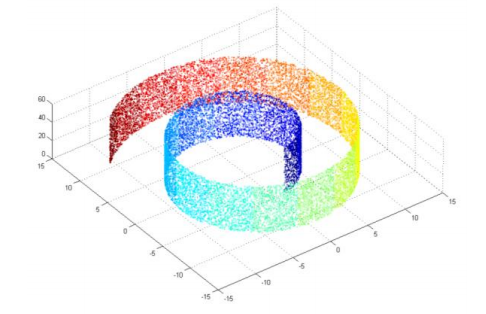
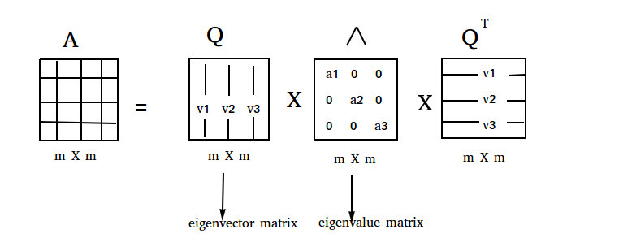

layout: true

<div class="my-header"></div>

<div class="my-footer"><span>
Kevin Rue-Albrecht
&emsp;&emsp;&emsp;&emsp;&emsp;&emsp;&emsp;&emsp;&emsp;&emsp;
Dimensionality reduction using <i class="fab fa-python"></i> Python
</span></div> 

```{r setup, include = FALSE}
stopifnot(requireNamespace("htmltools"))
htmltools::tagList(rmarkdown::html_dependency_font_awesome())
knitr::opts_chunk$set(
  message = FALSE, warning = FALSE, error = FALSE, include = TRUE, echo = FALSE,
  fig.align='center', out.height='500px'
)
options(width = 90)
stopifnot(require(base))
```

```{r, load_refs, include=FALSE, cache=FALSE}
options(htmltools.dir.version = FALSE)
library(RefManageR)
BibOptions(
  check.entries = FALSE,
  bib.style = "authoryear",
  cite.style = "authoryear",
  style = "markdown",
  hyperlink = "to.doc",
  dashed = TRUE)
bib <- ReadBib("bibliography.bib")
```

---

# Learning Objectives & Goals

## Learning Goals

- Understand what dimensionality reduction is.
- Describe when and how to use it.

## Objectives

- Apply various dimensionality reduction methods to a data set.
- Visualise the output of dimensionality reduction.

---

# Pre-requisites

.x-large-list[
- Access to the CCB cluster and the shared data folder.

- A working installation of <i class="fab fa-git"></i>.

- A clone of the shared <i class="fab fa-github"></i> GitHub repository for this course.

- A working installation of [Miniconda](https://docs.conda.io/en/latest/index.html).
]

---

# Credits

.center[
<i class="fab fa-github"></i> <https://github.com/mGalarnyk/Python_Tutorials>

Paul Brodersen
]

---

# What is dimensionality reduction?

.pull-left[
```{r}
x_nrow <- 10
x <- data.frame(
  V1 = rep(".", 10),
  V2 = rep(".", 10),
  V3 = rep(".", 10),
  V4 = rep(".", 10),
  V5 = rep(".", 10),
  V6 = rep(".", 10),
  row.names = paste0("sample", 1:x_nrow))
knitr::kable(x)
```
]

.pull-right[
```{r}
x_nrow <- 10
x <- data.frame(
  D1 = rep(".", 10),
  D2 = rep(".", 10),
  D3 = rep(".", 10),
  row.names = paste0("sample", 1:x_nrow))
knitr::kable(x)
```
]

---

# Why and when should you use dimensionality reduction?

```{r, echo=FALSE, out.height='400px'}
# Source: https://medium.com/analytics-vidhya/locally-linear-embedding-lle-data-mining-b956616d24e9

```

.center[
1. Visualisation
2. Interpretation
3. Compression
]

---

# How can we reduce dimensions?

## Method 1: Principal components analysis (PCA)

```{r, echo=FALSE, out.height='400px'}
# Source: https://towardsdatascience.com/pca-clearly-explained-how-when-why-to-use-it-and-feature-importance-a-guide-in-python-7c274582c37e
knitr::include_graphics("img/pca.jpeg")
```

---

# Principal components analysis (PCA)

## Eigenvalue decomposition

```{r, echo=FALSE, out.height='300px'}
# Source: https://blog.paperspace.com/dimension-reduction-with-principal-component-analysis/

```

#### Intepretation

- Eigenvectors = new axes through the data set.

- Eigenvalues = variance in the data set along the corresponding eigenvector.

---

# Set up

Use `conda.yml` to create a Conda environment for this exercise.

```{bash, echo=TRUE, eval=FALSE}
conda env create --file conda.yml --name obds-py-dimred
```

Activate the environment.

```{bash, echo=TRUE, eval=FALSE}
conda activate obds-py-dimred
```

Launch JupyterLab.

```{bash, echo=TRUE, eval=FALSE}
jupyter lab
```

Navigate to the sub-directory for today, and create a new notebook with your name,
e.g. `kevinrue.ipynb`.

---

# Import the data set

Import the `pandas` package like a pro!

```{python, echo=TRUE, eval=FALSE}
import panda as pd
```

.center[
**What does this line do? What are the consequences?**
]

--

Use the function `read_csv()` (in the `pandas` library) to import data from the file `iris.data`,
into a variable called `iris_data`.

```{python, echo=TRUE, eval=FALSE}
iris_data = ...
```

.center[
**What are the default column names?**
]

--

Use the following list of column names.

```{python, echo=TRUE, eval=FALSE}
['sepal length','sepal width','petal length','petal width','target']
```

Display the first 5 rows of the data set.

---

# Standardise the data

> Standardise = Center and scale each feature measured in the data set.

.center[
**Why would we want to do this? Can we standardise _all_ the variables in this data set?**
]

--

## Split measurements from class labels

First, separate the numerical measurements and the classification labels in two separate variables,
`iris_features` and `iris_class`, respectively.

```{python, echo=TRUE, eval=FALSE}
iris_features = ...
iris_class = ...
```

#### Hints

- For a data frame `df`, you can use the property [`df.loc`](https://pandas.pydata.org/docs/reference/api/pandas.DataFrame.loc.html) to access rows and columns by label.
- You can use the symbol `:` alone to access _all_ the rows and/or columns.
- For a data frame `df`,  you can extract _values_ as an Numpy array using the property [`df.values`](https://pandas.pydata.org/docs/reference/api/pandas.DataFrame.values.html).

---

# Standardise the data

We will use the [`StandardScaler`](https://scikit-learn.org/stable/modules/generated/sklearn.preprocessing.StandardScaler.html) class in the `scikit-learn` package, to standardize features by removing the mean and scaling to unit variance.

```{python, echo=TRUE, eval=FALSE}
from sklearn.preprocessing import StandardScaler
```

.center[
**Where should you add this line?**
]

--

Use the method [`fit_transform()`](https://scikit-learn.org/stable/modules/generated/sklearn.preprocessing.StandardScaler.html#sklearn.preprocessing.StandardScaler.fit_transform) of the `StandardScaler` object to standardise the set of measurements (we called it `iris_features`).
Aœssign the standardised data to the new variable name `iris_standardised`.

.center[
**Print the first four rows of `iris_standardised` and compare with `iris_features`.**
]

--

#### Bonus point

Use `pd.DataFrane` to reconstruct a data frame from the new value of `iris_features` and the names of the features measured.

You do not need to assign this to any variable.
The goal is simply to display the result nicely in the notebook.

---

# Apply PCA

We will use the [`PCA`](https://scikit-learn.org/stable/modules/generated/sklearn.decomposition.PCA.html) class in the `scikit-learn` library, to perform principal component analysis.

```{python, echo=TRUE, eval=FALSE}
from sklearn.decomposition import PCA
```

.center[
**Where should you add this line?**
]

--

Running a PCA using `scikit-learn` generally involves two steps:

1. Use the `PCA` module to create an object (e.g. `pca_iris`) that defines the parameters of the analysis.
  For instance, `PCA(n_components=2)` will return only the first two principal components.
2. Use the `fit_transform()` function of the `pca_iris` object to perform the analysis on the standardised data set.
  Assign the output of that function to a new variable `principalComponents`.

.center[
**What is the maximal number of principal components that can be computed on this data set?**

**What is the return value of the `fit_transform()` function?**
]

--

Use the return value of `fit_transform()` to create a `pandas.DataFrame` called `pca_dataframe`.
Name the columns of the data frame `PC 1`, `PC 2`, and so on.

```{python, echo=TRUE, eval=FALSE}
pca_dataframe = ...
```

---

# Visualise the PCA projection

We will use the [`pyplot`](https://matplotlib.org/2.0.2/api/pyplot_api.html) module in the `matplotlib` library, to construct a scatter plot of the first two principal components.

```{python, echo=TRUE, eval=FALSE}
import matplotlib.pyplot as plt
```

.center[
**Where should you add this line? What does it do?**
]

#### Hints

- Initialise a new figure.
- Initialise a new figure panel.
- Set the two axis labels and the plot title.
- Draw a scatter plot of the two principal components.
- Display grid lines in the background.

#### Bonus point

Color data points according to their class label. (**Recommendation:** start over in a separate notebook cell).

- Use `pd.concat()` to add the class label to the data frame.
  Assign to `pca_dataframe_labelled`.
- Use a `for` loop and `zip()` to iteratively add data points with a different color for each species.

---

# Variance explained by PCA

The variance explained by each principal component is stored in the `pca_iris` object that we used to apply PCA to the data set.

```{python, echo=TRUE, eval=FALSE}
pca_iris.explained_variance_ratio_
```

.center[
**Running PCA without standardisation yielded the following variance explained for the first four components. How do you compare this with your results?**
]

```
array([0.92461621, 0.05301557, 0.01718514, 0.00518309])
```

The variance explained by principal components is additive and the sum across all principal components cannot exceed 1 (100% of the variance in the original data set).

.center[
**How much variance is explained by the principal components that you have computed?**
]

#### Bonus point

Use `matplotlib` to draw a bar plot of the variance explained by each principal component

- Make sure the x-axis ticks reflect the name of each principal component.
- You can use [`numpy.arange`](https://numpy.org/doc/stable/reference/generated/numpy.arange.html) to generate series of evenly spaced values within a given interval.

---

# Summary: PCA

.center[
**Discuss the pros and cons in the following statements.**
]

- PCA is sensitive to variance: check if your data needs scaling.

- The directions of largest variance are assumed to be the most interesting.

- Principal components are linear combinations of the original dimensions,
  i.e, PCA can only rotate the original set of axes in your data.

- When some original variables are correlated, PCA can achieve dimensionality reduction.

- If the original variables are uncorrelated (i.e. orthogonal), PCA orders them by decreasing variance.

- Principal components that explain small amounts of variance can be excluded from downstream amalyses.

---

# How can we reduce dimensions?

## Method 2: Uniform Manifold Approximation and Projection (UMAP)

<i class="fab fa-youtube"></i> <https://www.youtube.com/watch?v=nq6iPZVUxZU&ab_channel=Enthought>

UMAP Uniform Manifold Approximation and Projection for Dimension Reduction | SciPy 2018 |

> This talk will present a new approach to dimension reduction called UMAP. UMAP is grounded in manifold learning and topology, making an effort to preserve the topological structure of the data. The resulting algorithm can provide both 2D visualisations of data of comparable quality to t-SNE, and general purpose dimension reduction. UMAP has been implemented as a (scikit-learn compatible) python library that can perform efficient dimension reduction, scaling out to much larger datasets than t-SNE or other comparable algorithms (see http://github.com/lmcinnes/umap​).

---

# Apply UMAP

We will use an instance of the [`UMAP`](https://scikit-learn.org/stable/modules/generated/sklearn.decomposition.PCA.html) class in the `umap` library (`umap-learn` package), to perform the analysis on the set of principal components (i.e. not the original data set).

.center[
**Why is this often a good idea? Consider other forms of the data set that we could input to UMAP.**
]

```{python, echo=TRUE, eval=FALSE}
import umap
```

.center[
**Where should you add this line?**
]

--

Running UMAP generally involves two steps:

1. Create a `UMAP` object (e.g. `umap_reducer`) that defines the parameters of the analysis.
2. Use the `fit_transform()` function of the `umap_reducer` object to perform the analysis.
  Assign the output of that function to a new variable `umap_iris_embedding`.

.center[
**What are some basic parameters of UMAP objects?**

**What is the return value of the `fit_transform()` function?**
]

---

# Visualise the UMAP projection

We will re-use the [`pyplot`](https://matplotlib.org/2.0.2/api/pyplot_api.html) code that we wrote to visualise the PCA projection.

#### Hints

- Create a `pandas.DataFrame` that combines the UMAP projections and the class labels.
  Call it `umap_iris_dataframe`.
- Draw a scatter plot of UMAP projections, colored by class label.

---

# Summary: UMAP

.center[
**Discuss the pros and cons in the following statements.**
]

- What does the acronym say about the method? (Uniform Manifold Approximation and Projection)

- UMAP is a _non-linear_ dimensionality reduction method.

---

# Further reading

## Novice

- <https://swcarpentry.github.io/python-novice-inflammation/>

## Advanced

- <https://pandas.pydata.org/>
- <https://scikit-learn.org/stable/>
- <https://matplotlib.org/stable/>

---

# References

```{r refs, results="asis"}
PrintBibliography(bib)
```

???

Extras:

- Install `git`
- `git init` (as opposed to `git clone`)
- `git merge` vs `git rebase`
