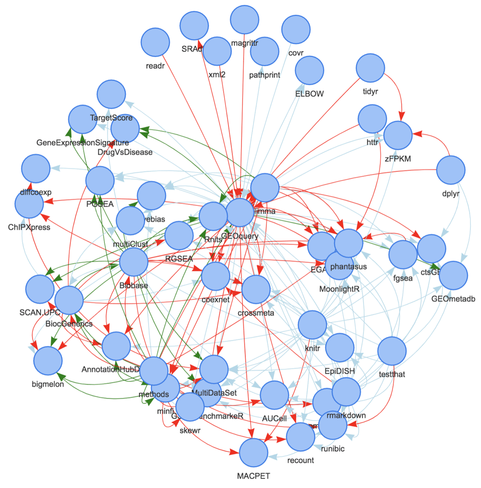

# Bioconductor resources and help

```{r, include=TRUE, echo=FALSE, out.height="100px", out.width="350px", fig.align="center"}
knitr::include_graphics("https://www.bioconductor.org/images/logo/jpg/bioconductor_logo_cmyk.jpg")
```

| Resource | Location |
|:--------:||:-------:|
| Main website | <https://www.bioconductor.org/> |
| Support site | <https://support.bioconductor.org/> |
| Courses & Conferences materials | <https://www.bioconductor.org/help/course-materials/> | 
| YouTube videos | <https://www.youtube.com/user/bioconductor> |
| Books | <http://www.bioconductor.org/books/release/> |
| Slack workspace | <https://bioc-community.herokuapp.com/> |
 
.center[
**... and more! Can you think of others?**
]

---

# Project objectives

```{r, include=TRUE, echo=FALSE, out.height="100px", out.width="350px", fig.align="center"}
knitr::include_graphics("https://www.bioconductor.org/images/logo/jpg/bioconductor_logo_cmyk.jpg")
```

.center[
**Analysis and comprehension of high-throughput genomic data**
]

- Statistical analysis: large data, technological artifacts, designed experiments; rigorous, robust.

- Comprehension: biological context, visualization, reproducibility.

- High-throughput.

  + Sequencing: RNA-seq, ChIP-seq, variants, copy number, ...

  + Microarrays: gene expression, SNP, ...

  + Flow cytometry, proteomics, images, ...

???

Source: [Introduction to R / Bioconductor (2016)](https://bioconductor.org/help/course-materials/2016/BiocIntro-May/B1_Bioconductor_Intro.html) by Martin Morgan

---

# Bioconductor packages in a workflow

```{r, include=TRUE, echo=FALSE, out.height='450px', out.width='800px'}
knitr::include_graphics("img/bioc-sequencing-ecosystem.svg")
```

.footnote[
Adapted from: [Introduction to R / Bioconductor (2019)](https://www.bioconductor.org/help/course-materials/2019/CSAMA/L1.3-starting-an-analysis.html) by Martin Morgan
]

---

# Bioconductor release 3.14 (October 27, 2021)

- Contents
  + 2083 software packages
  + 408 experiment data packages
  + 904 annotation packages
  + 29 workflows

- Updates
  + 89 new software packages
  + 13 new data experiment packages
  + 10 new annotation packages
  + 1 new workflow
  + no new books

- Compatibility
   + Bioconductor 3.14 is compatible with R 4.1.1
   + Supported on Linux, 32- and 64-bit Windows, and Intel 64-bit macOS 10.13 (High Sierra) or higher

Source: <https://bioconductor.org/news/bioc_3_14_release/>

---

# Finding packages and information

- Discover and navigate packages via [biocViews](https://www.bioconductor.org/packages/devel/BiocViews.html).

  + Filter: Software, Annotation, Experiment, Workflow, ...

- Learn more on each [package landing page](https://bioconductor.org/packages/release/bioc/html/Biobase.html)

  + Title, authors, maintainer, short description, citation, installation instructions, …, download statistics.

- All user-visible functions have help pages, most with runnable examples.

  + Learn by doing on a minimal example; positive control; sanity check.

- Vignettes

  + Narrative documents illustrating how to use the package, integrating code in a workflow, e.g. `browseVignettes("Biobase")`.

- Release cycle

  + Every six months; development takes place on a separate branch of the repository.

???

**Source:**

- [Introduction to R / Bioconductor (2019)](https://www.bioconductor.org/help/course-materials/2019/CSAMA/L1.3-starting-an-analysis.html) by Martin Morgan

---

# Exercise

## Exploring software packages

- Visit the listing of packages on the Bioconductor [biocViews](https://bioconductor.org/packages/release/BiocViews.html) web page.

- Use the `Autocomplete biocViews search` box in the upper left to identify packages that have been tagged for RNA sequencing analysis.

- Explore other analysis like ChIP-seq, epigenetics, variant annotation, proteomics, single-cell genomics, etc.

- Explore the graph of software packages by expanding and contracting individual terms.

- In the RNA-seq category, find out which of `DESeq2` and `edgeR` is more popular, and go to their landing page.

- Briefly explore the vignette and reference manual links.

.center[
**When would you consult the vignette? When would the reference manual be helpful?**
]

???

Source: [Introduction to R / Bioconductor (2019)](https://www.bioconductor.org/help/course-materials/2019/CSAMA/L1.3-starting-an-analysis.html) by Martin Morgan
]

---

# Exercise

## Exploring annotation packages

- Visit the listing of packages on the Bioconductor [biocViews](https://bioconductor.org/packages/release/BiocViews.html) web page.

- Click on the `AnnotationData` top-level term.

- Search, using the box on the right-hand side, for annotation packages that start with the following letters to get a sense of the packages and organisms available.

  + `org.`: symbol mapping
  + `TxDb.` and `EnsDb.`: gene models
  + `BSgenome.`: reference genomes

## Exploring workflow packages

Workflow packages are meant to provide a comprehensive introduction to workflows that require several different packages.
These can be quite extensive documents, providing a very rich source of information.

- Briefly explore the ‘Simple Single Cell’ workflow (or other workflow relevant to your domain of interest) to get a sense of the material the workflow covers.

???

Source:

- [Introduction to R / Bioconductor (2019)](https://www.bioconductor.org/help/course-materials/2019/CSAMA/L1.3-starting-an-analysis.html) by Martin Morgan

---

# The Bioconductor philosophy

- Common data structures

  + e.g., `DNAStringSet`, `GRanges`, `GAlignments`, `SummarizedExperiment`, `TxDb`

  + High standards of software engineering; [Core team](https://www.bioconductor.org/about/core-team/).

  + Reduce redundancy; Promotes interoperability.

  + ..., but community adoption can take time.

--

- Release cycle every 6 months (April, October)

  + Packages on the _release_ branch are stable for at least 6 months
    (except for exceptional bug fixes).
    Active development takes place on the _devel_ branch.
  
  + ..., but new features can take up to 6 months to be released (_devel_ $\rightarrow$ _release X.Y_).

--

- New packages are thoroughly reviewed by members of the core team and volunteers

  + Packages are submitted as issues on <i class="fa fa-github"></i> [Bioconductor/Contributions](https://github.com/Bioconductor/Contributions)
  
  + Review and fixes can take time, but accepted packages are generally high quality!

???

**Source:**

- [Introduction to R / Bioconductor (2019)](https://www.bioconductor.org/help/course-materials/2019/CSAMA/L1.3-starting-an-analysis.html) by Martin Morgan

---

# Bioconductor uses the S4 class system

.pull-left[
- Best practices: classes and methods implemented in a dedicated package.

- Formal definition: parent class (optional), new slot names and types.

- Internal validity checking method.

- Methods and generics implemented outside the class definition.

  + "What can I do with this object?"

```{r, include=TRUE, results='hide'}
setClass("Person",
  representation(
    name = "character",
    age = "numeric")
  )
```

Source: <http://adv-r.had.co.nz/S4.html>
]

.pull-right[
```{r}
Person <- function(name, age) {
  new("Person", name = name, age = age)
}
```

```{r, include=TRUE}
kevin <- Person(name = "Kevin", age = 21)
kevin
```

```{r, include=TRUE}
kevin@age # don't do that
```

```{r}
get_age <- function(object) {
  object@age
}
```

```{r, include=TRUE}
get_age(kevin) # do that (if possible)
```
]

---

# Bioconductor packages depend on each other

.pull-left[
```{r, include=TRUE, echo=FALSE, fig.align='center'}
## Source: https://f1000research.com/articles/8-752

# Ideally, generate the figure using BiocPkgTools for package DESeq2
```
]

.pull-right[
Data visualization of dependencies between all packages within one degree of the GEOquery package.

Links are colored based on type (Suggests [light blue], Depends [green], and Imports [red]) and arrows point to the “dependent” package.
]

.footnote[
`r BiocStyle::Biocpkg("BiocPkgTools")` `r Citep(bib, "biocpkgtools2019f1000")`
]
