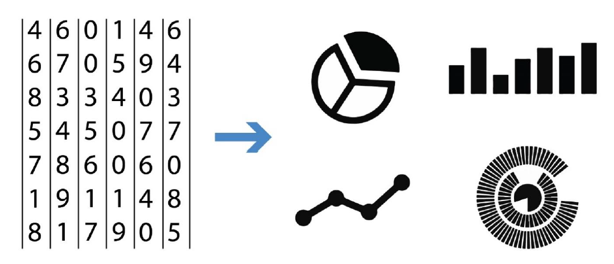

layout: true

<div class="my-header"></div>

<div class="my-footer"><span>
Kevin Rue-Albrecht
&emsp;&emsp;&emsp;&emsp;&emsp;&emsp;&emsp;&emsp;&emsp;
Introduction to ggplot2
</span></div>

```{r setup, include = FALSE}
stopifnot(requireNamespace("htmltools"))
htmltools::tagList(rmarkdown::html_dependency_font_awesome())
knitr::opts_chunk$set(
  message = FALSE, warning = FALSE, error = FALSE,
  include = FALSE
)
options(width = 200)
```

```{r, load_refs, include=FALSE, cache=FALSE}
options(htmltools.dir.version = FALSE)
library(RefManageR)
BibOptions(
  check.entries = FALSE,
  bib.style = "authoryear",
  cite.style = "authoryear",
  max.names = 2,
  style = "markdown",
  hyperlink = "to.doc",
  dashed = TRUE)
bib <- ReadBib("bibliography.bib")
```

---

# Prerequisites

<br/>

.x-large-list[
- A clone of a personal GitHub repository for this course.

- A clone of a shared GitHub repository for this course.

- A working installation of [R](https://www.r-project.org/) (4.0.3) including the `r BiocStyle::CRANpkg("renv")` package.

- A working installation of [git](https://git-scm.com/).

- A working installation of [RStudio](https://rstudio.com/).
]

---

# Lesson goals and objectives

## Learning goals

.x-large-list[
- Describe how to build and display `r BiocStyle::CRANpkg("ggplot2")` figures.

- Understand the notion of aesthetics.

- Describe tidy data.
]

## Learning objectives

.x-large-list[
- Set up a project environment to work with `r BiocStyle::CRANpkg("ggplot2")`.

- Build and display, manage, and share `r BiocStyle::CRANpkg("ggplot2")` figures.
]

---

# Plots - Visualise and comprehend data

```{r, include=TRUE, echo=FALSE, fig.align='center'}

# Source: https://www.autodesk.com/autodesk-university/article/Turn-Revit-Data-Useful-Information-Visualization-Techniques-and-Workflows-2019
```

---

# Plots - Beyond summary statistics

```{r, include=TRUE, echo=FALSE, fig.align='center'}
knitr::include_graphics("img/plot-same-mean.gif")
# Source: https://www.variancereduction.com/single-post/2017/06/12/same-stats-different-graphs-the-importance-of-data-visualization
```

---

# Plots, plots everywhere!

```{r, include=TRUE, echo=FALSE, fig.align='center', out.height='500px'}
knitr::include_graphics("img/plots-plots-everywhere.jpg")
# Source: https://makeameme.org/meme/plots-plots-everywhere
```

---

# Plotting in base <i class="fab fa-r-project"></i>

```{r, include=TRUE, fig.align='center', fig.height=4, fig.width=8}
hist(iris$Sepal.Length, breaks = 25, xlab = "Sepal Length",
  main = "Histogram of sepal lengths", col = "grey90", border = "red",
  xlim = c(4, 8), cex.lab = 1.5, cex.axis = 1.5, cex.main = 2)
```

```{r, include=TRUE}
head(iris$Sepal.Length)
```

---

# Tidy data

```{r, include=TRUE}
head(iris)
```

```{r, include=TRUE}
summary(iris)
```

---

# Plotting tidy data with `r BiocStyle::CRANpkg("ggplot2")`

```{r, include=TRUE, fig.align='center', fig.height=4.5, fig.width=8}
library(ggplot2)
plot1 <- ggplot(iris, aes(x = Sepal.Length)) +
  geom_histogram(fill = "grey", color = "black") +
  labs(title = "Histogram of sepal lengths", y = "Frequency", x = "Sepal length") +
  theme(text = element_text(size = 16))
print(plot1)
```

---

# `r BiocStyle::CRANpkg("ggplot2")`

.pull-left[
- Currently the most popular plotting framework in <i class="fab fa-r-project"></i>

- Uses tidy data (part of the `r BiocStyle::CRANpkg("tidyverse")`

  + e.g. `data.frame`, `datatable`, `tibble`
  
  + One row - one data point
  
  + One column - one feature of data points, e.g. position on x axis, color, size

- Introduction and Cheatsheet: <https://ggplot2.tidyverse.org/>
]

.pull-right[
```{r, include=TRUE, echo=FALSE, fig.align='center'}
knitr::include_graphics("img/rstudio-cheatsheet-ggplot.png")
# Source: https://makeameme.org/meme/plots-plots-everywhere
```
]

---

# Geometric objects

A **layer** combines **data**, **aesthetic** mapping, a **geom** (geometric object), a **stat** (statistical transformation), and a **position** adjustment.
Typically, you will create layers using a `geom_` function, overriding the default **position** and **stat** if needed.

Reference: <https://ggplot2.tidyverse.org/reference/#section-geoms>

- `geom_point()` - scatter plot, requires `x` and `y`.

- `geom_histogram()` - histogram, requires `x` (continuous).

- `geom_bar()` - histogram, requires `x` (categorical).

- `geom_col()` - histogram, requires `x` and `y`.

- `geom_boxplot()` - boxplot, requires `x` and/or `y`.

- `geom_line()` - connect consecutive observations with line, requires `x` and `y`.

**Note:** refer to man pages for optional and alternative aesthetics for each **geom**.

---

# Exercise with the built-in `diamonds` dataset

```{r, include=TRUE}
diamonds
```

**Note:** refer to the man page for more information about each column.

---

# Exercise

## Specify the dataset.

Use `library(ggplot2)` to load the package.

What does `ggplot(diamonds)` do?

## Add the aesthetics.

What does `ggplot(diamonds, aes(x = carat, y = price))` do?

## Add geometric objects

- Draw points showing `carat` on the x-axis and `price` on the y-axis.

- Color data points by `cut`.

- Add a smoothed mean trend line.

**Note:** identify the relevant `geom_` function and add it as an additional layer.

---

# Exercise

## Predict the difference between these two plots

### Plot 1

```{r, include=TRUE, eval=FALSE}
ggplot(diamonds, aes(x = carat, y = price, colour = cut)) +
  geom_point() +
  geom_smooth()
```

### Plot 2

```{r, include=TRUE, eval=FALSE}
ggplot(diamonds, aes(x = carat, y = price)) +
  geom_point(aes(colour = cut)) +
  geom_smooth()
```

---

# Answer

.pull-left[
.small-code[
```{r, include=TRUE, fig.height=4, fig.width=5, fig.align='center'}
ggplot(diamonds, aes(x = carat, y = price, colour = cut)) +
  geom_point() +
  geom_smooth()
```
]

**Note:** Colour aesthetic is passed to both `geom_point()` and `geom_smooth()`.
]

.pull-right[
.small-code[
```{r, include=TRUE, fig.height=4, fig.width=5, fig.align='center'}
ggplot(diamonds, aes(x = carat, y = price)) +
  geom_point(aes(colour = cut)) +
  geom_smooth()
```
]

**Note:** Colour aesthetic is only known to `geom_point()`.
]

---

# Themes

Themes are a powerful way to customize the non-data components of your plots, e.g.

- axis ticks - `element_line(colour, size, linetype, ...)`

- axis text - `element_text(family, face, colour, size, hjust, ...)`

- background - `element_rect(fill, colour, size, linetype, color, ...)`

```{r, include=TRUE, results='hide'}
theme(
  axis.ticks = element_line(size = 2),
  axis.text.x = element_text(face = "italic", hjust = 1),
  plot.background = element_rect(fill = "grey90", colour = "black")
)
```

You can get details of the current theme using `theme_get()`.

A number of presets are available, e.g. `theme_classic()`, `theme_minimal()`, `theme_bw()`.

**Note:** you can combine a preset theme with further customisation, e.g. `theme_minimal() + theme(...)`.

---

# Preset themes

```{r, include=TRUE}
base_plot <- ggplot(diamonds, aes(x = carat, y = price, colour = cut)) +
  geom_point()
```

.pull-left[
```{r, include=TRUE, fig.height=4, fig.align='center'}
base_plot + theme_classic()
```
]

.pull-left[
```{r, include=TRUE, fig.height=4, fig.align='center'}
base_plot + theme_dark()
```
]

---

# Customise the theme

```{r, include=TRUE, fig.height=5, fig.width=12, fig.align='center'}
base_plot +
  labs(title = "Diamond price and carat values",
  x = "Carat", y = "Price") +
  theme(axis.title = element_text(size = 16, face = "bold"),
  axis.text = element_text(size = 14),
  plot.title = element_text(hjust = 0.5, size = 20))
```

---

# Plot grids - cowplot

```{r, include=TRUE, fig.height=5, fig.width=12, fig.align='center'}
plot1 <- base_plot + theme_classic() + labs(title = "Theme classic")
plot2 <- base_plot + theme_dark() + labs(title = "Theme dark")
library(cowplot)
plot_grid(plot1, plot2, labels = c("A", "B"), ncol = 2, nrow = 1)
```

---

# Plot grids - patchwork

```{r, include=TRUE, fig.height=5, fig.width=12, fig.align='center'}
library(patchwork)
plot1 + plot2
```

---

# Plot grids - gridExtra

```{r, include=TRUE, fig.height=5, fig.width=12, fig.align='center'}
library(gridExtra)
grid.arrange(plot1, plot2, ncol = 2, nrow = 1)
```

---

# Plot grids - gridExtra

```{r, include=TRUE, fig.height=6, fig.width=5, fig.align='center'}
library(gridExtra)
plot1 / plot2
```

---

# Facets - Wrap

Wrap a 1-dimensional 'ribbon' of plots over dimensions using `facet_wrap(~variable)`:

```{r, include=TRUE, fig.height=5, fig.width=12, fig.align='center'}
ggplot(diamonds, aes(x = carat, y = price)) +
  geom_point() +
  facet_wrap(~cut, nrow = 2)
```

---

# Facets - Grid

Arrange plots by row and column following two variables using `facet_grid(row ~ column)`

```{r, include=TRUE, fig.height=5, fig.width=12, fig.align='center'}
ggplot(diamonds, aes(x = carat, y = price)) +
  geom_point() +
  facet_grid(cut ~ color)
```

---

# Exercise

- Load the `ChickWeight` data set.

- Plot a histogram of chick weight.

- Change the fill and border color of the bars.

- Change the number of bins (i.e.,bars).

**Note:** you may change the bin width or the total number of bars.

- Change the label and font size of the axes.

- Change the font size and angle of the x-axis tick labels.

**Note:** you will probably want to justify the text labels as right-aligned.

- Change the y-axis upper limit to an arbitrary number, e.g. 100.

- Facet a vertical strip of histograms, one for each diet.

**Note:** you may also like to fill bars with a different color for each diet.

- Allow each facet to fit the y-axis range to its own data.

---

# Exercise

Using the `ChickWeight` data set:

- Create a scatter plot of weight (y-axis) over time (x-axis).

- Color by diet.

- Add a linear mean trend line for each diet.

- Which diet leads to the highest mean increase in weight?

- Collate that last plot with the last histogram in the previous exercise.

- Label the panels "A" and "B".

---

# Further reading

## ggplot2

- Introduction and Cheatsheet: <https://ggplot2.tidyverse.org/>

## renv

- [Documentation (pkgdown)](https://rstudio.github.io/renv/)

---

# References

.small-text[
```{r, include=TRUE, echo=FALSE, results="asis"}
PrintBibliography(bib)
```
]
