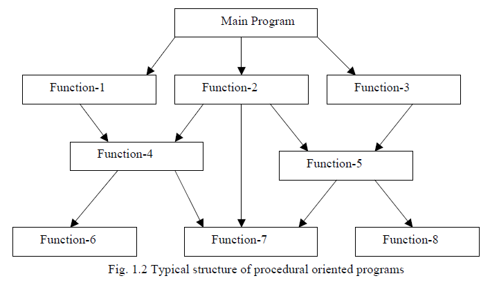
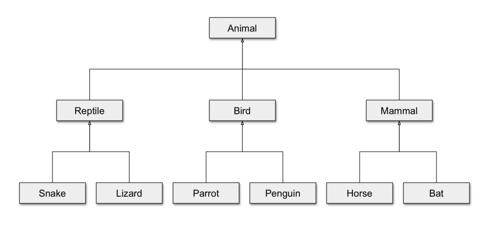
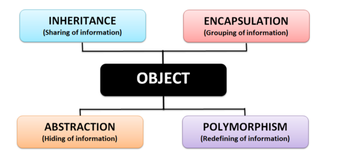
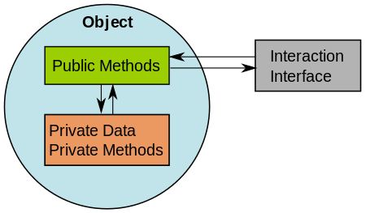
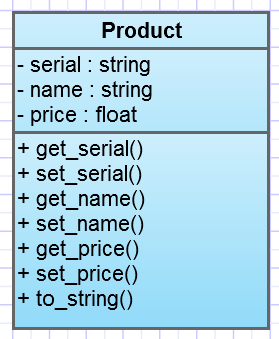
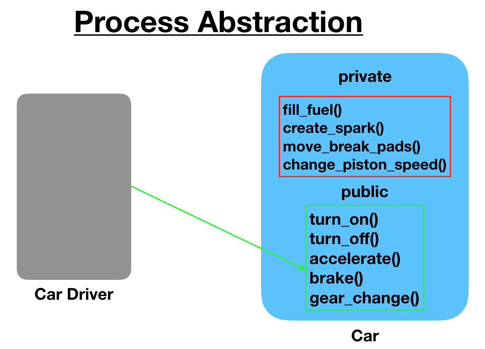
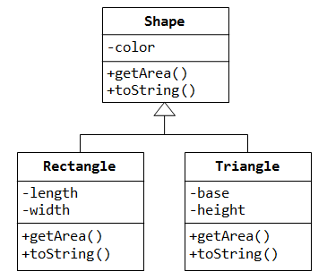

# Procedural programming

We often see programming as applying functions to variables in our workspace.
This is but one type of programming paradigm.

.pull-left[
```{r, include=TRUE, echo=FALSE, fig.align='center'}
## Source: http://www.hexainclude.com/procedure-oriented-programming-language/

```
]

.pull-right[
- Divide and conquer

- Readable

- Sustainable

- Easier to debug

- Reuse code
]

---

# Classes: the cornerstone of OOP

- _Classes_ represent the generic definition of real-world objects.

- _Objects_ are instances of classes representing individual examples.

- Class _attributes_ store data specific to individual objects.

- Class _methods_ are functions specialised in manipulating class attributes.

- Classes often have hierarchical (and nested) relationships.

.pull-left[
```{r, include=TRUE, echo=FALSE, fig.align='center', out.height='200px'}
## Source: https://medium.com/cultured-perl/test-class-hierarchy-is-an-antipattern-391c6ef1e491

```
]

.pull-right[
```{r, include=TRUE, echo=FALSE, fig.align='center', out.height='250px'}
## Source: https://bournetocode.com/projects/AQA_A_Theory/pages/OOP.html
knitr::include_graphics("img/class-bike.png")
```
]

---

# Analogy

- A _class_ is the generic description of an object
  
  + Like a recipe for a dish; or an entry in a dictionary.

- An _object_ is an instance of that class

  + Like one specific plate of food serve on a table.

```{r, include=TRUE, echo=FALSE, fig.align='center', out.height='300px'}
## Source: https://www.guru99.com/java-oops-class-objects.html
knitr::include_graphics("img/class-object-relationship.jpeg")
```

---

# Object Oriented Programming (OOP)

.pull-left[
## Why Object Oriented Programming?

- Better code reusability.
- Better security mechanisms.
- More flexibility and scalability.
]

.pull-right[
## In procedural programming:

- Decompose the problem into sub-problems.
- Write _functions_ for each sub-problem.
- Task oriented.

## In object-oriented programming:

- Focus on _data_ rather than logic.
- Use _objects_ / _classes_ to model real-world concepts.
- Objects can communicate and interact with each other.
]

---

# The four pillars of object oriented programming

The OOP paradigm follows four principles.

```{r, include=TRUE, echo=FALSE, fig.align='center'}
## Source: https://medium.com/swlh/the-four-pillars-of-object-oriented-programming-8ce8a26b32eb

```

???

Note: Individually described in next few slides

| Name | Description |
| - | - |
| polymorphism | refers to a programming language's ability to process objects differently depending on their data type or class. |
| Encapsulation | describes the idea of bundling data and methods that work on that data within one unit, e.g., a class. |
| Inheritance | is a mechanism where you can to derive a class from another class for a hierarchy of classes that share a set of attributes and methods. |
| abstraction | refers to providing only essential information about the data to the outside world, hiding the background details or implementation (e.g. someone driving a car doesn't need to know how an engine works -> API) |

---

# Inheritance

.pull-left[
```{r, include=TRUE, echo=FALSE, fig.align='center', out.height='200px'}
## Source: https://medium.com/cultured-perl/test-class-hierarchy-is-an-antipattern-391c6ef1e491

```
]

.pull-right[
```{r, include=TRUE, echo=FALSE, fig.align='center', out.height='250px'}
## Source: https://bournetocode.com/projects/AQA_A_Theory/pages/OOP.html
knitr::include_graphics("img/class-bike.png")
```
]

- Child classes inherit all the attributes and methods of their parent class(es).

- Child class can add their own new attributes and methods.

---

# Encapsulation

- Objects can keep their data private.

- The contents of an object can only be accessed by public methods.

- Improves security.

.pull-left[
```{r, include=TRUE, echo=FALSE, fig.align='center', out.height='200px'}
## Source: http://www.personal.psu.edu/users/a/g/ags5311/blogs/ExtendedText.html

```
]

.pull-right[
```{r, include=TRUE, echo=FALSE, fig.align='center', out.height='300px', out.width='300px'}
## Source: https://www.perltutorial.org/perl-oop/

```
]

---

# Abstraction

- Expose only high level methods.

- Keep implementation details internal.

- Internal implementation can be changed without affecting other objects.

```{r, include=TRUE, echo=FALSE, fig.align='center', out.height='300px', out.width='500px'}
## Source: https://www.journaldev.com/33191/what-is-abstraction-in-oops

```

---

# Polymorphism

-  Attributes and public methods can be implemented differently for different classes and sub-classes.

```{r, include=TRUE, echo=FALSE, fig.align='center'}
## Source: https://expertiza.csc.ncsu.edu/index.php/CSC/ECE_517_Fall_2011/ch1_1g_vn

```

.center[
**What do you think `getArea()` does for each class?**
]

---

# The S3 class system in <i class="fab fa-r-project"></i>

Everything is an object in <i class="fab fa-r-project"></i>.
For example, character vectors are objects.

.pull-left[
```{r, include=TRUE}
character_object <- "A"
character_object
str(character_object)
class(character_object)
attributes(character_object)
```
]

.pull-right[
```{r, include=TRUE}
character_object2 <- c("A", "B", "C")
character_object2
str(character_object2)
class(character_object2)
attributes(character_object2)
```
]

---

# Factors are objects, too

.pull-left[
```{r, include=TRUE}
factor_object <- factor(c("A", "B", "C"))
factor_object
str(factor_object)
class(factor_object)
```
]

.pull-right[
```{r, include=TRUE}
attributes(factor_object)
attr(factor_object, "levels")
attr(factor_object, "class")
```
]

---

# Data frames are objects

.pull-left[
```{r, include=TRUE}
dataframe_object <- data.frame(
  numbers = c(1, 2, 3),
  strings = c("A", "B", "C")
  )
dataframe_object
class(dataframe_object)
```
]

.pull-right[
```{r, include=TRUE}
str(dataframe_object)
attributes(dataframe_object)
```
]

---

# And matrices are objects

.pull-left[
```{r, include=TRUE}
matrix_object <- matrix(
  data = rbinom(8, 10, 0.5),
  nrow = 2
  )
matrix_object
```
]

.pull-right[
```{r, include=TRUE}
class(matrix_object)
str(matrix_object)
attributes(matrix_object)
attr(matrix_object, "dim")
```
]

---

# S3 method dispatch

Methods are ordinary functions that use a special naming convention: `generic.class`:

.pull-left[
```{r}
options(width = 60)
```


```{r, include=TRUE}
methods("print") %>% head(14)
```
]

.pull-right[
```{r, include=TRUE}
print.factor(factor_object)
print.factor(character_object)
print.default(character_object)
```
]

.center[
**You can call methods directly, but you shouldn't!**
]

The whole point of method dispatch is that <i class="fab fa-r-project"></i> uses the class of the object to determine the method to use.

---

# More class systems in <i class="fab fa-r-project"></i>

- [S4](http://adv-r.had.co.nz/S4.html)

- [R6](https://adv-r.hadley.nz/r6.html)

---

# References

- [The S3 object system](http://adv-r.had.co.nz/S3.html), in _Advanced R_ by Hadley Wickham

.small-text[
```{r, include=TRUE, echo=FALSE, results="asis"}
PrintBibliography(bib)
```
]
