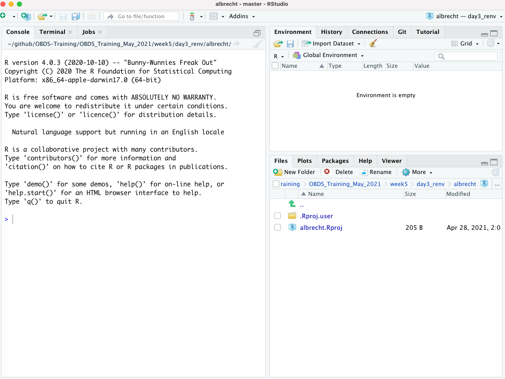
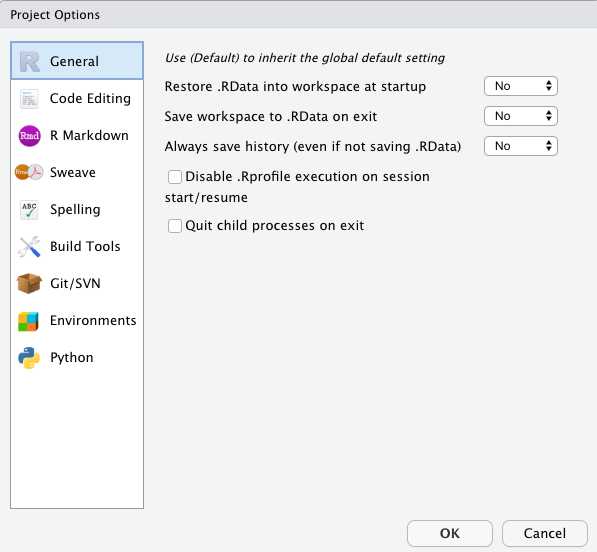
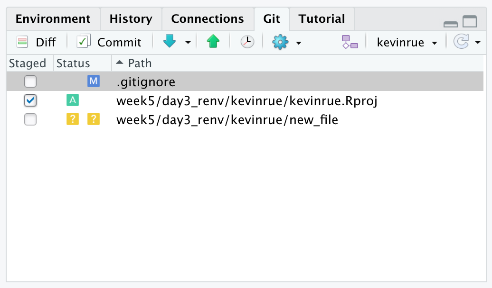
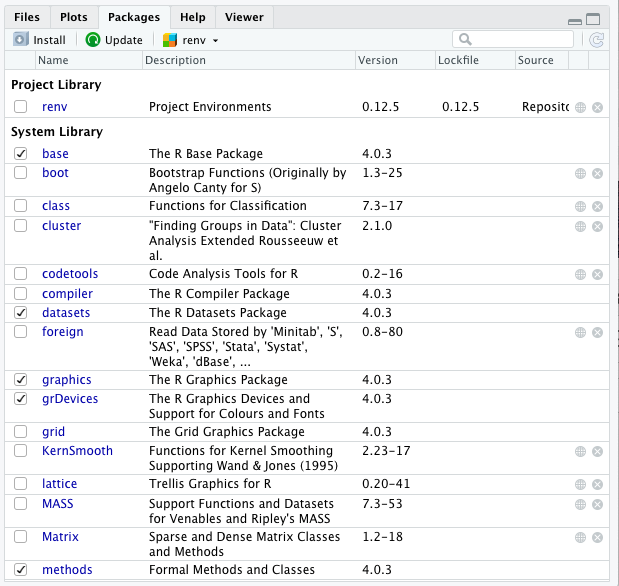

layout: true

<div class="my-header"></div>

<div class="my-footer"><span>
Kevin Rue-Albrecht
&emsp;&emsp;&emsp;&emsp;&emsp;&emsp;&emsp;&emsp;&emsp;&emsp;&emsp;&emsp;&emsp;&emsp;
Introduction to renv
</span></div>

```{r setup, include = FALSE}
stopifnot(requireNamespace("htmltools"))
htmltools::tagList(rmarkdown::html_dependency_font_awesome())
knitr::opts_chunk$set(
  message = FALSE, warning = FALSE, error = FALSE,
  include = FALSE
)
```

```{r, load_refs, include=FALSE, cache=FALSE}
options(htmltools.dir.version = FALSE)
library(RefManageR)
BibOptions(
  check.entries = FALSE,
  bib.style = "authoryear",
  cite.style = "authoryear",
  max.names = 2,
  style = "markdown",
  hyperlink = "to.doc",
  dashed = TRUE)
bib <- ReadBib("bibliography.bib")
```

---

# Prerequisites

<br/>

.x-large-list[
- A working installation of [git](https://git-scm.com/).

- A clone of the shared GitHub repository for this course.

- A working installation of [R](https://www.r-project.org/) (4.0.3).

- A working installation of [RStudio](https://rstudio.com/).
]

---

# Lesson goals and objectives

## Learning goals

.x-large-list[
- Understand the concept of projects in RStudio.

- Understand the concept of R environment.

- Describe how to create and manage new R projects and environments.
]

## Learning objectives

.x-large-list[
- Create RStudio projects and switch between them.

- Initialise, manage, and share project environments using `r BiocStyle::CRANpkg("renv")`.
]

---

# RStudio projects

From [support.rstudio.com](https://support.rstudio.com/hc/en-us/articles/200526207-Using-Projects):

> RStudio projects make it straightforward to divide your work into multiple contexts, each with their own working directory, workspace, history, and source documents.

RStudio projects are associated with R working directories. You can create an RStudio project:

- In a brand new directory

- In an existing directory where you already have R code and data

- By cloning a version control (e.g., [<i class="fab fa-git"></i>](https://git-scm.com/), [Subversion](https://subversion.apache.org/)) repository

It is up to you to decide how to manage projects:

- Projects may be independent pieces of work, or different pieces of a larger project.

- Projects are helpful to logically structure your work.

- Files outside of projects are easily lost and their origin can be difficult to track.

---

# Create a new project

To create a new project use the **Create Project** command (available on the **Projects** menu and on the global toolbar):

```{r, include=TRUE, echo=FALSE, fig.align='center', out.height='450px', out.width='700px'}
knitr::include_graphics("img/projects_new.png")
```

---

# Exercise

## Create a project

- Launch the **new Project Wizard**.

- Select **New Directory**.

- Select **New Project**.

- In **Directory name:**, type your HPC user name (e.g. `albrecht`).

- In **Create project as subdirectory of :**, click on **Browse** and select the sub-directory `5_r/3_renv` in the shared GitHub repository for this course.

- Untick the following checkboxes, if there are present:

  + **Create a git repository** (we create this project within a repository already)
  
  + **Use renv with this project** (we will use `r BiocStyle::CRANpkg("renv")` later).

**Note:** The latter may not be visible if `r BiocStyle::CRANpkg("renv")` is not installed.
  We will install it later.

- Click on the button **Create Project**.

---

# New project RStudio session

```{r, include=TRUE, echo=FALSE, fig.align='center', out.height='500px', out.width='700px'}

```

---

# How new projects are set up in RStudio

When a new project is created, RStudio:

- Creates a **project file** (with an `.Rproj` extension) within the project directory.
  This file contains various project options, and can also be used as a shortcut for opening the project directly from the filesystem.

- Creates a hidden directory named `.Rproj.user` where project-specific temporary files (e.g. auto-saved source documents, window-state, etc.) are stored.
  This directory is also automatically added to `.Rbuildignore`, `.gitignore`, etc., if required.

- Loads the project into RStudio and display its name in the **Projects** toolbar (which is located on the far right side of the main toolbar)

---

# Working with projects

## Opening projects

There are several ways to open a project:

- Using the **Open Project** command (available from both the **Projects** menu and the **Projects** toolbar) to browse for and select an existing project file (e.g. `MyProject.Rproj`).

- Selecting a project from the list of most recently opened projects (also available from both the **Projects** menu and toolbar).

- Double-clicking on the project file within the system shell (e.g. Windows Explorer, OSX Finder, etc.).

---

# Working with projects

## Opening projects

When a project is opened within RStudio the following actions are taken:

- A new <i class="fab fa-r-project"></i> session (process) is started

- The `.Rprofile` file in the project's main directory (if any) is sourced by <i class="fab fa-r-project"></i>

- The `.RData` file in the project's main directory is loaded (if project options indicate that it should be loaded).

- The `.Rhistory` file in the project's main directory is loaded into the RStudio **History** pane (and used for Console Up/Down arrow command history).

- The current working directory is set to the project directory.

- Previously edited source documents are restored into editor tabs.

- Other RStudio settings (e.g. active tabs, splitter positions, etc.) are restored to where they were the last time the project was closed.

---

# Working with projects

## Quitting a project

When you are within a project and choose to either Quit, close the project, or open another project the following actions are taken:

- `.RData` and/or `.Rhistory` are written to the project directory (if current options indicate they should be).

- The list of open source documents is saved (so it can be restored next time the project is opened)

- Other RStudio settings (as described above) are saved.

- The <i class="fab fa-r-project"></i> session is terminated.

**Note:** in a moment, we will disable `.RData` and `.Rhistory`.

---

# Working with projects

## Working with multiple projects at once

You can work with more than one RStudio project at a time by simply opening each project in its own instance of RStudio.
There are two ways to accomplish this:

1. Use the **Open Project** in **New Window** command located on the **Project** menu.

2. Opening multiple project files via the system shell (i.e. double-clicking on the project file).

---

# Working with projects

## Project options

There are several options that can be set on a per-project basis to customize the behavior of RStudio.
You can edit these options using the **Project Options** command on the **Project** menu:

```{r, include=TRUE, echo=FALSE, fig.align='center', out.height='350px', out.width='450px'}

```

---

# Project options - General

Note that the **General** project options are all overrides of existing global options.
To inherit the default global behavior for a project you can specify `(Default)` as the option value.

- **Restore .RData into workspace at startup** — Load the `.RData` file (if any) found in the initial working directory into the R workspace (global environment) at startup.
  If you have a very large `.RData` file then unchecking this option will improve startup time considerably.
  
> Select **No**.

- **Save workspace to .RData on exit** — Ask whether to save `.RData` on exit, always save it, or never save it.
  Note that if the workspace is not dirty (no changes made) at the end of a session then no prompt to save occurs even if **Ask** is specified.
  
> Select **No**.

- **Always save history (even when not saving .RData)** — Make sure that the `.Rhistory` file is always saved with the commands from your session even if you choose not to save the .RData file when exiting.
  
> Select **No**.

---

# Project options - Code Editing

- **Index R source files** — Determines whether R source files within the project directory are indexed for code navigation (i.e. go to file/function, go to function definition).

> Normally this should remain enabled, however if you have a project directory with thousands of files and are concerned about the overhead of monitoring and indexing them you can disable indexing here.

- **Insert spaces for tab** — Determine whether the tab key inserts multiple spaces rather than a tab character (soft tabs).

> Tick the checkbox and configure 4 spaces per soft-tab.

- **Text encoding** — Specify the default text encoding for source files.
  Note that source files which don't match the default encoding can still be opened correctly using the **File : Reopen with Encoding** menu command.

> We recommend **UTF-8**, which should be the default value.

---

# Project options - Git/SVN

## Version control

- **Version control system** — Specify the version control system to use with this project.
Note that RStudio automatically detects the presence of version control for projects by scanning for a `.git` or `.svn` directory.
Therefore it isn't normally necessary to change this setting.
You may want to change the setting for the following reasons:

  1. You have both a `.git` and `.svn` directory within the project and wish to specify which version control system RStudio should bind to.
  2. You have no version control setup for the project and you want to add a local git repository (equivalent to executing git init from the project root directory).

---

# RStudio <i class="fab fa-git"></i> integration

The RStudio <i class="fab fa-git"></i> pane reports the presence of files modified since the latest commit on your current branch:

.pull-left[
```{r, include=TRUE, echo=FALSE, fig.align='center', out.width='500px'}

```
]

.pull-right[
At this point, make sure you have checked out a branch other than `master`.

```{bash, eval=FALSE, include=TRUE}
$ git checkout -b your_username
```
]

You can use this panel to stage the changes, commit, and push/pull:

- **Unticked `[M]`:** tracked file not staged for commit (modified)

- **Ticked `[A]`:** new file is staged for commit (added)

- **Unticked `[?]`:** new file not staged for commit (untracked)

---

# RStudio projets - Summary

- One project = one logical unit of work (e.g. an analysis, a package).

- It is easy to switch between projects.

- Multiple projects can be stored in the same <i class="fab fa-git"></i> repository.

- Do not commit data files, only code (use `.gitignore`).

  + You can create symbolic links to data files stored outside your project.
  
  + Anything _produced_ by your scripts should be treated as disposable, so long as you track your scripts using version control.

---

# Introduction to `r BiocStyle::CRANpkg("renv")`

The `r BiocStyle::CRANpkg("renv")` package is a new effort to bring project-local R dependency management to your projects.

> `r BiocStyle::CRANpkg("renv")` = <ins>r</ins>eproducible <ins>env</ins>ironment.

Underlying the philosophy of `r BiocStyle::CRANpkg("renv")` is that any of your existing workflows should just work as they did before:

- `r BiocStyle::CRANpkg("renv")` manages library paths (and other project-specific state) to isolate your project’s R dependencies

- The existing tools you’ve used for managing R packages (e.g. `install.packages()`, `remove.packages()`, `BiocManager::install()`) should work as they did before.

## Features

- Isolated – each project has its own package library.

- Portable – easy to transport projects across different computers.

- Reproducible – records packages, versions and source.

.right[
<https://rstudio.github.io/renv/>
]

---

# Without `r BiocStyle::CRANpkg("renv")`

By default, each R session uses the same set of library paths.

```{r, include=TRUE, echo=FALSE, fig.align='center', out.height='300px'}
knitr::include_graphics("img/renv-shared-library.svg")
```

.center[
**What happens when you install a new version of a package in the library?**

**Use `.libPaths()` to display your current library path(s).**
]

---

# With `r BiocStyle::CRANpkg("renv")`

Instead, `r BiocStyle::CRANpkg("renv")` creates a local library for each project.

```{r, include=TRUE, echo=FALSE, fig.align='center', out.height='300px'}
knitr::include_graphics("img/renv-project-library.svg")
```

.center[
**What happens when you install a new version of a package in library 1?**
]

---

# `r BiocStyle::CRANpkg("renv")` uses a global package cache

Instead of installing each package *de novo* in each project library,
`r BiocStyle::CRANpkg("renv")` installs each version of package in a *global package cache*,
and then *links* the relevant version of each package to the relevant project libraries.

```{r, include=TRUE, echo=FALSE, fig.align='center', out.height='300px'}
knitr::include_graphics("img/renv-package-cache.svg")
```

.center[
**What are the benefits of this method?**

**(Think about time and disk space)**
]

---

# Exercise

## Install `renv`

```{r, include=TRUE, eval=FALSE}
install.packages("renv")
```

**Note:** this installs `r BiocStyle::CRANpkg("renv")` in your _global_ package library, i.e. it is available outside of any project, as soon as you open <i class="fab fa-r-project"></i>.

Restart RStudio, to make sure that the changes take effect, and that RStudio has access to the newly installed package(s).

---

# Exercise

## Initialise a new project environment

Call `renv::init()` to initialize a new project-local environment with a private R library.

```{r, eval=FALSE, include=TRUE}
 > renv::init()
 * Initializing project ...
 * Discovering package dependencies ... Done!
 * Copying packages into the cache ... Done!
 The following package(s) will be updated in the lockfile:
 
 # CRAN ===============================
 - renv   [* -> 0.12.5]
 
 * Lockfile written to '~/github/kevinrue/obds-training-2021jan/r_ggplot2/renv.lock'.
 
 Restarting R session...
 
 * Project '~/github/kevinrue/obds-training-2021jan/r_ggplot2' loaded. [renv 0.12.5]
```

.center[
**Do you see any update in the RStudio <i class="fab fa-git"></i> pane at this point? What should we do next?**
]

---

# New environment

When a new environment is created, `r BiocStyle::CRANpkg("renv")` :

- creates the project subdirectory `renv`, which contains:

  + the project library in the subdirectory `library`
  
  + project settings in the file `settings.dcf`
  
  + a script to activate the environment in `activate.R`

- creates or updates the file `.Rprofile` to automatically activate the environment every time you open the project

- creates the file `renv.lock` to store the name, version, source, and checksum of packages installed in the project library.

.center[
**Call `.libPaths()` to display the library paths now. Compare with what you saw earlier.**
]

---

# Install packages in a project environment

.pull-left[
In a new R environment, the **Packages** pane will include:

- base packages, in the _global_ library (installed with <i class="fab fa-r-project"></i>).

- the `r BiocStyle::CRANpkg("renv")` package, installed in the _project_ library.

```{r, include=TRUE, echo=FALSE, fig.align='center', out.height='300px'}

```
]

.pull-right[
## Functions
.small-code[
```{r, eval=FALSE, include=TRUE}
# base R
install.packages('ggplot2')
# renv
renv::install('ggplot2')
# Bioconductor
BiocManager::install('ggplot2')
# devtools offers several functions
devtools::install_github("tidyverse/ggplot2")
# remotes offers several functions
remotes::install_github("tidyverse/ggplot2")
```
]

**Note:** in the **Packages** pane, you will see several new packages listed under **Project library**: the package(s) that you asked for, as well as its dependencies.
]

---

# Remove and update packages

<br/>

<br/>

Call `renv::remove()` remove packages from the project library.

**Note:** The package is kept in the global cache (it may be used in other projects).

<br/>

<br/>

Call `renv::update()` to update packages that are out-of-date.

**Note:** Currently, only CRAN and GitHub package sources are supported (e.g.., not Bioconductor).

---

# Save the state of an environment

Call `renv::snapshot()` to save the state of the project library to the lockfile (called `renv.lock`).

You may still see the following:

```{r, include=TRUE, eval=FALSE}
 > renv::snapshot()
 * The lockfile is already up to date.
```

Create a script that loads one of the packages that you just installed, e.g.

```{r, include=TRUE, eval=FALSE}
## File: test-script.R
library(ggplot2)
```

Then, call `renv::snapshot()` again.

**Note:** this time, you should be prompted to proceed with the snapshot, thereby updating the `renv.lock` file with the package dependencies effectively used in your project.

Enter `y` to proceed with the snapshot.
Open the file `renv.lock`, and inspect its contents.

.center[
**Do you see any update in the RStudio <i class="fab fa-git"></i> pane at this point? What should we do next?**
]

---

# Restore an environment

The function `renv::restore()` :

- _reads_ the file `renv.lock`.

- installs or updates packages in your project library to match the versions described in `renv.lock`.

**Note:** we will use this functionality in the coming days and weeks, to give you project environments that we have tested for the course.

## Example usage

- Teaching - teacher initialises, manages, and shares the `renv.lock` file; students restore the environment from the `renv.lock` file.

- Collaborations - after the environment is initialised, everyone manages, snapshots, and shared the updated `renv.lock` file with collaborators who update their own environment accordingly.

- Publication - share the `renv.lock` file alongside your analysis code, for reproducibility.

- ... and more!

---

# Share and restore environments

At this point, each of you has pushed their own project and environment files to a separate branch.

- Open a pull request for your own environment, and assign another participant to review your pull request.

> Make sure that each of you is only assigned to one pull request.

- As part of the review process, the participant assigned to each pull request must check out the corresponding branch, and restore the environment.

  + If they successfully restore the environment, they can approve the pull request and you can merge it.

  + Otherwise, their review should describe what the issue is (i.e., include the command run, and the error message).
  
We will use this method to give you an environment for each of the coming days.

.center[
**What do you think the pros and cons are, for this method of teaching?**
]

---

# Further reading

## Projects

- "Using Projects" - [support.rstudio.com](https://support.rstudio.com/hc/en-us/articles/200526207-Using-Projects)

## `renv`

- rstudio::conf 2020 slides: <https://kevinushey-2020-rstudio-conf.netlify.app/slides.html>

- Latest documentation: <https://rstudio.github.io/renv/>

- <i class="fab fa-github"></i> GitHub repository: <https://github.com/rstudio/renv/>

## <i class="fab fa-git"></i>

- Using Git from RStudio - [Software Carpentry](https://swcarpentry.github.io/git-novice/14-supplemental-rstudio/)

---

# References

.small-text[
```{r, include=TRUE, echo=FALSE, results="asis"}
PrintBibliography(bib)
```
]
