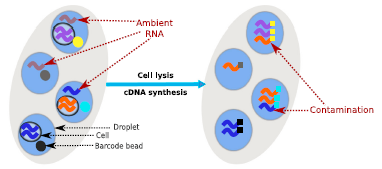
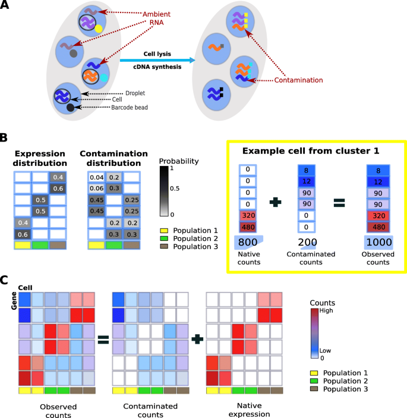

layout: true

<div class="my-header"></div>

<div class="my-footer"><span>
Kevin Rue-Albrecht
&emsp;&emsp;&emsp;
Empty droplets, doublets and ambient RNA in single-cell droplet data
</span></div> 

```{r setup, include = FALSE}
stopifnot(requireNamespace("htmltools"))
htmltools::tagList(rmarkdown::html_dependency_font_awesome())
knitr::opts_chunk$set(
  message = FALSE, warning = FALSE, error = FALSE, include = FALSE
)
options(width = 90)
stopifnot(require(base))
```

```{r, load_refs, include=FALSE, cache=FALSE}
options(htmltools.dir.version = FALSE)
library(RefManageR)
BibOptions(
  max.names = 3,
  check.entries = FALSE,
  bib.style = "authoryear",
  cite.style = "authoryear",
  style = "markdown",
  hyperlink = "to.doc",
  dashed = TRUE)
bib <- ReadBib("bibliography.bib")
```

---

# Prerequisites

<br/>

.x-large-list[
- A clone of a personal GitHub repository for this course.

- A clone of a shared GitHub repository for this course.

- A clone of <https://github.com/OBDS-Training/OBDS_environments>

- A working installation of [R](https://www.r-project.org/) (4.0.3), including the *[renv](https://rstudio.github.io/renv/articles/renv.html)* package.

- A working installation of [git](https://git-scm.com/).

- A working installation of [RStudio](https://rstudio.com/).

- Access to the CGAT cluster and the shared data folder.
]

---

# Setup

- Copy the subdirectory `r_scrnaseq_droplets_qc` from the `OBDS_environments` repository to your personal <i class="fab fa-git"></i> repository for the course.

- Download the shared folder `r/scrnaseq_droplets_qc/data` from the CGAT cluster as a subdirectory of the OBDS environment in your personal repository.

The result on your computer should look like the following

```
  obds_training/
  |_ r_scrnaseq_droplets_qc/
    |_ data/
      |_ ... (data files)
```

- Launch the R project in `r_scrnaseq_droplets_qc`.

- Restore the project environment using `r BiocStyle::CRANpkg("renv")`.

---

# Learning objectives

## Learn to work with:

.x-large-list[
- Empty droplets

- Doublets

- Ambient RNA
]

---

# The origin of empty droplets

.pull-left[
```{r, include=TRUE, echo=FALSE, out.height='500px', out.width='300px'}
# Source: https://cores.research.asu.edu/sites/default/files/inline-images/10x-barcoded%20gel%20beads.png
knitr::include_graphics("img/10x-barcoded gel beads.png")
```
]

.pull-right[
- To optimise the capture rate, the number of GEL beads is much higher than the number of cells.

- This leads to a higher probability of a cell and a bead ending up in the same droplet.

- However, this also leads to a large number of 'empty' droplets with just a bead and some ambient RNA or a dead cell.

- But also, droplets can occasionally capture more than one cell.

  + 1,000 cells ~ 0.8% doublets
  + 2,000 cells ~ 1.6% doublets
  + 3,000 cells ~ 2.3% doublets
  + 4,000 cells ~ 3.1% doublets
  + 5,000 cells ~ 3.9% doublets
  + etc ...
]

---

# Empty droplets contain fewer transcripts

Below is an example of a challenging cell-calling scenario mixing:

- 300 high RNA content 293T cells
- 2000 low RNA content PBMC cells

On the left is the cell calling result with the cell calling algorithm prior to Cell Ranger 3.0 and on the right is the current Cell Ranger 3.0 result. You can see that low RNA content cells are successfully identified by the new algorithm.

.pull-left[
```{r, include=TRUE, echo=FALSE}
# Source: https://support.10xgenomics.com/img/single-cell-gex/knee-plot-old-cell-calling.png
knitr::include_graphics("img/knee-plot-old-cell-calling.png")
```
]

.pull-right[
```{r, include=TRUE, echo=FALSE}
# Source: https://support.10xgenomics.com/img/single-cell-gex/knee-plot-new-cell-calling.png
knitr::include_graphics("img/knee-plot-new-cell-calling.png")
```
]

---

# The emptyDrops method

The function `DropletUtils::emptyDrops()` estimates the probability of empty droplets.

.pull-left[
## Parameters

- `m`, a matrix of UMI counts

- `lower`, total UMI count below which barcodes are assumed to be empty droplets.

- `niters`, number of iterations to use for the Monte Carlo p-value calculations.
  More interations increase the sensitivity to yield lower $p$-values and identify more cell-containing droplets, at the cost of computing time.
]


.pull-right[
## Method
- Barcodes with fewer than `lower` are used to estimate the composition of ambient RNA.

- The count vector for each barcode above lower is then tested for a significant deviation from these proportions.

- $p$-values are corrected for multiple testing using the Benjamini-Hochberg correction.
]

## Output

A table including the probability that each cell is an empty droplet.

---

# Exercises

## Empty droplets

- Import the raw Cell Ranger matrix for 1,000 cells into R; use `r BiocStyle::Biocpkg("DropletUtils")`.

- Remove droplets without any count at all.

- Run `DropletUtils::emptyDrops()`.

**Note:**
  How do you read the output?
  Which droplets would you consider empty?

- Draw plots comparing empty droplets and other droplets
  (e.g., library size, mitochondrial content, PCA).

- Import the filtered Cell Ranger matrix for 1,000 cells and compare their set of filtered cells.

- Remove empty droplets from the data sets.

---

# The origin of doublets

.pull-left[
```{r, include=TRUE, echo=FALSE, out.height='500px', out.width='300px'}
# Source: https://cores.research.asu.edu/sites/default/files/inline-images/10x-barcoded%20gel%20beads.png
knitr::include_graphics("img/10x-barcoded gel beads.png")
```
]

.pull-right[
- To optimise the capture rate, the number of GEL beads is much higher than the number of cells.

- This leads to a higher probability of a cell and a bead ending up in the same droplet.

- However, this also leads to a large number of 'empty' droplets with just a bead and some ambient RNA or a dead cell.

- But also, droplets can occasionally capture more than one cell.

  + 1,000 cells ~ 0.8% doublets
  + 2,000 cells ~ 1.6% doublets
  + 3,000 cells ~ 2.3% doublets
  + 4,000 cells ~ 3.1% doublets
  + 5,000 cells ~ 3.9% doublets
  + etc ...
]

---

# The DoubletFinder method

.pull-left[
## Steps

1.  Generate artificial doublets from existing scRNA-seq data

2. Pre-process merged real-artificial data

3. Perform PCA and use the PC distance matrix to find each cell's proportion of artificial k nearest neighbors (pANN)

4. Rank order and threshold pANN values according to the expected number of doublets
]

.pull-right[
```{r, include=TRUE, echo=FALSE, fig.align='center', out.height='450px'}
knitr::include_graphics("https://marlin-prod.literatumonline.com/cms/attachment/11ab5a3c-8f8a-4e8d-a333-7e9feedb846a/fx1_lrg.jpg")
```
]

.footnote[
`r Citet(bib, "mcginnis2019doubletfinder")`

<i class="fab fa-github"></i> [chris-mcginnis-ucsf/DoubletFinder](https://github.com/chris-mcginnis-ucsf/DoubletFinder)
]

---

# DoubletFinder in a workflow

.pull-left[
- Works on `r BiocStyle::CRANpkg("Seurat")` objects.

- Preprocess the Seurat object

  + Normalise, scale, variable features, dimensionality reduction.

- Sweep combiantions of parameters pN and pK. identify optimal pK parameter

- Estimate proportion of homotypic doublets

- Classify / predict / call doublets.
]

.pull-right[
```{r, include=TRUE, echo=FALSE, fig.align='center'}
knitr::include_graphics("https://marlin-prod.literatumonline.com/cms/attachment/5dd42233-d6f7-43fd-99bf-b3f00e5dccaf/fx2_lrg.jpg")
```
]

.footnote[
`r Citet(bib, "mcginnis2019doubletfinder")`

<i class="fab fa-github"></i> [chris-mcginnis-ucsf/DoubletFinder](https://github.com/chris-mcginnis-ucsf/DoubletFinder)
]

---

# DoubletFinder parameters

| Name | Description |
|:-----|:------------|
| `seu` | A fully-processed Seurat object (i.e., After NormalizeData, FindVariableGenes, ScaleData, and RunPCA have all been performed). |
| `PCs` | The number of (significant) PCs to use for computing the distance matrix. |
| `pN` | The proportion of artificial doublets to generate, relative to the number of cells in the dataset. |
| `pK` | The proportion of cells in the merged dataset to use as nearest neighbors when testing each cell. |
| `nExp` | The total number of doublets expected in the dataset.<br/>This value can best be estimated from cell loading densities into the 10X/Drop-Seq device, and adjusted according to the estimated proportion of homotypic doublets. |

See `?DoubletFinder::doubletFinder()` for more details.

---

# The scDblFinder method

The rough logic is very similar to other methods (e.g. `r BiocStyle::Githubpkg("chris-mcginnis-ucsf/DoubletFinder")`, `r BiocStyle::Biocpkg("scds")`), with a few twists that make it more efficient and provide extra features `r Citep(bib, "germain2020scdblfinder")`.

## Parameters

| Name | Description |
|:-----|:------------|
| `sce` | A `SummarizedExperiment` or count matrix. |
| `clusters` | Optional cluster assignments (if omitted, will run clustering). |
| `samples` | Vector indicating which sample each cell belong to. Samples are understood to be processed independently. |
| `artificialDoublets` | Approximate number of doublets to identify (if omitted, will be $5 \times nbClusters^2$). |
| `k` | Number of nearest neighbours for KNN graph. |

.footnote[
Bioconductor: `r BiocStyle::Biocpkg("scDblFinder")`.
See `?scDblFinder::scDblFinder()` for more details.
]

---

# Other Doublet Detection Methods

## R

.x-large-list[
- `r BiocStyle::Biocpkg("scds")` (Bioconductor)

- <i class="fab fa-github"></i> [EDePasquale/DoubletDecon](https://github.com/EDePasquale/DoubletDecon)
  `r Citep(bib, "depasquale2019doubletdecon")`
]

## Python

.x-large-list[
- <i class="fab fa-github"></i> [JonathanShor/DoubletDetection](https://github.com/JonathanShor/DoubletDetection)

- <i class="fab fa-github"></i> [Scrublet](https://github.com/AllonKleinLab/scrublet)
  `r Citep(bib, "wolock2019scrublet")`
]

---

# Exercises

## Doublets

- Continue using the data set after excluding empty droplets.

- Run `scDblFinder.::scDblFinder()`.

- Draw plots comparing doublets and other droplets.
  (e.g., library size, mitochondrial content, PCA)

- Remove doublets from the data sets.

## Bonus point

- Compare results with the output of `r BiocStyle::Githubpkg('chris-mcginnis-ucsf/DoubletFinder')`

  + You will need to make a `Seurat` object.

---

# The origin of ambient RNA

.pull-left[
```{r, include=TRUE, echo=FALSE, fig.align='center'}
# Source: https://twitter.com/GenomeBiology/status/1235571002903576576/photo/1

```

`r Citet(bib, "yang2020decontx")`
]

.pull-right[
- In droplet-based microfluidic devices, ambient RNA can be incorporated into droplets along with oligonucleotide-barcoded beads and cells.

- Both native mRNA from the cell and contaminating ambient RNA will be barcoded and counted within a droplet.
]

<br/>

## Objective

Deconvolute ambient RNA signal from cellular transcripts to estimate true biological signal as precisely as possible.

---

# The decontX method

.pull-left[
```{r, include=TRUE, echo=FALSE, fig.align='center', out.height='450px'}
# Source: https://media.springernature.com/lw685/springer-static/image/art%3A10.1186%2Fs13059-020-1950-6/MediaObjects/13059_2020_1950_Fig1_HTML.png

```

`r Citet(bib, "yang2020decontx")`
]

.pull-right[
- Bioconductor package `r BiocStyle::Biocpkg("celda")`

- Function `celda::decontX()`

- **Only
the expression profile of “real” cells after cell calling are required to run DecontX.**

- **Empty cell droplet information (low expression cell barcodes before cell calling) are
not needed.**
]

---

# The decontX method

The function `celda::decontX()` identifies contamination from factors such as ambient RNA in single cell genomic datasets.
It estimate matrices of native expression and contamination from ambient RNA.

.pull-left[
## Parameters

- `x`, a `SingleCellExperiment` object.

- `z`, broad cell cluster labels.

- `batch`, batch labels.

- `maxIter`, maximum iterations for the EM algorithm.
]


.pull-right[
## Method

Assumption: each cell is a mixture of two multinomial distributions:

1. a distribution of native transcripts from the cell’s true population

2. a distribution of contaminating transcripts from all other cell populations captured in the assay
]

## Output

A `SingleCellExperiment` object with the decontaminated counts stored as a new assay.
Other pieces of information are stored in `colData()` and `metadata()`.
See `?celda::decontX()` for more information.

---

# Exercises

## Ambient RNA

- Run `celda::decontX()`.

- Visualize the UMAP layout created by `decontX`; use `plotDimReduceCluster()`.

- Visualize the percentage of contamination estimated by `decontX` in each cell.
  Use the `plotDecontXContamination()` function.

**Note:** Does any cluster display higher (estimated) levels of ambient RNA?

- Visualize the log-normalised expression of marker genes on a UMAP layout faceted by gene; use `plotDimReduceFeature()`.

**Note:** Use either markers genes expected from literature or computationally identified for this data set.

- Visualise the percentage of cells with detectable expression of marker genes before and after decontamination as a bar plot; use `plotDecontXMarkerPercentage()`.

- Visualize the log-normalised expression of marker genes before and after decontamination as a bar plot; use `plotDecontXMarkerExpression()`.

---

# References

```{r refs, include=TRUE, echo=FALSE, results="asis"}
PrintBibliography(bib)
```
