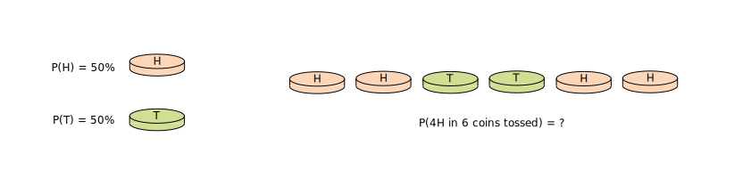
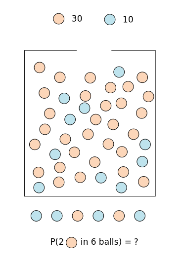
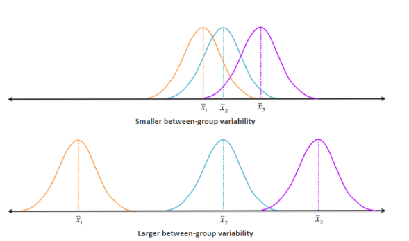
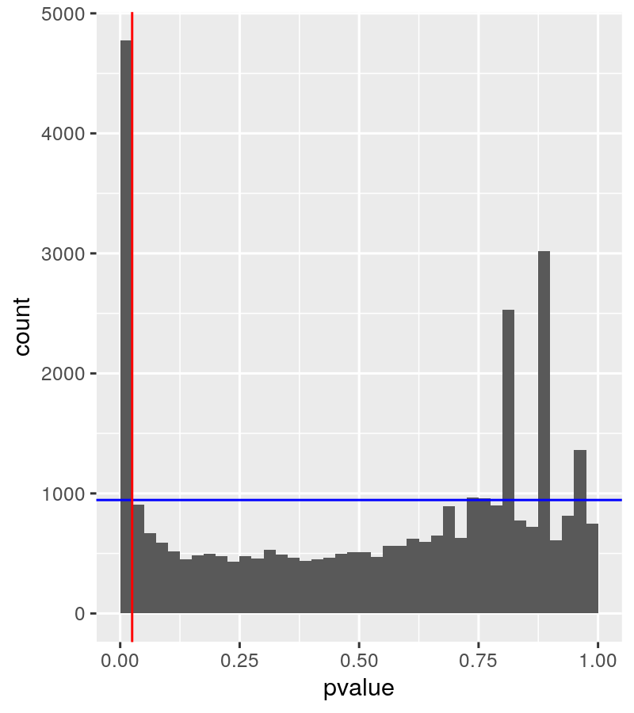
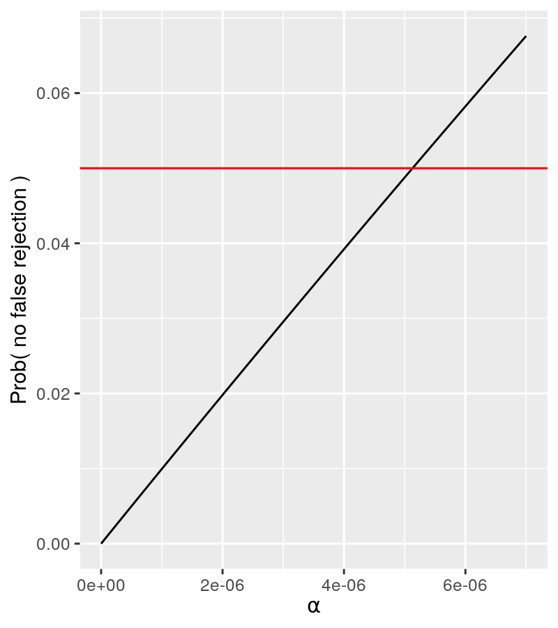
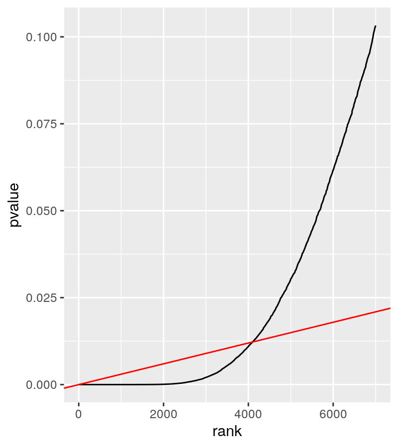

# <i class="fab fa-r-project"></i> is built for statistics

- <i class="fab fa-r-project"></i> includes a number of common statistical distributions:

  + The Normal Distribution
  
  + The Binomial Distribution
  
  + The Poisson Distribution
  
  + ...

--

- <i class="fab fa-r-project"></i> implements a range of statistical tests:

  + Student's t-Test
  
  + Pearson's Chi-squared Test for Count Data
  
  + Wilcoxon Rank Sum and Signed Rank Tests
  
  + ...

---

# <i class="fab fa-r-project"></i> Functions for Probability Distributions

<!-- Sources
https://www.stat.umn.edu/geyer/old/5101/rlook.html
-->

.pull-left[
.xx-small-table[
|Distribution                   |Probability |Quantile    |Density     |Random      |
|:------------------------------|:-----------|:-----------|:-----------|:-----------|
|Beta                           |`pbeta`     |`qbeta`     |`dbeta`     |`rbeta`     |
|Binomial                       |`pbinom`    |`qbinom`    |`dbinom`    |`rbinom`    |
|Cauchy                         |`pcauchy`   |`qcauchy`   |`dcauchy`   |`rcauchy`   |
|Chi-Square                     |`pchisq`    |`qchisq`    |`dchisq`    |`rchisq`    |
|Exponential                    |`pexp`      |`qexp`      |`dexp`      |`rexp`      |
|F                              |`pf`        |`qf`        |`df`        |`rf`        |
|Gamma                          |`pgamma`    |`qgamma`    |`dgamma`    |`rgamma`    |
|Geometric                      |`pgeom`     |`qgeom`     |`dgeom`     |`rgeom`     |
|Hypergeometric                 |`phyper`    |`qhyper`    |`dhyper`    |`rhyper`    |
|Logistic                       |`plogis`    |`qlogis`    |`dlogis`    |`rlogis`    |
|Log Normal                     |`plnorm`    |`qlnorm`    |`dlnorm`    |`rlnorm`    |
|Negative Binomial              |`pnbinom`   |`qnbinom`   |`dnbinom`   |`rnbinom`   |
|Normal                         |`pnorm`     |`qnorm`     |`dnorm`     |`rnorm`     |
|Poisson                        |`ppois`     |`qpois`     |`dpois`     |`rpois`     |
|Student t                      |`pt`        |`qt`        |`dt`        |`rt`        |
|Studentized Range              |`ptukey`    |`qtukey`    |`dtukey`    |`rtukey`    |
|Uniform                        |`punif`     |`qunif`     |`dunif`     |`runif`     |
|Weibull                        |`pweibull`  |`qweibull`  |`dweibull`  |`rweibull`  |
|Wilcoxon Rank Sum Statistic    |`pwilcox`   |`qwilcox`   |`dwilcox`   |`rwilcox`   |
|Wilcoxon Signed Rank Statistic |`psignrank` |`qsignrank` |`dsignrank` |`rsignrank` |
]
]

.pull-right[
.small-text[
- Each distribution has a root name, e.g. `norm`

- Every distribution has four functions.

- The root name is prefixed by one of the letters:

  + `p` for "probability", the cumulative distribution function (c. d. f.)
  
  + `q` for "quantile", the inverse c. d. f.
  
  + `d` for "density", the density function (p. f. or p. d. f.)
  
  + `r` for "random", a random variable having the specified distribution
]
]

---

# The normal distribution

## Notation

$${\mathcal {N}}(\mu ,\sigma ^{2})$$
--

## Parameters

- ${\mu \in \mathbb {R} }$ = mean (location)

- ${ \sigma ^{2}>0}$ = variance (squared scale)

--

## Properties

.pull-left[
- Median: ${ \mu }$

- Mode: ${ \mu }$
]

.pull-right[
- Variance: ${ \sigma ^{2} }$
]

--

- Probability density function (PDF): ${\displaystyle {\frac {1}{\sigma {\sqrt {2\pi }}}}e^{-{\frac {1}{2}}\left({\frac {x-\mu }{\sigma }}\right)^{2}}}$

---

# Mean and standard deviation

The base R functions `mean()` and `sd()` compute the mean and standard deviation of a distribution

To demonstrate, let us first generate a vector of random, normally distributed, values.

```{r, include=TRUE}
set.seed(1)
x <- rnorm(n = 100, mean = 2, sd = 5)
```

We can then use that vector to demonstrate the functions.

```{r, include=TRUE}
mean(x)
sd(x)
```

.center[
**What are optional arguments for those functions?**

**Why do you think the mean and standard deviation are not exactly those that we would expect?**
]

---

# The standard normal distribution

```{r}
slide_mean <- 0; slide_sd <- 1;
```

Standard normal distribution with mean `r slide_mean` and standard deviation `r slide_sd`.

```{r}
x <- tibble(
  quantile = seq(from = slide_mean-5*slide_sd, to = slide_mean+5*slide_sd, by = slide_sd/100),
  pnorm = pnorm(q = quantile, mean = slide_mean, sd = slide_sd)
)
gg1 <- ggplot(x) + geom_point(aes(quantile, pnorm)) +
  geom_vline(xintercept = slide_mean, color = "blue") +
  geom_label(aes(x = x, label = x), y = 0, data = tibble(x = slide_mean)) +
  geom_vline(xintercept = slide_mean+slide_sd*c(-2, 2), color = "blue", linetype = "dashed") +
  geom_label(
    aes(x = x, label = label), y = 0, alpha = 0.5,
    data = tibble(x = slide_mean+slide_sd*c(-2, 2), label = "2*sd")) +
  labs(
    title = sprintf("pnorm(q = quantile, mean = %s, sd = %s)", slide_mean, slide_sd),
    subtitle = "the cumulative distribution function (c. d. f.)") +
  cowplot::theme_cowplot()
```

```{r}
x <- tibble(
  quantile = seq(from = 0, to = 1, by = 0.01),
  qnorm = qnorm(p = quantile, mean = slide_mean, sd = slide_sd)
)
gg2 <- ggplot(x) + geom_point(aes(quantile, qnorm)) +
  geom_hline(yintercept = slide_mean, color = "blue") +
  geom_label(aes(y = y, label = y), x = 0, data = tibble(y = slide_mean)) +
  geom_hline(yintercept = slide_mean+slide_sd*c(-2, 2), color = "blue", linetype = "dashed") +
  geom_label(
    aes(y = y, label = label), x = 0, alpha = 0.5,
    data = tibble(y = slide_mean+slide_sd*c(-2, 2), label = "2*sd")) +
  labs(
    title = sprintf("qnorm(p = quantile, mean = %s, sd = %s)", slide_mean, slide_sd),
    subtitle = "the inverse c. d. f.") +
  cowplot::theme_cowplot()
```

```{r}
x <- tibble(
  quantile = seq(from = slide_mean-5*slide_sd, to = slide_mean+5*slide_sd, by = slide_sd/100),
  dnorm = dnorm(x = quantile, mean = slide_mean, sd = slide_sd)
)
gg3 <- ggplot(x) + geom_point(aes(quantile, dnorm)) +
  geom_vline(xintercept = slide_mean, color = "blue") +
  geom_label(aes(x = x, label = x), y = 0, data = tibble(x = slide_mean)) +
  geom_vline(xintercept = slide_mean+slide_sd*c(-2, 2), color = "blue", linetype = "dashed") +
  geom_label(
    aes(x = x, label = label), y = 0, alpha = 0.5,
    data = tibble(x = slide_mean+slide_sd*c(-2, 2), label = "2*sd")) +
  labs(
    title = sprintf("dnorm(x = quantile, mean = %s, sd = %s)", slide_mean, slide_sd),
    subtitle = "the density function (p. f. or p. d. f.)") +
  cowplot::theme_cowplot()
```

```{r}
x <- tibble(
  rnorm = rnorm(n = 1E3, mean = slide_mean, sd = slide_sd)
)
gg4 <- ggplot(x, aes(rnorm)) + geom_histogram(bins = 30, color = "black", fill = "grey") +
  geom_rug(alpha = 0.5) +
  geom_vline(xintercept = slide_mean, color = "blue") +
  geom_label(aes(x = x, label = x), y = 0, data = tibble(x = slide_mean)) +
  geom_vline(xintercept = slide_mean+slide_sd*c(-2, 2), color = "blue", linetype = "dashed") +
  geom_label(
    aes(x = x, label = label), y = 0, alpha = 0.5,
    data = tibble(x = slide_mean+slide_sd*c(-2, 2), label = "2*sd")) +
  labs(
    title = sprintf("rnorm(n = 1E3, mean = %s, sd = %s)", slide_mean, slide_sd),
    subtitle = "a random variable having the specified distribution") +
  cowplot::theme_cowplot()
```

```{r, include=TRUE, echo=FALSE, fig.width=12, fig.height=7}
plot_grid(gg1, gg2, gg3, gg4, ncol = 2, nrow = 2)
```

---

# A parameterised normal distribution

```{r}
slide_mean <- 50; slide_sd <- 100;
```

Normal distribution parameterised with mean `r slide_mean` and standard deviation `r slide_sd`.

--

```{r}
x <- tibble(
  quantile = seq(from = slide_mean-5*slide_sd, to = slide_mean+5*slide_sd, by = slide_sd/100),
  pnorm = pnorm(q = quantile, mean = slide_mean, sd = slide_sd)
)
gg1 <- ggplot(x) + geom_point(aes(quantile, pnorm)) +
  geom_vline(xintercept = slide_mean, color = "blue") +
  geom_label(aes(x = x, label = x), y = 0, data = tibble(x = slide_mean)) +
  geom_vline(xintercept = slide_mean+slide_sd*c(-2, 2), color = "blue", linetype = "dashed") +
  geom_label(
    aes(x = x, label = label), y = 0, alpha = 0.5,
    data = tibble(x = slide_mean+slide_sd*c(-2, 2), label = "2*sd")) +
  labs(
    title = sprintf("pnorm(q = quantile, mean = %s, sd = %s)", slide_mean, slide_sd),
    subtitle = "the cumulative distribution function (c. d. f.)") +
  cowplot::theme_cowplot()
```

```{r}
x <- tibble(
  quantile = seq(from = 0, to = 1, by = 0.01),
  qnorm = qnorm(p = quantile, mean = slide_mean, sd = slide_sd)
)
gg2 <- ggplot(x) + geom_point(aes(quantile, qnorm)) +
  geom_hline(yintercept = slide_mean, color = "blue") +
  geom_label(aes(y = y, label = y), x = 0, data = tibble(y = slide_mean)) +
  geom_hline(yintercept = slide_mean+slide_sd*c(-2, 2), color = "blue", linetype = "dashed") +
  geom_label(
    aes(y = y, label = label), x = 0, alpha = 0.5,
    data = tibble(y = slide_mean+slide_sd*c(-2, 2), label = "2*sd")) +
  labs(
    title = sprintf("qnorm(p = quantile, mean = %s, sd = %s)", slide_mean, slide_sd),
    subtitle = "the inverse c. d. f.") +
  cowplot::theme_cowplot()
```

```{r}
x <- tibble(
  quantile = seq(from = slide_mean-5*slide_sd, to = slide_mean+5*slide_sd, by = slide_sd/100),
  dnorm = dnorm(x = quantile, mean = slide_mean, sd = slide_sd)
)
gg3 <- ggplot(x) + geom_point(aes(quantile, dnorm)) +
  geom_vline(xintercept = slide_mean, color = "blue") +
  geom_label(aes(x = x, label = x), y = 0, data = tibble(x = slide_mean)) +
  geom_vline(xintercept = slide_mean+slide_sd*c(-2, 2), color = "blue", linetype = "dashed") +
  geom_label(
    aes(x = x, label = label), y = 0, alpha = 0.5,
    data = tibble(x = slide_mean+slide_sd*c(-2, 2), label = "2*sd")) +
  labs(
    title = sprintf("dnorm(x = quantile, mean = %s, sd = %s)", slide_mean, slide_sd),
    subtitle = "the density function (p. f. or p. d. f.)") +
  cowplot::theme_cowplot()
```

```{r}
x <- tibble(
  rnorm = rnorm(n = 1E3, mean = slide_mean, sd = slide_sd)
)
gg4 <- ggplot(x, aes(rnorm)) + geom_histogram(bins = 30, color = "black", fill = "grey") +
  geom_rug(alpha = 0.5) +
  geom_vline(xintercept = slide_mean, color = "blue") +
  geom_label(aes(x = x, label = x), y = 0, data = tibble(x = slide_mean)) +
  geom_vline(xintercept = slide_mean+slide_sd*c(-2, 2), color = "blue", linetype = "dashed") +
  geom_label(
    aes(x = x, label = label), y = 0, alpha = 0.5,
    data = tibble(x = slide_mean+slide_sd*c(-2, 2), label = "2*sd")) +
  labs(
    title = sprintf("rnorm(n = 1E3, mean = %s, sd = %s)", slide_mean, slide_sd),
    subtitle = "a random variable having the specified distribution") +
  cowplot::theme_cowplot()
```

```{r, include=TRUE, echo=FALSE, fig.width=12, fig.height=7}
plot_grid(gg1, gg2, gg3, gg4, ncol = 2, nrow = 2)
```

---

# The binomial distribution

```{r, include=TRUE, echo=FALSE, fig.align='center'}
# Source: Kevin Rue-Albrecht (Adobe Illustrator)

```

.pull-left[
- Two mutually exclusive outcomes
  + $P(H) = 1 - P(T)$

- Size of experiment
  + e.g., coins tossed, balls drawn.

- Model number of occurrences of a specific outcome.
]

.pull-right[
```{r, include=TRUE, echo=FALSE, fig.align='center', out.height='300px'}
# Source: Kevin Rue-Albrecht (Adobe Illustrator)

```
]

---

# A parameterised binomial distribution

```{r}
slide_size <- 50; slide_prob <- 0.1;
```

Binomial distribution parameterised with size `r slide_size` and probability `r slide_prob`.
This distribution models an experiment where a coin is tossed 50 times, and the probability of observing head is 10%.

```{r}
x <- tibble(
  quantile = seq(from = 0, to = slide_size, by = 1),
  pbinom = pbinom(q = quantile, size = slide_size, prob = slide_prob)
)
gg1 <- ggplot(x) + geom_point(aes(quantile, pbinom)) +
  labs(
    title = sprintf("pbinom(q = quantile, size = %s, prob = %s)", slide_size, slide_prob),
    subtitle = "the cumulative distribution function (c. d. f.)") +
  cowplot::theme_cowplot()
```

```{r}
x <- tibble(
  quantile = seq(from = 0, to = 1, by = 0.01),
  qbinom = qbinom(p = quantile, size = slide_size, prob = slide_prob)
)
gg2 <- ggplot(x) + geom_point(aes(quantile, qbinom)) +
  labs(
    title = sprintf("qbinom(p = quantile, size = %s, prob = %s)", slide_size, slide_prob),
    subtitle = "the inverse c. d. f.") +
  cowplot::theme_cowplot()
```

```{r}
x <- tibble(
  quantile = seq(from = 0, to = slide_size, by = 1),
  dbinom = dbinom(x = quantile, size = slide_size, prob = slide_prob)
)
gg3 <- ggplot(x) + geom_point(aes(quantile, dbinom)) +
  labs(
    title = sprintf("dbinom(x = quantile, size = %s, prob = %s)", slide_size, slide_prob),
    subtitle = "the density function (p. f. or p. d. f.)") +
  cowplot::theme_cowplot()
```

```{r}
x <- tibble(
  rbinom = rbinom(n = 1E3, size = slide_size, prob = slide_prob)
)
gg4 <- ggplot(x, aes(rbinom)) + geom_histogram(bins = 30, color = "black", fill = "grey") +
  labs(
    title = sprintf("rbinom(n = 1E3, size = %s, prob = %s)", slide_size, slide_prob),
    subtitle = "a random variable having the specified distribution") +
  cowplot::theme_cowplot()
```

```{r, include=TRUE, echo=FALSE, fig.align='center',fig.width=12, fig.height=7}
plot_grid(gg1, gg2, gg3, gg4, ncol = 2, nrow = 2)
```

---

# Quantiles

Quantiles are the values at a selected set of evenly-spaced locations in the distribution.

```{r, include=TRUE, echo=FALSE, fig.align='center'}
# Source: Kevin Rue-Albrecht (Adobe Illustrator)

```

Quantiles are not always observed values.

```{r, include=TRUE, echo=FALSE, fig.align='center'}
# Source: Kevin Rue-Albrecht (Adobe Illustrator)

```

---

# Example - Quantiles of a normal distribution

For instance, the minimum value, the value that separates the lowest 10% values in the distribution, 20%, and so on, until the maximum value.

```{r, include=TRUE, echo=FALSE, fig.align='center', fig.height=6, fig.width=9}
slide_mean <- 50; slide_sd <- 100;
x1 <- tibble(
  rnorm = rnorm(n = 10E3, mean = slide_mean, sd = slide_sd)
)
x2 <- tibble(
  quantile = seq(0, 1, length.out = 10),
  value = quantile(x1$rnorm, seq(0, 1, length.out = 10))
)
ggplot() +
  geom_histogram(aes(rnorm), x1, bins = 30, color = "black", fill = "grey") +
  geom_vline(aes(xintercept = value), x2, color = "blue", linetype = "dashed") +
  labs(
    title = sprintf("quantile(x, seq(0, 1, length.out = 10))"),
    subtitle = "Ten deciles computed on the distribution `x`") +
  cowplot::theme_cowplot()
```

---

# Exercise

## Generate and summarise a distribution

- Generate a vector of 1,000 normally distributed values with mean 10 and standard deviation 5.

- Inspect the output of the `summary()` function for that vector.

- Compute the mean and standard deviation for those values.

- Compute the deciles (i.e. 10 evenly spaced quantiles) for those values.

- Visualise the distribution of those values as a histogram.

- Visualise as vertical lines on the histogram: the mean (red solid), median (red dashed), one standard deviation below and above the mean (blue solid), and one median absolute deviation below and above the median (blue dashed).

- Generate a new vector with _a lot_ more values (e.g., one million).
  Draw again a histogram.
  How does the distribution compare with more data points?

---

# Exercise

## Query distributions and probabilities

For the standard normal distribution ${\mathcal {N}}(\mu=0 ,\sigma ^{2}=1)$:

- Plot the cumulative distribution function in the range $[-5, 5]$ in 0.1 increment.

- Plot the inverse cumulative distribution function for quantiles in 0.01 increment.

- Plot the density function in the range $[-5, 5]$ in 0.1 increment.

- What is the probability of observing a value greater than 2?

- What is the probability of observing a value between -2 and 2?

- What is the probability of observing a value more extreme than -2 or 2?

---

# Empirical Cumulative Distribution Function

The `ecdf()` function computes an empirical cumulative distribution function.

It produces an object that can be plotted, printed, and used for further computations.

.small-code[
```{r, include=TRUE}
ecdf_iris_sepal_length <- ecdf(iris$Sepal.Length)
ecdf_iris_sepal_length
```
]

.pull-left[
.small-code[
```{r, include=TRUE, message=FALSE, fig.align='center', fig.height=2.75, fig.width=5}
ggplot(iris, aes(Sepal.Length)) +
  geom_histogram(color = "black", fill = "grey") +
  cowplot::theme_cowplot()
```
]
]

.pull-right[
.small-code[
```{r, include=TRUE, fig.align='center', fig.height=3.4, fig.width=5}
plot(ecdf_iris_sepal_length, cex = 0.5)
```
]
]

---

# ecdf - Knots

Knots are the unique values observed in the empirical distribution.
For ease of inspection, the function `knots()` automatically sorts knots in increasing order.

```{r, include=TRUE, echo=TRUE}
knots(ecdf_iris_sepal_length)
```

In other words, the `knots()` function is equivalent to identifying the unique values in the original vector and sorting them in increasing order.

```{r, include=TRUE, echo=TRUE}
sort(unique(iris$Sepal.Length))
```

---

# ecdf - Quantiles

The `quantile()` function can be applied to `ecdf` objects.

```{r, include=TRUE, echo=TRUE}
quantile(ecdf_iris_sepal_length, c(0, 0.25, 0.5, 0.75, 1))
```

In this case, the same function `quantile()` can be applied to the original vector of data for the same result.

```{r, include=TRUE, echo=TRUE}
quantile(iris$Sepal.Length, c(0, 0.25, 0.5, 0.75, 1))
```

.center[
**Is this choice convenient or confusing to you? Why?**
]

---

# <i class="fab fa-r-project"></i> Functions for Statistical Testing

In the `r BiocStyle::CRANpkg("stats")` package, functions that implement statistical tests have a named that ends in `.test`.

```{r, include=TRUE, echo=FALSE, results='asis'}
cat(paste(sprintf("`%s`", sort(grep("\\.test$", ls("package:stats"), value=TRUE))), collapse = ", "))
```

Each of those functions comes with a help page with programmatic usage, statistical advice, and external references to published work.

```{r, include=TRUE}
?pairwise.t.test
help(pairwise.t.test)
```

---

# The five steps of hypothesis testing

## General principles of hypothesis testing

```{r, include=TRUE, echo=FALSE, out.height='450px', out.width='700px', fig.align='center'}
# Source: Kevin Rue-Albrecht (Adobe Illustrator)

```

---

# Parametric tests and Non-parametric equivalents

```{r}
tibble(
  "Parametric test" = c(
    "Paired t-test",
    "Unpaired t-test",
    "Pearson correlation",
    "One-way Analysis of Variance"),
  "Non-parametric equivalent" = c(
    "Wilcoxon Rank sum test",
    "Mann-Whitney U test",
    "Spearman correlation",
    "Kruskal–Wallis test")
) %>% knitr::kable()
```

When parametric assumptions are not met, non-parametric tests equivalent should be used.

<br/>

.large-table[
|Parametric test              |Non-parametric equivalent |
|:----------------------------|:-------------------------|
|Paired t-test                |Wilcoxon Rank sum test    |
|Unpaired t-test              |Mann-Whitney U test       |
|Pearson correlation          |Spearman correlation      |
|One-way Analysis of Variance |Kruskal–Wallis test       |
]

--

Non-parametric tests make fewer assumptions, as such:

- they have wider applicability.
- they may be applied in situations where less is known about the data.
- they are more robust.
- ..., however, fewer assumption gives non-parametric tests _less_ power than their parametric equivalent.

???

**Credits:** [https://www.healthknowledge.org.uk/](https://www.healthknowledge.org.uk/public-health-textbook/research-methods/1b-statistical-methods/parametric-nonparametric-tests)

---

# Parametric t-test

.pull-left[
## Two normal distributions

```{r, include=TRUE}
set.seed(1)
x <- rnorm(n = 1000, mean = 0, sd = 1)
y <- rnorm(n = 1000, mean = 1, sd = 1)
```

```{r, include=TRUE, echo=FALSE, fig.height=5}
test_data <- bind_rows(
  tibble(group = "x", value = x),
  tibble(group = "y", value = y)
)
ggplot(test_data, aes(value)) +
  geom_histogram(fill = "grey", color = "black") +
  facet_wrap(~group, ncol = 1) +
  cowplot::theme_cowplot()
```
]

--

.pull-right[
## Unpaired t-test

.x-small-code[
```{r, include=TRUE}
t.test(value ~ group, test_data)
```

Compare with

```{r, include=TRUE, eval=FALSE}
t.test(x, y)
t.test(y, x)
```
]
]

---

# Non-parametric wilcoxon test

.pull-left[
## Two uniform distributions

```{r, include=TRUE}
set.seed(1)
x <- runif(n = 1000, min = 1, max = 11)
y <- runif(n = 1000, min = 3, max = 13)
```

```{r, include=TRUE, echo=FALSE, fig.height=5}
test_data <- bind_rows(
  tibble(group = "x", value = x),
  tibble(group = "y", value = y)
)
gg <- ggplot(test_data, aes(value)) +
  facet_wrap(~group, ncol = 1) +
  geom_histogram(fill = "grey", color = "black") +
  cowplot::theme_cowplot()
gg
```
]

--

.pull-right[
## Mann-Whitney U test

.x-small-code[
```{r, include=TRUE}
wilcox.test(value ~ group, test_data)
```
]

## Directed hypothesis

.x-small-code[
```{r, include=TRUE}
wilcox.test(value ~ group, test_data, alternative = "less")
```
]
]

---

# Paired test

For each sample, the two measurements are related to one another; e.g. patients measured before and after a treatment.

.pull-left[
.small-code[
```{r, include=TRUE}
set.seed(1)
n_sample <- 10
x <- runif(n = n_sample, min = 10, max = 20)
y <- x + 2 + rnorm(n = n_sample, mean = 0, sd = 1)
```
]

```{r}
test_data <- tibble(
  sample = paste("sample", seq_len(n_sample)),
  x = x,
  y = y
) %>% pivot_longer(cols = c(x, y), names_to = "variable")
```

```{r, include=TRUE, echo=FALSE, fig.height=5}
ggplot(test_data, aes(variable, value)) +
  geom_line(aes(group = sample), size = 0.1) +
  geom_point() +
  cowplot::theme_cowplot()
```
]

--

.pull-right[
.small-code[
```{r, include=TRUE}
t.test(x, y, paired = TRUE)
```
]

**Note:**
What is actually tested is whether the mean of the differences between the paired $x$ and $y$ measurements is different from 0.
]

---

# Analysis of Variance (ANOVA)

Is the variance _between_ groups larger than the variance _within_ groups?

```{r, include=TRUE, echo=FALSE, fig.align='center', out.height='450px'}
# Source: https://turnthewheelsandbox.wordpress.com/2015/08/11/lesson-12-intro-to-one-way-anova/

```

`r Citet(bib, "liguori2018data")`

---

# Analysis of Variance (ANOVA)

.pull-left[
.small-code[
```{r, include=TRUE}
set.seed(1)
n_sample <- 1000
x1 <- rnorm(n = n_sample, mean = 10, sd = 2)
x2 <- x1 + 5 + rnorm(n = n_sample, mean = 0, sd = 1)
x3 <- x2 + 0 + rnorm(n = n_sample, mean = 0, sd = 0.5)
test_data <- bind_rows(
  tibble(group = "x1", value = x1),
  tibble(group = "x2", value = x2),
  tibble(group = "x3", value = x3)
)
```

```{r, include=TRUE, echo=FALSE, fig.height=5}
test_data <- bind_rows(
  tibble(group = "x1", value = x1),
  tibble(group = "x2", value = x2),
  tibble(group = "x3", value = x3)
)
gg <- ggplot(test_data, aes(value)) +
  facet_wrap(~group, ncol = 1) +
  geom_histogram(fill = "grey", color = "black") +
  cowplot::theme_cowplot()
gg
```
]
]

.pull-right[
.small-code[
```{r, include=TRUE}
out <- aov(value ~ group, test_data)
out
```

```{r, include=TRUE}
summary(out)
```

]
]

---

# Linear models

Describe a continuous response variable as a function of one or more predictor variables.

.pull-left[
```{r}
set.seed(1)
test_data <- tibble(
  x = rnorm(n = 50, mean = 0, sd = 1),
  y = 10 + 2.5 * x + rnorm(n = 50, mean = 0, sd = 0.5))
```

```{r, include=TRUE, echo=FALSE, out.width='300px', out.height='200px', fig.width=6, fig.height=4}
ggplot(test_data, aes(x = x, y = y)) +
  geom_point() +
  stat_smooth(method = "glm", se = FALSE) +
  cowplot::theme_cowplot()
```

- What is the slope?
- What is the intercept?
]

Null hypotheses:

- The slope is equal to 0.

- The intercept is equal to 0.

--

.pull-right[
```{r, include=TRUE}
lm(y ~ x, test_data)
```
]

---

# Linear models - summary

.small-code[
```{r, include=TRUE}
lm(y ~ x, test_data) %>% summary()
```
]

---

# Fisher's Exact Test

- Test of independence between two categorical variables

- Alternative to the Chi-square test when the sample is not large enough.

  + Rule of thumb: when any of the _expected_ values in the contingency table is less than 5.

  + e.g., Gene set over-representation analysis (ORA)

.pull-left[
```{r, include=TRUE, echo=FALSE}
# Source: Kevin Rue-Albrecht (Adobe Illustrator)
knitr::include_graphics("img/fisher-test-table.svg")
```
]

.pull-right[
```{r, include=TRUE, echo=FALSE}
# Source: Kevin Rue-Albrecht (Adobe Illustrator)
knitr::include_graphics("img/fisher-test-venn.svg")
```
]

.footnote[
Further reading: [Towards data science](https://towardsdatascience.com/fishers-exact-test-in-r-independence-test-for-a-small-sample-56965db48e87)
]

---

# Fisher's Exact Test

|               |    DE | Not DE |  Total |
|:--------------|------:|-------:|-------:|
|In pathway     |   $a$ |    $b$ |  $a+b$ |
|Not in pathway |   $c$ |    $d$ |  $c+d$ |
|Total          | $a+c$ |  $b+d$ | $a+b+c+d$ $(=n)$ |

.center[
**What is the probability of observing a given distribution?**
]

<br/>

<!-- Source: https://en.wikipedia.org/wiki/Fisher%27s_exact_test -->

$$p = \frac{{a+b \choose a} {c+d \choose c}} {n \choose a+c} = \frac{{a+b \choose b}{c+d \choose d}}{n \choose b+d}= \frac{(a+b)!~(c+d)!~(a+c)!~(b+d)!}{a!~b!~c!~d!~n!}$$

---

# Fisher's Exact Test

.center[
```{r include=TRUE, echo=FALSE}
x_table <- matrix(data = c(12, 4, 3, 23),
  nrow = 2,
  dimnames = list(
    c("DE","Not DE"),
    c("in_pathway", "not_pathway")
  ))
knitr::kable(x_table)
```
]

```{r, include=TRUE}
fisher.test(x_table)
```

---

# Beware of interpreting inadequate tests!

.pull-left[
## Two uniform distributions

```{r, include=TRUE}
set.seed(1)
n_size <- 10E3
x <- runif(n = n_size, min = 1, max = 11)
y <- runif(n = n_size, min = 3, max = 13)
```

```{r, include=TRUE, echo=FALSE, fig.height=5}
test_data <- bind_rows(
  tibble(group = "x", value = x),
  tibble(group = "y", value = y)
)
gg <- ggplot(test_data, aes(value)) +
  facet_wrap(~group, ncol = 1) +
  geom_histogram(fill = "grey", color = "black") +
  cowplot::theme_cowplot()
gg
```
]

.pull-right[
## Parametric (unpaired) t-test

.x-small-code[
```{r, include=TRUE}
t.test(value ~ group, test_data)
```
]
]

---

# Choosing a test

```{r, include=TRUE, echo=FALSE, out.height='400px', out.width='600px', fig.align='center'}
# Source: https://python.plainenglish.io/statistical-tests-with-python-880251e9b572
knitr::include_graphics("img/choose-statistical-test.png")
```

`r Citet(bib, "liguori2018data")`

See also <https://stats.idre.ucla.edu/other/mult-pkg/whatstat/>

---

# Knowledge assumptions - Central tendency

Tests make assumptions that must be met to for the results to be interpreted properly and with validity.

For instance, Student's t-Test expects values to be located around a central or typical value.

.pull-left[
```{r, echo=FALSE, include=TRUE, fig.height=5}
x_mean <- 0
x_sd <- 20
data_table <- tibble(x = as.integer(rnorm(n = 10E3, mean = x_mean, sd = x_sd)))
summary_table <- bind_rows(
  tibble(Value = "mean", value = mean(data_table$x)),
  tibble(Value = "median", value = median(data_table$x)),
  tibble(Value = "mode", value = as.integer(names(which.max(table(data_table$x)))))
)
data_table %>% 
  ggplot() +
  geom_histogram(aes(x = x), color = "black", fill = "grey") +
  geom_vline(aes(xintercept = value, color = Value), summary_table, size = 2, alpha = 0.3) +
  cowplot::theme_cowplot()
```
]

.pull-right[
Measures of central tendency include:

.large-list[
- the arithmetic mean
- the median
- ...
]
]

---

# Knowledge assumptions - Normality

In addition, Student's t-Test also expects values to be normally distributed.

.pull-left[
## Normal distribution

.small-code[
```{r include=TRUE}
x <- rnorm(n = 5000, mean = 0, sd = 1)
```

```{r, include=TRUE, echo=FALSE, fig.height=3}
ggplot(tibble(x=x)) +
  geom_histogram(aes(x), fill = "grey", color = "black", bins = 20) +
  theme_cowplot()
```

```{r, include=TRUE, fig.height=5}
shapiro.test(x)
```
]
]

.pull-right[
## Log-normal distribution

.small-code[
```{r, include=TRUE}
x <- 2^rnorm(n = 5000, mean = 0, sd = 1)
```

```{r, include=TRUE, echo=FALSE, fig.height=3}
ggplot(tibble(x=x)) +
  geom_histogram(aes(x), fill = "grey", color = "black", bins = 20) +
  theme_cowplot()
```

```{r, include=TRUE, fig.height=5}
shapiro.test(x)
```
]
]

---

# Knowledge assumptions - Normality

The Quantile-Quantile Plots (QQ plot) contrasts the quantiles of the observed distribution to those of a theoretical distribution.

.pull-left[
## Normal distribution

.small-code[
```{r, include=TRUE, echo=TRUE, fig.height=5}
x <- rnorm(n = 5000, mean = 5, sd = 3)
qqnorm(x)
```
]
]

.pull-right[
## Log-normal distribution

.small-code[
```{r, include=TRUE, echo=TRUE, fig.height=5}
x <- 2^rnorm(n = 5000, mean = 0, sd = 1)
qqnorm(x)
```
]
]

---

# Multiple-testing correction

## Hypothesis

"Jelly beans cause acne."

## Results

.pull-left[
- No link between jelly beans and acne.
]

.pull-right[
- No link between _brown_ jelly beans and acne.
- No link between _pink_ jelly beans and acne.
- ...
- Link between _green_ jelly beans and acne.
]

## News

> Green jelly beans linked to acne!
  95% confidence!
  Only 5% chance of coincidence!

.footnote[
[https://xkcd.com/882/](https://imgs.xkcd.com/comics/significant.png)
]

---

# Multiple-testing correction

.pull-left[
Distribution of $p$-values in an RNA-seq differential expression experiment

- True positive
- True negative
- False positive (type I error)
- False negative (type I error)

```{r, include=TRUE, echo=FALSE, fig.align='center', out.height='300px', out.width='300px'}
## Source: https://www.huber.embl.de/msmb/Chap-Testing.html

```
]

.pull-right[
.center[
Bonferroni correction
]

```{r, include=TRUE, echo=FALSE, fig.align='center', out.height='200px', out.width='200px'}
## Source: https://www.huber.embl.de/msmb/Chap-Testing.html

```

.center[
Benjamini-Hochberg procedure
]

```{r, include=TRUE, echo=FALSE, fig.align='center', out.height='200px', out.width='200px'}
## Source: https://www.huber.embl.de/msmb/Chap-Testing.html

```
]

---

# Multiple-testing correction

```{r}
set.seed(1)
n_tests <- 1000
compute_p_value <- function(dummy) {
  x <- rnorm(n = 100, mean = 0, sd = 1)
  y <- rnorm(n = 100, mean = 0, sd = 1)
  out <- t.test(x, y)
  out$p.value
}
result_table <- tibble(
  pvalue = vapply(X = seq_len(n_tests), FUN = compute_p_value, FUN.VALUE = numeric(1)),
  BH = p.adjust(p = pvalue, method = "BH"),
  bonferroni = p.adjust(p = pvalue, method = "bonferroni")
)
```

.pull-left[
Let us carry `r n_tests` tests between two normal distributions of mean 0 and standard deviation 1.

```{r, include=TRUE, echo=FALSE, fig.height=3}
data_table <- tibble(
  x = rnorm(n = 100, mean = 0, sd = 1),
  y = rnorm(n = 100, mean = 0, sd = 1)
) %>% pivot_longer(cols = c(x, y))
ggplot(data_table) +
  geom_boxplot(aes(name, value)) +
  geom_jitter(aes(name, value), width = 0.1)
```

```{r, include=TRUE, echo=FALSE, fig.height=3}
ggplot(result_table) +
  geom_histogram(aes(pvalue), fill = "grey", color = "black", breaks = seq(0, 1, 0.05)) +
  scale_x_continuous(limits = c(0, 1)) +
  labs(title = "Raw p-value")
```

```{r, include=TRUE, echo=FALSE, results='asis'}
cat(sprintf("There are %i out of %i raw p-values smaller than 0.05", sum(result_table$pvalue < 0.05), n_tests))
```
]

.pull-right[
```{r, include=TRUE, echo=FALSE, fig.height=3}
ggplot(result_table) +
  geom_histogram(aes(BH), fill = "grey", color = "black", bins = 20) +
  coord_cartesian(xlim = c(0, 1)) +
  labs(title = "BH correction")
```

```{r, include=TRUE, echo=FALSE, results='asis'}
cat(sprintf("There are %i BH-corrected p-values smaller than 0.05", sum(result_table$BH < 0.05)))
```

```{r, include=TRUE, echo=FALSE, fig.height=3}
ggplot(result_table) +
  geom_histogram(aes(bonferroni), fill = "grey", color = "black", bins = 20) +
  coord_cartesian(xlim = c(0, 1)) +
  labs(title = "bonferroni correction")
```

```{r, include=TRUE, echo=FALSE, results='asis'}
cat(sprintf("There are %i bonferonni corrected p-values smaller than 0.05", sum(result_table$bonferroni < 0.05)))
```
]

---

# Multiple-testing correction in <i class="fab fa-r-project"></i>

The `p.adjust()` function can run a number of methods for multiple testing correction.

The `p.adjust.methods` object list the available methods.

The function takes a vector of p-values and the name of a method.

```{r, include=TRUE, eval=FALSE}
p.adjust(p_values, method = "bonferroni")
```

---

# Exercise

## Testing & Multiple testing correction

Given an Excel file that contains a matrix of log-normalised counts (`logcounts`) and experimental metadata (`cell_info`),
test each gene (i.e., row) in the matrix for differential expression between the two experimental groups.
Start by importing the `logcounts` table and converting it to a matrix.

### Approach

1. Write the code to test a single gene and access the p-value.
2. Write a function that generalises the code to test any one gene and return the p-value.
3. Use the function `vapply` to test every row in the matrix and collect a vector of p-values.

### Bonus points

- Visualise a histogram of the p-values.

- Correct p-values for multiple testing.
  How many genes remain before and after multiple testing?

- Use `gene_info` to get the gene name for the gene identifier with the smallest p-value.

---

# Exercise

## Over-representation analysis (ORA)

Given the list of genes (Ensembl gene identifiers) that your identified as differentially expressed in the previous exercise,
and a list of gene sets (`go_db`),
test each gene set for over-representation of differentially expressed genes.
Start by importing the Gene Ontology table and converting it to a list.

### Approach

1. Write the code to test a single gene set and access the p-value.
2. Write a function that generalises the code to test any one gene set and return the p-value.
3. Use the function `vapply` to test every gene set in the list and collect a vector of p-values.

### Bonus points

- Visualise a bar plot of the p-values.

- Correct p-values for multiple testing.
  How many gene sets remain before and after multiple testing?

- Use `go_info` to annotate each GO gene set with its corrected p-value,
  and arrange the table by increasing p-value.

---

# Further reading

- [UCLouvain Bioinformatics Summer School 2019](https://uclouvain-cbio.github.io/BSS2019/)

  + [Introduction to Statistics and Machine Learning](https://github.com/ococrook/2019-BSS/raw/master/Intro2statsml.pdf) by Oliver M. Crook
  
  + [Practical: stats/ML](https://htmlpreview.github.io/?https://github.com/ococrook/2019-BSS/blob/master/practical/Intro2statmlPractical.html)

- [CSAMA](https://github.com/Bioconductor/CSAMA/tree/2019/lecture/1-monday) by the European Molecular Biology Laboratory (EMBL).

- [Statistic with R and dplyr and ggplot](https://www.youtube.com/watch?v=ANMuuq502rE) by Greg Martin

- [Susan Holmes](http://statweb.stanford.edu/~susan/) - [Introduction to Statistics for Biology and Biostatistics](http://statweb.stanford.edu/~susan/courses/s141/)

- Susan Holmes & Wolfgang Huber - [Modern Statistics for Modern Biology: Testing](https://www.huber.embl.de/msmb/Chap-Testing.html)

- [Bioconductor Case Studies](https://www.bioconductor.org/help/publications/books/bioconductor-case-studies/)

- [Introduction to Econometrics with R](https://www.econometrics-with-r.org/6-6-exercises-4.html)

---

# References

.small-text[
```{r, include=TRUE, echo=FALSE, results="asis"}
PrintBibliography(bib)
```
]
