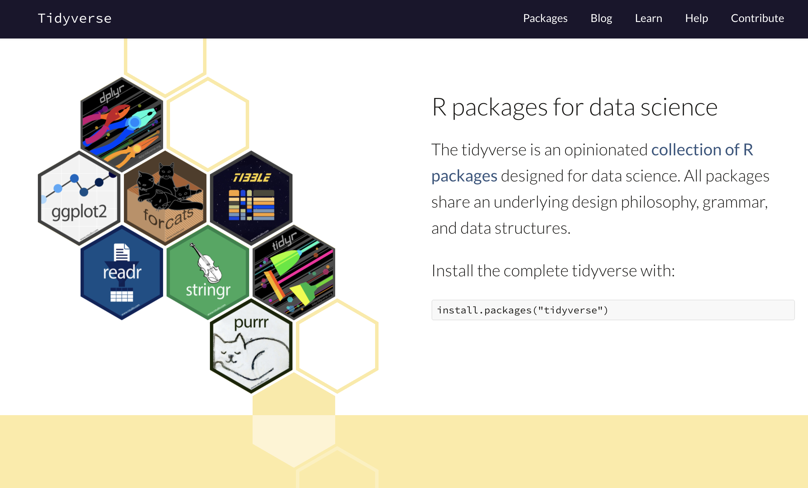

# The tidyverse

```{r, include=TRUE, echo=FALSE, out.height='500px', fig.align='center'}
## Source: https://www.tidyverse.org/

```

---

# Packages of the tidyverse

.pull-left[

[](https://ggplot2.tidyverse.org/index.html) plot data.

[](https://dplyr.tidyverse.org/index.html) `r BiocStyle::CRANpkg("dplyr")`: manipulate data.

[](https://tidyr.tidyverse.org/index.html) tidy data.

[](https://readr.tidyverse.org/index.html) import data from files.
]

.pull-right[
[](https://purrr.tidyverse.org/index.html) apply vectorised functions.

[](https://tibble.tidyverse.org/index.html) the tidyverse `data.frame`.

[](https://stringr.tidyverse.org/index.html) work with character strings.

[](https://forcats.tidyverse.org/index.html) work with factors.
]

---

# The data science workflow

```{r, include=TRUE, echo=FALSE, out.height='250px', fig.align='center'}
## Source: https://r4ds.had.co.nz/introduction.html
knitr::include_graphics("img/r4ds-data-science.png")
```

.center[
The tidyverse provides functions for each stage of the data science process.
]

---

# Tidy data

.pull-left[
## Not tidy

```{r, include=TRUE, echo=FALSE}
x <- matrix(
  data = rbinom(50, 10, 0.5), nrow = 10, ncol = 5,
  dimnames = list(paste0("G", seq_len(10)), paste0("S", seq_len(5))))
x <- as.data.frame(x)
x
```
]

.pull-right[
## Tidy
```{r, include=TRUE, echo=FALSE}
x %>% 
  tibble::rownames_to_column(var = "gene") %>% 
  tidyr::pivot_longer(tidyselect::starts_with("S"), names_to = "sample")
```
]

.center[
**How would you describe the difference between the tidy  and the "not tidy" layout of the data?**
]

---

# Loading tidyverse packages

Loading the `r BiocStyle::CRANpkg("tidyverse")` package loads all the packages of the tidyverse in a single command.

```{r, include=TRUE, message=TRUE}
library(tidyverse)
```

However, packages of the tidyverse can also be loaded individually, e.g.

```{r, include=TRUE}
library(ggplot2)
```

---

# The pipe operator

The `r BiocStyle::CRANpkg("magrittr")` package defines the pipe operator as `%>%`.

The pipe operator `%>%` in <i class="fab fa-r-project"></i> has a similar behaviour to pipe operator `|` in the Linux shell, adapted to the context of <i class="fab fa-r-project"></i> code:

- The `%>%` operator must follow code that emits an object (e.g., data frame, but not only!).
- The `%>%` operator must be followed by a function (base <i class="fab fa-r-project"></i>, tidyverse, or custom function).
- The output of code on the left side of `%>%` is passed as the first argument of the function on the right side (it is possible to alter this when needed).

## Keyboard shortcuts

Those make it simpler to insert the pipe in the RStudio Editor:

|  OS  | Shortcut |
| :--: | :------: |
| macOS | Command-Shift-M |
| Windows / Linux | Control-Shift-M |

---

# The pipe operator

.pull-left[
## Example

```{r, include=TRUE}
x <- 4
x %>% sqrt()
```

Is equivalent to:

```{r, include=TRUE}
x <- 4
sqrt(x)
```
]

.pull-right[
## If you are so inclined ...

```{r, include=TRUE, fig.height=5}
iris %>% 
  ggplot(aes(Sepal.Length, Sepal.Width)) +
  geom_point()
```

]

---

# The tidyverse philoshopy

- Most functions take (tidy) data as their first argument.

  + The `r BiocStyle::CRANpkg("magrittr")` pipe operator `%>%` is central to tidyverse workflows.
  
- Most functions take columns names as unquoted variable names.

  + Since the tidy dataset is given as first argument, all variable names are assumed to be names of columns in that dataset.

- Most functions prefer to work with the `tibble` data structure.

  + Tibble have certain features (e.g., no row names) which are expected and otherwise often raise warnings or messages.

```{r, include=TRUE}
iris %>% select(Sepal.Length, Sepal.Width, Species) %>% slice_head(n = 3)
```

---

# Import and export data

<!-- Source: https://www.tidyverse.org/packages/ -->


> provides a fast and friendly way to read rectangular data (like csv, tsv, and fwf).
> It is designed to flexibly parse many types of data found in the wild, while still cleanly failing when data unexpectedly changes.

```{r}
library(readr)
```

The `r BiocStyle::CRANpkg("readr")` package is mostly known for its functions to read and write files, e.g.

.pull-left[
- `read_csv`

- `read_tsv`

- `read_delim`

- `read_rds`
]

.pull-right[
- `write_csv`

- `write_tsv`

- `write_delim`

- `write_rds`
]

---

# Exercise

## Read and write files

- Read data from the file `iris.csv`.
  Assign the data imported from the file to an object called `iris_raw`.

.center[
**What do you learn about the data from the messages displayed in the R console while the contents of the file are parsed and imported into your R session?**
]

- Print the value of `iris_raw`.

.center[
**What is the class of the data? What are the dimensions of the dataset? What is the type of data stored in each column?**
]

- Write the dataset to a file named `iris.tsv`, separating fields with the tabulation character.

.center[
**What function do you use? What options are available for that function?**
]

- Inspect the `iris.tsv` file.
  You can use `file.edit()` to open the file in the RStudio editor.

.center[
**Are you satisfied with the contents and appearance of the file?**
]

---

# The tibble class

The `r BiocStyle::CRANpkg("tibble")` package defines a modern take on data frames (i.e., rectangular data).

The `tibble` class keep the features that have stood the test of time, and drop the features that used to be convenient but are now frustrating (i.e. converting character vectors to factors).

- It never changes the type of inputs used to create columns (e.g., character vectors are not converted to factors).

- It never adjusts the name of columns (e.g., the space character is not substituted by `.`).

- It always returns a `tibble` object after subsetting.

- It never tries to partially match column names.

- It does not support row names.

- It only shows the first 10 rows when displayed in the <i class="fab fa-r-project"></i> console.

- It displays the type of data in each column.

- It can contain another tibble (with the same number of rows) in a column.

A great introduction to the tibble is available in the [package vignette](https://cran.r-project.org/web/packages/tibble/vignettes/tibble.html).

---

# Making a tibble

The `tibble()` function is a nice way to create a tibble from scratch.

- Columns are created sequentially: subsequent columns can refer to previously defined ones.

- Single values are recycled to fill the entire column.

  + Vectors of a different length will cause the function to throw an error.

```{r, include=TRUE}
tibble(x = 1:5, y = 1, z = x ^ 2 + y)
```

---

# Data exploration

```{r, include=TRUE, echo=FALSE, out.height='250px', fig.align='center'}
## Source: https://www.tidyverse.org/
knitr::include_graphics("img/r4ds-data-science-explore.png")
```

.center[
In this section, we will focus on data exploration using the tidyverse.
]

- We will start from data that is already tidy.

- We will transform data (e.g., calculate, filter, summarise).

- We will continue practicing visualisation using `r BiocStyle::CRANpkg("ggplot2")`

---

# Manipulate tidy data

<!-- Source: https://www.tidyverse.org/packages/ -->


> provides a grammar of data manipulation, providing a consistent set of verbs that solve the most common data manipulation challenges.

```{r}
library(dplyr)
```

The `r BiocStyle::CRANpkg("dplyr")` package is known for its many functions to sort, select, filter, group, combine, and summarise columns and observations, e.g.

- `select`: select a subset of columns in a `tibble`.

- `mutate`: create or update values in one or more columns.

- `filter`: filter observations using conditions on column values.

- `group_by`: group observations on column values; subsequent functions will be applied on each group separately.

- `summarise`: summarise groups of observations.

- `arrange`: sort observations.

- `join`: merge two `tibble` objects on matching values in one or more columns.

- `pull`: extract one column from a `tibble`.

---

# Subset the columns of a table

The `select()` function can be used to subset a `tibble` to certain columns.
This function _always_ returns a table, even for a single column (see `pull()` to extract a vector).

There are many ways to define the selection of columns.

```{r, include=TRUE, eval=FALSE}
iris %>% select(Sepal.Length, Sepal.Width)
iris %>% select(starts_with("Petal") | ends_with("Width"))
iris %>% select(!ends_with("Width"))
iris %>% select(!c(Sepal.Length, Petal.Length))
```

Functions such as `starts_with` and `ends_with` are made available by the `r BiocStyle::CRANpkg("tidyselect")` package.

Note that `select()` does not affect the original object.
It creates a new object that can be assigned to a new variable name in the <i class="fab fa-r-project"></i> session.

---

# Create and update columns in a table

The `mutate()` function can be used to create or update values in one or more columns.

Columns are treated sequentially, a single call to `mutate()` can create columns that immediately re-use columns created in the same call.

.small-code[
```{r, include=TRUE}
iris %>% mutate(
  ID = seq(1, nrow(iris)),
  Flower.ID = paste0(Species, ID)
  ) %>% slice_head(n = 6)
```
]

---

# Subset observations in a table

The `filter()` function can be used to select rows of a table (i.e., observations) using conditional statements on values in certain columns.

.small-code[
```{r, include=TRUE}
iris %>%
  filter(Sepal.Length > mean(Sepal.Length) & Sepal.Width > mean(Sepal.Width)) %>% 
  as_tibble()
```
]

---

# Compute summary statistics

The `summarise()` function can be used to compute summary statistics for groups of observations (or the entire dataset).

Without grouping, summary statistics are simply computed across all observations (as a single group).

.pull-left[
.small-code[
## Without grouping

```{r, include=TRUE}
iris %>% 
  summarise(Sepal.Length.mean = mean(Sepal.Length))
```
]
]

.pull-left[
.small-code[
## With grouping

```{r, include=TRUE}
iris %>% 
  group_by(Species) %>% 
  summarise(Sepal.Length.mean = mean(Sepal.Length))
```
]
]

---

# Sort observations

The `arrange()` function can be used to order observations using values in certain columns.

- Multiple columns can be used; subsequent columns are used to break ties.

- Columns that contain factors are sorted following the order of the factor levels.

- Columns that contain character values are sorted alphabetically.

.small-code[
```{r, include=TRUE}
iris %>% 
  arrange(Species, desc(Sepal.Length)) %>% 
  as_tibble()
```
]

---

# Extract a single column as a vector

The `pull()` function can be used to extract a single column as a vector.

- In particular, the `pull()` function has a `name=` argument that can be used to create a named vector.

.pull-left[
.small-code[
## Without names

```{r, include=TRUE}
iris %>% pull(Sepal.Length) %>% 
  head(5)
```
]
]

.pull-right[
.small-code[
## With names

```{r, include=TRUE}
iris %>% pull(Sepal.Length, name = Species) %>% 
  head(5)
```
]
]

---

# Combine two tables using shared information

The `r BiocStyle::CRANpkg("dplyr")` packages provides different functions to combine two tables.
Those functions mainly differ in the way they handle observations that do not have matching information in the other table:

- `inner_join()`: only includes rows present in both `x` and `y`.

- `left_join()`: includes all rows in `x`.

- `right_join()`: includes all rows in `y`.

- `full_join()`: includes all rows present in either `x` or `y`.

In particular, if a row in `x` matches multiple rows in `y`, all the rows in `y` will be returned once for each matching row in `x`.

---

# Combine two tables using shared information

.pull-left[
## tibble_1

```{r, include=TRUE, echo=FALSE}
tibble_1 <- tibble(
  ID = paste0("sample", 1:4),
  gene1 = rbinom(4, 10, 0.5),
  gene2 = rbinom(4, 10, 0.5)
)
tibble_1
```
]

.pull-right[
## tibble_2

```{r, include=TRUE, echo=FALSE}
tibble_2 <- tibble(
  ID = paste0("sample", 1:4),
  batch = factor(rep(c("A", "B"), each = 2)),
  condition = factor(rep(c("control", "treated"), times = 2)),
)
tibble_2
```
]

.center[
**How would you describe how to join these two tibbles?**
]

--

```{r, include=TRUE, results='hide'}
tibble_joined <- left_join(tibble_1, tibble_2, by = "ID")
tibble_joined
```

---

# Combine two tables using shared information

.pull-left[
## tibble_1

.small-code[
```{r, include=TRUE, echo=FALSE}
tibble_1
```
]
]

.pull-right[
## tibble_2

.small-code[
```{r, include=TRUE, echo=FALSE}
tibble_2
```
]
]

.small-code[
```{r, include=TRUE}
tibble_joined <- left_join(tibble_1, tibble_2, by = "ID")
tibble_joined
```
]

---

# Exercise

## Manipulate data

### Exercise 1

- Using `iris_raw`, for each species of iris, compute the following summary statistics for the `sepal_length`: mean, median, minimum, maximum.

### Exercise 2

- For each species of iris, compute the mean of every column that is numeric.
  **Hint:** use the functions `dplyr::across()`, `tidyselect::where()`, and `base::is.numeric()`.
- Filter the table above to retain only species of iris with an average sepal length less than `6`.
- Sort the table above by descending `sepal_length`.
- From the table above, extract the `sepal_length` column as a numeric vector.
  Make it a named numeric vector, where each value is named with the corresponding species.

---

# Exercise

## Manipulate data

### Exercise 3

Let's make the silly assumption that iris sepals are rectangular in shape.

- Using `iris_raw`, compute a new column named `sepal_area`, which is the product of `sepal_length` and `sepal_width`.

- Subset the result to the columns named `species` and `sepal_area`.

- Subset the result to display the top 5 observations by `sepal_area`.

## Bonus point

- Make a histogram of `sepal_area` colored by species.

You might also want to facet the plot by species.
  
---

# Tidying data

<!-- Source: https://www.tidyverse.org/packages/ -->


> provides a set of functions that help you get to tidy data. Tidy data is data with a consistent form: in brief, every variable goes in a column, and every column is a variable.

The `r BiocStyle::CRANpkg("tidyr")` package is mostly known for functions to reshape rectangular data, e.g.

- `pivot_longer()`: "lengthens" data, increasing the number of rows and decreasing the number of columns.
  This generally "tidies" data.

- `pivot_wider()`: Opposite of `pivot_longer`.

- `separate()`: split the value of a column into multiple columns (e.g. sample name -> experimental conditions).

- `unite()`: Opposite of `separate`.

---

# Exercise

## Pivot data from wide to long

.pull-left[
Reshape the `iris_raw` dataset in a tidy format where one observation is represented by:

- the species

- the variable measured

- the value

**Hint:** you want to pivot all the columns that start are numeric.
]

.pull-right[
```{r, include=TRUE, echo=FALSE}
iris %>% 
  pivot_longer(c(starts_with("Sepal"), starts_with("Petal")), names_to = "variable")
```
]

.center[
**What information have we lost in the process? What could we do to remedy the issue?**
]

---

# Exercise

## Pivot data from long to wide

- Reshape the tidy format of the iris data set into the original wide format.

**Hint:** you will only be able to restore the wide format if you kept track of the identity of each flower in the long format.

---

# Split a column value into multiple columns

The `separate()` function can be used to split the values of a column into values stored in multiple columns using a separator given as a regular expression.

- You need to know in advance how many new columns the split will create.

- Each input value must generate the same number of output values.

.small-code[
```{r, include=TRUE}
iris %>% 
  separate(Sepal.Length, c("Sepal.Length.unit", "Sepal.Length.decimal"), sep = "[.]") %>% 
  select(c("Sepal.Length.unit", "Sepal.Length.decimal")) %>% as_tibble()
```
]

---

# Combine multiple columns into a single value

The `unite()` function can be used to combine values stored in separate columns into a single new column.

- Similarly to the `separate()` function, the original columns being split or combined are not retained from the resulting table, unless the option `remove=FALSE` is set.

.small-code[
```{r, include=TRUE}
iris %>% 
  mutate(ID = seq(1, nrow(iris))) %>% 
  unite("FlowerID", Species, ID, sep = "_") %>% 
  as_tibble()
```
]

---

# Working with character strings

<!-- Source: https://www.tidyverse.org/packages/ -->


> provides a cohesive set of functions designed to make working with strings as easy as possible.
> It is built on top of stringi, which uses the ICU C library to provide fast, correct implementations of common string manipulations.

The `r BiocStyle::CRANpkg("stringr")` package is known for its many functions to process, substitute, concatenate, and modify character strings, e.g.

- `str_sub`: extract and replace substrings from a character vector.

- `str_trim`: trim whitespaces.

- `str_c`: join multiple strings into a single string.

- `str_length`: query the length of a string.

- `str_to_lower` / `str_to_upper`: convert case of a string.

---

# Extract substrings

The `str_sub()` function can be used to extract or replace substrings using the index of the start and end positions.

For demonstration, we extract the iris species in a character vector.

```{r, include=TRUE}
iris_species <- iris %>% pull(Species)
```

E.g., extract the unique substrings of the first three characters.

```{r, include=TRUE}
iris_species %>% str_sub(1, 3) %>% unique()
```

E.g., replace the fourth character onwards by an ellipsis.

```{r, include=TRUE}
str_sub(iris_species, 4) <- "..."
iris_species %>% unique()
```

---

# Join multiple strings and remove whitespaces

The `str_c()` function joins two or more strings, and the `str_trim()` function removes whitespaces for either end of a string.

```{r, include=TRUE}
words <- c("A ", " few ", "words")
```

Remove whitespaces.

```{r, include=TRUE}
words %>% str_trim()
```

Join the trimmed strings into a single string.

```{r, include=TRUE}
words %>% str_trim() %>% str_c(collapse = " ")
```

---

# Other package of the tidyverse

<!-- Source: https://github.com/tidyverse/haven/blob/master/man/figures/logo.png -->
<!-- Source: https://github.com/tidyverse/readxl/blob/master/man/figures/logo.png -->

| Package | Description |
| :-----: | :---------- |
|[](https://haven.tidyverse.org/index.html) | enables R to read and write various data formats used by other statistical packages (e.g., SAS, SPSS, Stata) |
| [](https://readxl.tidyverse.org/index.html) | makes it easy to get data out of Excel and into R. |
| [](https://googledrive.tidyverse.org/) | allows you to interact with files on Google Drive from R. |
| [](https://lubridate.tidyverse.org/) | makes it easier to do the things R does with date-times and possible to do the things R does not. |
| [](https://hms.tidyverse.org/) | provides a simple class for storing durations or time-of-day values and displaying them in the `hh:mm:ss` format. |

---

# Integrated exercise

## Gene expression

### Part 1

We provide you with an Excel file that contains gene expression data for the nine most highly variable genes in a pancreas cancer gene expression dataset (<https://portal.gdc.cancer.gov/projects/TCGA-PAAD>), as well as metadata for the individual samples and genes.

- Import the gene expression matrix from the Excel file into the R session as a `tibble`.
  Assign it to an object named `exprs_assay`.

- Reshape the gene expression matrix in a tidy format.
  Assign it to a new object `exprs_assay_long`.

- Draw a histogram of gene expression levels for each gene in a separate facet.

---

# Integrated exercise

## Gene expression

### Part 2

- Import the sample metadata from the Excel file into the R session as a `tibble`.
  Assign it to an object named `sample_info`.

> Metadata key:
> 
> [NIH AJCC staging system](https://www.cancer.gov/publications/dictionaries/ca> ncer-terms/def/ajcc-staging-system)
> 
> - grade: how abnormal the cancer cells and tissue look under a microscope
> - T: size of the tumor and any spread of cancer into nearby tissue
> - N: spread of cancer to nearby lymph nodes
> - M: metastasis (spread of cancer to other parts of the body)

- Convert the four columns above to the factor type.

- Combine sample information with gene expression data.
  Assign the output to `exprs_sampleinfo`.

---

# Integrated exercise

## Gene expression

### Part 3

- Identify the gene with the largest absolute difference in expression between male and female patients.

- Visualise the expression of that gene across tumour grades.
  Facet by `sex`.
  Color by `T` score.

- Draw a heat map of all nine genes.
  Remove labels as well as ticks for the x-axis.
  Remove the panel grid and background.

### Bonus point

- In the heat map, group samples by sex.

---

# Further reading

- [R for Data Science](https://r4ds.had.co.nz/)

- [RStudio Cheat Sheets](https://www.rstudio.com/resources/cheatsheets/)

---

# References

.small-text[
```{r, include=TRUE, echo=FALSE, results="asis"}
PrintBibliography(bib)
```
]
